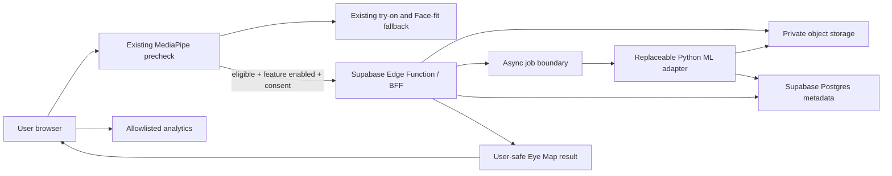
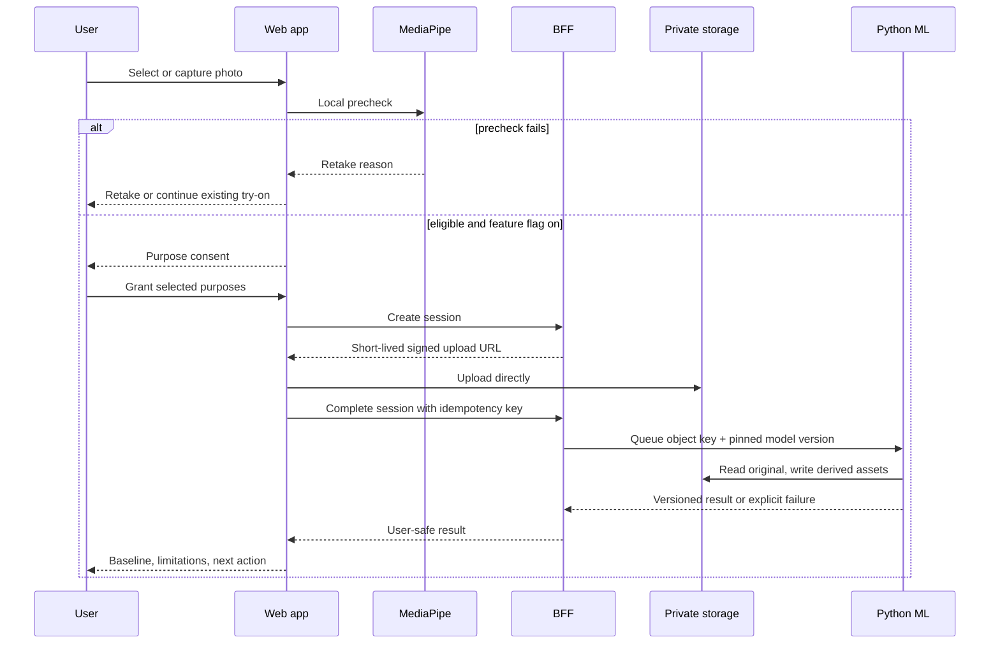
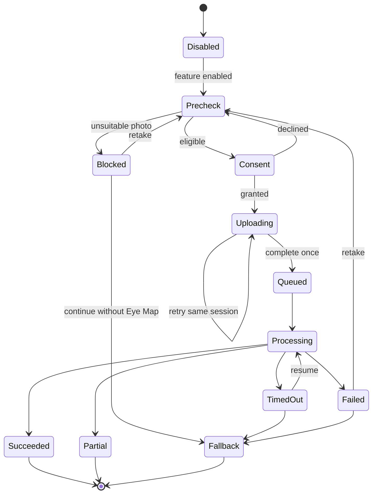

# Eye Map architecture and trust boundaries

## Component diagram

The current frontend never imports the Python package. It talks to a versioned
contract, so the model can be replaced without rewriting the product.

## Data flow

## State transitions

## Failure codes

The ML adapter must return machine-readable codes. UI copy is resolved in the
web app and never exposes internal stack traces.

| Code | Recoverable | Handling |
| --- | --- | --- |
| `missing_required_structure` | yes | Ask for retake |
| `multiple_faces` | yes | Ask for a one-person photo |
| `mask_sanity_failed` | yes | Do not show derived measurements |
| `unsupported_image` | yes | JPEG/PNG/WebP guidance |
| `model_unavailable` | yes | Existing try-on fallback |
| `schema_incompatible` | no | Disable Eye Map and alert engineering |
| `consent_revoked` | no | Stop and delete by scope |

## Privacy invariants

1. Public buckets are forbidden.
2. Signed URLs are short-lived and purpose-scoped.
3. Original, thumbnail, mask, and overlay are separate assets with deletion
   state.
4. No identity embeddings are generated.
5. Raw images and health-context values never enter analytics, URLs, logs, or
   partner payloads.
6. Model and rule versions are recorded for reproducibility.
