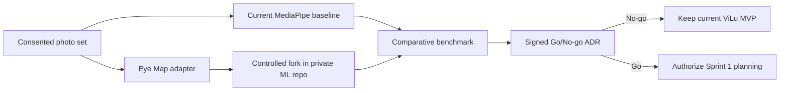
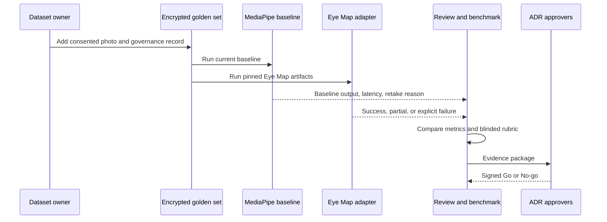
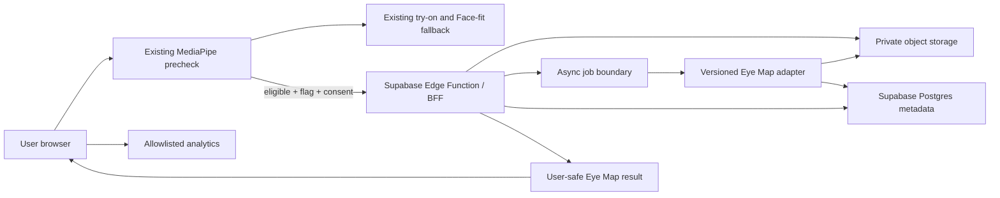
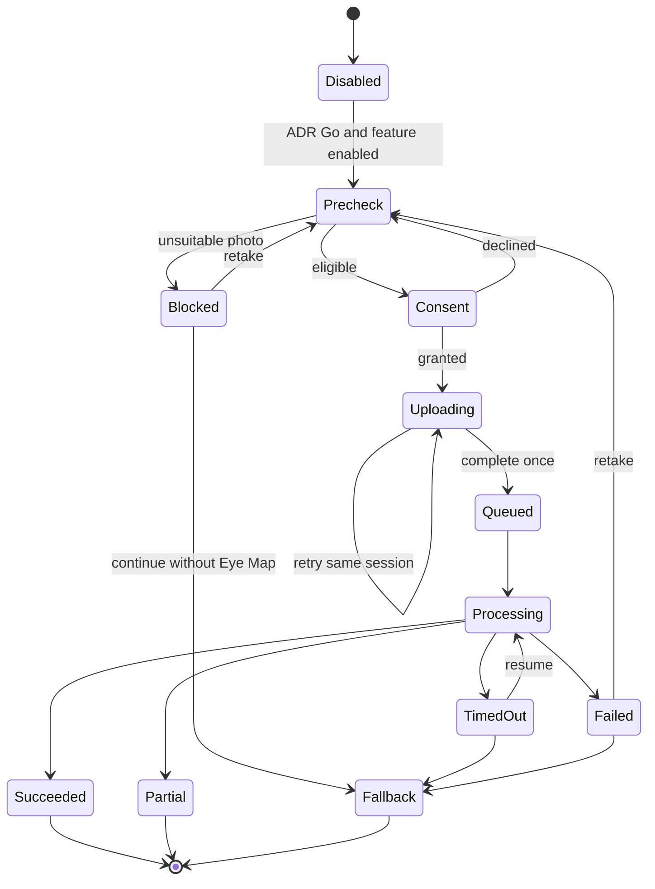

# Eye Map architecture and trust boundaries

## Current architecture: Sprint 0

Sprint 0 is an offline experiment, not a production vertical slice.

Repository boundary:

- `optica-shop`: public contracts, feature flag, architecture, and tests;
- private `vilu-eye-map-ml`: pinned Python runtime, adapter, controlled fork,
  artifact checks, and benchmark code;
- encrypted controlled storage: consented photos and all derived assets.

Sprint 0 has no browser upload, BFF, queue, cloud inference, or user-facing Eye
Map route. Production continues to use the existing browser MediaPipe engine.

## Sprint 0 sequence

## Target architecture after Go

The following is a target for later design. It is not authorized for
implementation until the Go/No-go ADR is signed.

The frontend never imports the Python package. It consumes a versioned result
contract so the model can be replaced without rewriting the product.

## Target state transitions

## Result contract invariant

The adapter returns exactly one discriminated status: `success`, `partial`, or
`failure`. Missing structures are explicit. Invalid numbers, absent irises,
absent brows, and empty masks can never become valid zero values. UI copy is
resolved by the web app and never exposes internal stack traces.

## Failure codes

| Code | Recoverable | Handling |
| --- | --- | --- |
| `missing_required_structure` | yes | Ask for retake |
| `multiple_faces` | yes | Ask for a one-person photo |
| `mask_sanity_failed` | yes | Do not show derived measurements |
| `unsupported_image` | yes | JPEG/PNG/WebP guidance |
| `model_unavailable` | yes | Existing try-on fallback |
| `schema_incompatible` | no | Disable Eye Map and alert engineering |
| `consent_revoked` | no | Stop and delete by scope |

## Trust boundaries

| Boundary | Allowed | Forbidden |
| --- | --- | --- |
| Sprint 0 Git repos | Code, contracts, aggregate metrics | Photos, weights, PII |
| Governance registry | Consent and deletion metadata | Model output in identity records |
| Offline runner | Encrypted object ID, pinned model | Contact data and analytics |
| Browser to analytics | Event, locale, reason code, latency bucket | Photo, answers, free text, measurements |
| Browser to future BFF | Consented upload metadata | Secrets, provider credentials |
| Future BFF to ML | Private object key, model version, correlation ID | User contact, questionnaire answers |
| ML to future BFF | Masks, normalized features, explicit failure codes | Diagnosis, treatment eligibility |

## Privacy invariants

1. Sprint 0 photos remain on controlled encrypted storage.
2. Photos and weights never enter Git.
3. Identity/contact data is separate from image and output records.
4. No identity embeddings are generated.
5. Raw images and health-context values never enter analytics, URLs, logs, or
   partner payloads.
6. Model and rule versions are recorded for reproducibility.
7. Consent withdrawal deletes originals and all derived assets by scope.
8. Public storage buckets are forbidden in any later pilot.
