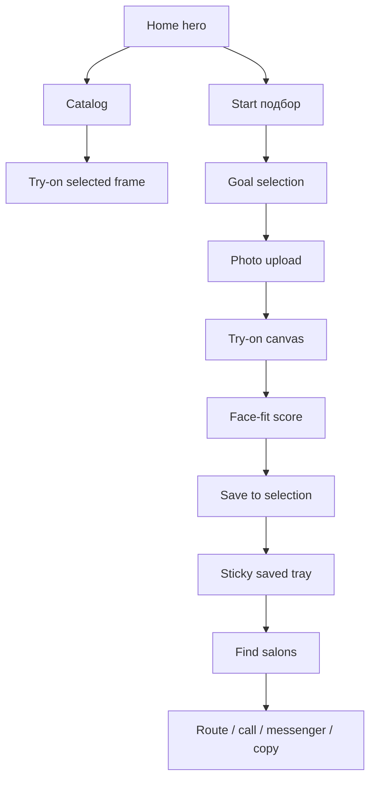
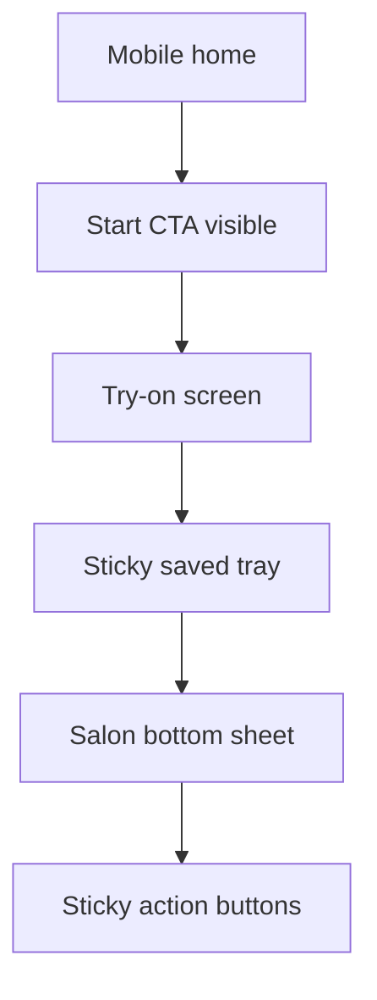

# Design Review: Premium UI Redesign for ViLu

Status: design plan approved for exploration  
Branch: `codex/premium-ui-redesign-plan`  
Date: 2026-06-18  
Inputs:

- `docs/designs/premium-ui-redesign-plan.md`
- `docs/designs/premium-ui-redesign-eng-review.md`

## Verdict

Initial design readiness score: 5/10.  
After this review plan: 8.5/10.

The CEO review correctly identified the product wedge, and the engineering review correctly protected system boundaries. The missing layer was visual decision-making: what ViLu should actually look and feel like, which patterns should win, and which UI choices should be forbidden before implementation starts.

Design direction:

> ViLu should feel like a precise, premium optical assistant: calm, product-led, useful, and trustworthy, not a loud landing page or a generic eyewear store.

## Design Positioning

ViLu is not trying to beat Warby Parker, Ray-Ban, or Zenni at being a full ecommerce eyewear catalog. ViLu's stronger position is narrower:

> online frame-fit preparation before a real salon visit.

The visual system should make that obvious. Every major screen should reinforce the path:

1. choose a use case;
2. upload a photo locally;
3. understand fit;
4. save 2-3 frames;
5. find a nearby salon and act.

## Resolved Design Decisions

| Decision | Final choice | Why |
|---|---|---|
| Public brand | Use `ViLu` for product UI; keep `VisionLux` only where it represents demo/store legacy content. | The product needs one clear public brand. Mixed naming lowers trust. |
| Hero composition | Use an actual try-on / saved-selection product preview, not abstract editorial decoration. | The first screen must show the product's value, not just atmosphere. |
| Mobile salon pattern | Use a bottom sheet for salons on mobile; use modal/panel on desktop. | Bottom sheets are more ergonomic on phones and avoid cramped centered dialogs. |
| Catalog filters | Desktop: visible compact filters. Mobile: collapsed filter drawer/chips. | Comparison needs density on desktop; mobile needs breathing room. |
| Saved selection | Sticky compact selection tray after first saved frame. | The user needs constant progress toward the 2-3 frame goal. |
| Typography | Reduce hero scale and introduce clamp-based max sizes. | Current large type reads uncontrolled and causes visual amateurism. |
| Palette | Move from beige-dominant to optical neutral + mineral green + amber accent. | Beige can remain as warmth, but not as the whole brand. |
| Cards | Use cards only for repeated product/salon items and modals; avoid card-inside-card layouts. | Nested cards create demo/UI-kit feeling. |
| Motion | Use restrained micro-interactions only. | Premium optical UX should feel stable, not animated for its own sake. |
| Trust copy | Place trust copy at risk moments, not in large legal blocks. | Users need reassurance exactly when uploading photo, saving profile, or contacting salons. |

## Visual System Direction

### Palette

Recommended palette roles:

| Token | Role | Suggested direction |
|---|---|---|
| `ink` | Primary text, nav, key CTAs | Near-black optical navy/black. |
| `paper` | Main background | Clean off-white, not yellow beige. |
| `mist` | Secondary panels | Cool gray-green or very light neutral. |
| `mineral` | Brand accent, trust, active states | Deep desaturated green. |
| `amber` | Conversion accent | Warm amber used sparingly for primary actions. |
| `line` | Borders | Low-contrast neutral. |
| `danger/info` | Notices | Muted semantic colors, not saturated badges. |

Do not let one color family dominate the entire product. The current warm palette should be reduced to accent/background support, not the whole identity.

### Typography

Rules:

- Hero title should use max-size clamps and intentional line breaks.
- Do not scale type directly with viewport width.
- No negative letter spacing.
- Use display weight only for top-level moments.
- Product cards, dashboard panels, and salon cards need tighter, smaller type.
- Cyrillic line breaks must be tested manually.

Recommended hierarchy:

| Text role | Desktop | Mobile | Notes |
|---|---:|---:|---|
| Hero H1 | 64-88px max | 42-52px | Current scale is too aggressive. |
| Section H2 | 36-48px | 28-34px | Use for product sections and flow steps. |
| Card title | 20-28px | 18-22px | Keep cards professional, not heroic. |
| Body | 16-18px | 15-16px | Comfort and readability. |
| Meta/labels | 12-14px | 12-13px | Uppercase sparingly. |

### Layout

- First viewport should show the product path, not just a giant headline.
- Hero must reveal a hint of the next section on common desktop and mobile heights.
- Use full-width sections with constrained inner content.
- Avoid decorative floating cards unless the card is an actual product/app state preview.
- Keep repeated item cards at modest radius, roughly 8-12px depending on existing language.
- Stable dimensions are mandatory for product cards, saved tray, and action buttons.

## Screen-by-Screen Review

### 1. Home

Current issue: the hero feels oversized and decorative. The product path is not as instantly clear as it should be.

Design fix:

- Top nav: `ViLu`, `Онлайн-примерка`, `Каталог`, `Face-fit score`, `Салоны`, profile/saved icons.
- Hero H1: `Подберите оправу онлайн и найдите, где примерить рядом`.
- Supporting text: one short sentence about photo, 2-3 styles, nearby optics.
- Primary CTA: `Начать подбор`.
- Secondary CTA: `Смотреть оправы`.
- Product preview: show a realistic app-state card: uploaded photo placeholder, selected frame, score, saved count, salon CTA.
- Four-step rail visible above/below CTA: `Фото`, `Face-fit`, `Подбор`, `Салон`.

Score after fix target: 9/10.

### 2. Catalog / Products

Current issue: card design can feel like generic ecommerce and may not communicate fit/use-case decisions strongly enough.

Design fix:

- Card top: frame image area with stable aspect ratio.
- Card body: brand/model, use cases, size, material/color, price.
- Primary action: `Примерить` or `Оценить посадку`.
- Secondary action: save/compare icon.
- Filters: use case, frame shape, material, color, size, sun/optical/computer.
- Saved selection tray appears after first saved item.

Score after fix target: 8/10.

### 3. Try-On

Current issue: try-on must feel like the core product, not an embedded demo widget.

Design fix:

- Split interaction into stable zones: photo canvas, frame controls, fit insight, saved tray.
- Photo privacy note lives directly near upload/canvas.
- Frame controls use icon buttons where possible and readable labels only where needed.
- Score card appears as a professional assessment panel, with limitations visible.
- Saved count badge must stay on one line: `0 из 3`, `1 из 3`, `2 из 3`, `3 из 3`.

Score after fix target: 9/10.

### 4. Face-Fit Score

Current issue: score concept is valuable but must not look like pseudo-medical certainty.

Design fix:

- Use `Предварительная оценка` language.
- Score component: numeric score + confidence/limitations + checklist for salon.
- Emphasize what can be judged online and what must be checked in person.
- Add CTA: `Сохранить в подбор` then `Найти салон`.

Score after fix target: 9/10.

### 5. Salon Finder

Current issue: centered modal with cards risks feeling like a generic directory.

Design fix:

- Desktop: right-side panel or large modal with clear saved-selection context.
- Mobile: bottom sheet with drag/close affordance and sticky action row.
- Every salon card should answer: distance/city, address, open hours, partner/listed status, action buttons.
- Copy must say: `Перед визитом уточните наличие похожих моделей.`
- Action priority: route, call, Telegram/WhatsApp, copy подбор.

Score after fix target: 8.5/10.

### 6. Demo Dashboard

Current issue: dashboard is useful for MVP vision but legally sensitive; trust copy must be elegant and unmissable.

Design fix:

- Preserve dashboard; do not remove.
- Add compact demo/local mode notice under title.
- Local save toast: `Сохранено на этом устройстве. Данные не отправлены на сервер.`
- Recipe disclaimer appears in context, not as a giant warning.
- Contact/reminders marked as future/demo if not actually sent.

Score after fix target: 8/10.

### 7. Knowledge Base / SEO Pages

Current issue: these pages are useful for GenEO, but visual system should align with product.

Design fix:

- Use article layout with clear answer blocks, tables, FAQ, author/date/source.
- Avoid over-marketing language.
- CTA blocks should return user to try-on flow.
- Keep JSON-LD and route stability intact.

Score after fix target: 8/10.

## Interaction Model



Design requirement: the user should always know where they are in this graph and what the next useful step is.

## Mobile Pattern



Mobile rules:

- No hero text clipping.
- No modal content hidden behind bottom actions.
- Bottom sheet content scrolls independently.
- Primary action is always reachable without precision taps.
- Long labels wrap intentionally or become icon+tooltip/accessible label.

## Design QA Checklist

| Surface | Must pass |
|---|---|
| Home | Hero feels premium, CTA visible, next section hinted. |
| Nav | Brand consistent as ViLu; active route clear. |
| Catalog | Cards align; images stable; filters understandable. |
| Try-on | Canvas and controls do not fight; privacy note visible. |
| Fit score | Looks useful, not medically overconfident. |
| Saved tray | Count is stable and professional at every state. |
| Salon card | Actions fit on mobile and desktop without clipping. |
| Dashboard | Demo/local notice visible but not ugly. |
| KB pages | Readable article layout; CTA back to product. |
| Footer | Privacy, terms, disclaimer accessible. |

## Anti-Patterns To Avoid

- Giant Cyrillic headline taking the whole screen without product proof.
- Beige-on-beige visual system.
- Decorative orbs/blobs/cards that do not represent product state.
- Nested cards inside cards.
- Too many pill buttons with long text.
- Generic ecommerce hero that hides the try-on/salon wedge.
- Modal that traps mobile content behind a sticky footer.
- Score UI that looks like a medical diagnosis.
- Trust copy buried in footer only.
- Animated polish before layout stability.

## Design Tokens Recommendation

```text
Brand: ViLu
Tone: precise, calm, premium, useful
Primary surface: off-white / optical paper
Primary text: optical black
Accent 1: mineral green
Accent 2: warm amber
Support: cool gray, pale green-gray
Radii: 8-12px for cards, full pill only for controls/chips
Shadows: subtle elevation only, no floating toy-like cards
Motion: 120-180ms for hover/focus/entry, respect reduced motion
```

## Implementation-Ready Design Decisions

1. Public app name is `ViLu`.
2. Hero uses product-state preview.
3. Saved selection becomes a sticky compact tray after first save.
4. Mobile salons use bottom sheet.
5. Desktop salons use panel/modal with visible saved-selection context.
6. Catalog filters are visible on desktop and collapsed/chip-based on mobile.
7. The palette becomes neutral/mineral/amber, reducing beige dominance.
8. Trust copy is placed next to risky interactions.
9. Product cards use stable image and action zones.
10. Knowledge Base keeps clean article layouts aligned with product visual system.

## Test Implications For Design

Design implementation is not complete until screenshots are checked at:

- 390 x 844;
- 430 x 932;
- 768 x 1024;
- 1366 x 768;
- 1440 x 900.

Required visual checks:

- hero text fits;
- CTA visible;
- saved tray fits;
- salon bottom sheet actions fit;
- product card buttons fit;
- dashboard notices do not crowd forms;
- KB pages remain readable;
- no card-inside-card clutter;
- no accidental brand mismatch.

## Recommended Next Step

Run `design-shotgun` or create 2-3 static visual directions before editing production UI:

- Direction A: Premium Optical Minimalism.
- Direction B: Product-Led Try-On Cockpit.
- Direction C: Boutique Salon Preparation.

Recommended choice for ViLu: B with A's restraint.

## GSTACK REVIEW REPORT

| Review | Trigger | Why | Runs | Status | Findings |
|--------|---------|-----|------|--------|----------|
| CEO Review | `/plan-ceo-review` | Scope & strategy | 1 | CLEAR | Correct wedge: premium optical decision layer, not generic ecommerce. |
| Eng Review | `/plan-eng-review` | Architecture & tests | 1 | CLEAR | Frontend-only boundaries, trust model, data flow, states, and tests defined. |
| Design Review | `/plan-design-review` | UI/UX gaps | 1 | CLEAR | Initial score 5/10, target plan 8.5/10; 10 implementation-ready design decisions made. |

- **VERDICT:** CEO + ENG + DESIGN planning are aligned. Next best step is visual exploration via `design-shotgun`, then production implementation.

NO UNRESOLVED DECISIONS
