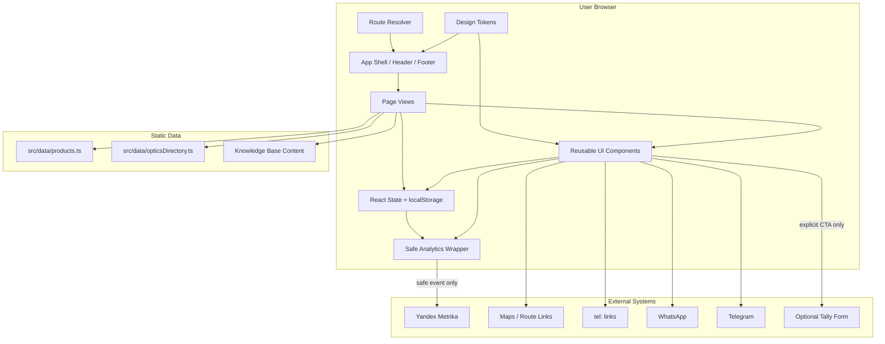
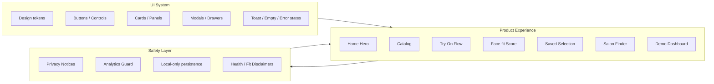
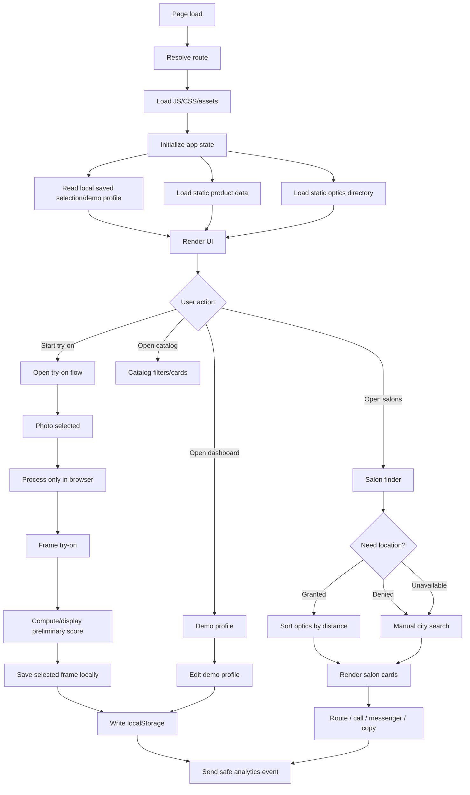
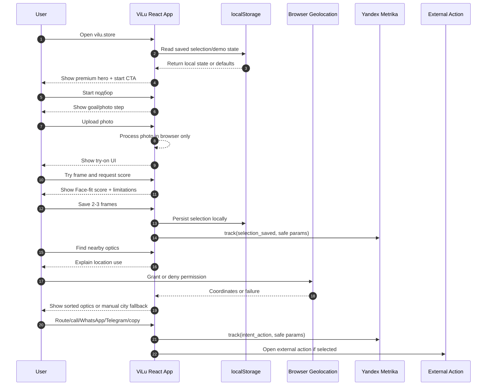
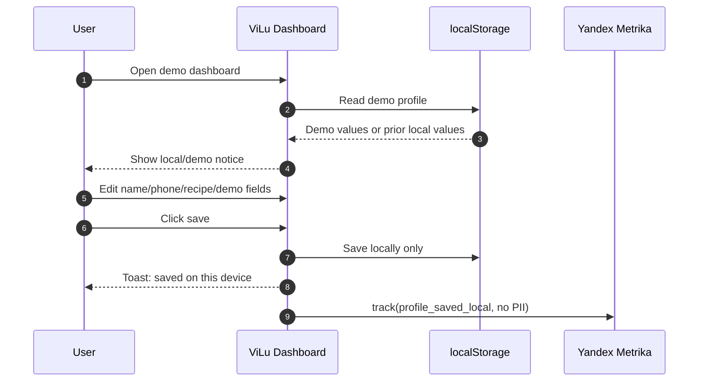
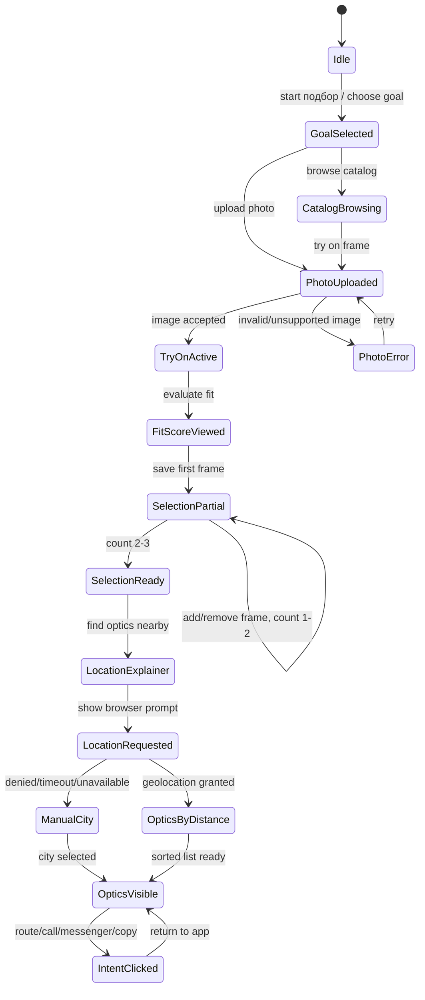
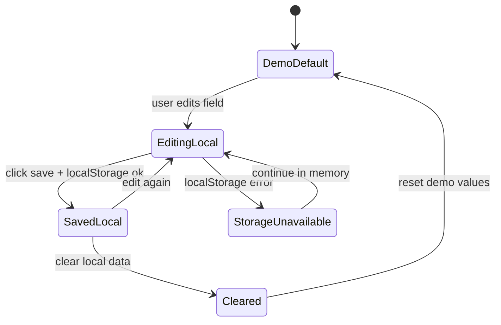
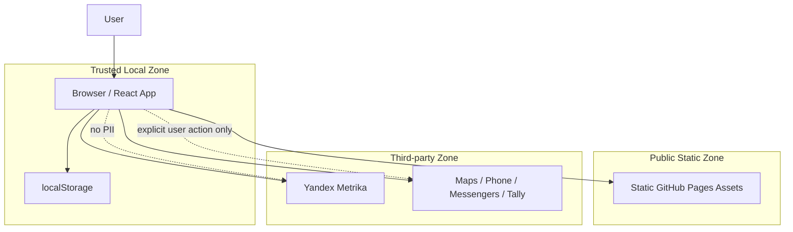

# Engineering Review: Premium UI Redesign for ViLu

Status: ready for plan-design-review  
Branch: `codex/premium-ui-redesign-plan`  
Date: 2026-06-18  
Source plan: `docs/designs/premium-ui-redesign-plan.md`  
Review mode: frontend-only architecture review

## Executive Summary

This engineering review converts the CEO visual direction into an implementation-safe plan. The redesign should improve perceived quality without changing the product's legal/privacy posture or adding backend complexity.

Core engineering decision:

> Treat the redesign as a presentation-system and CJM-clarity upgrade, not as a product-scope expansion.

The current system already has the correct MVP foundation: static React/Vite app, local/demo-safe state, static products, static optics directory, Knowledge Base routes, Yandex Metrika with safe events, and GitHub Pages deployment. The redesign must preserve those boundaries.

## Architecture Goals

1. Make the UI feel premium and optical without adding backend dependencies.
2. Keep the main CJM observable and testable: open -> start try-on -> upload -> score -> save -> optics -> contact/route/copy.
3. Preserve local-only handling for photos, profile data, and recipe-like demo data.
4. Keep analytics useful while preventing PII leakage.
5. Make visual changes easy to review in GitHub through small scoped commits.
6. Prepare a design-review-ready system: tokens, components, state diagrams, failure modes, and test matrices.

## Non-Goals

- No server-side accounts.
- No server-side photo storage.
- No prescription/health profile storage.
- No real checkout.
- No map/provider API integration.
- No claims of diagnosis, PD accuracy, or medical recommendation.
- No hidden SEO/LLM text.
- No sending personal data to Yandex Metrika, GA, Tally, or any external system.

## Component Architecture

Engineering rule: redesign may change `Shell`, `Tokens`, `Pages`, and `Components`. It should not change the trust model of `LocalState`, `Analytics`, or `External` integrations.

## Proposed Frontend Module Boundaries

Boundary rule: UI components can be reused across product flows, but safety copy and analytics guards must not be optional decoration. They are part of the product contract.

## Data Flow Diagram

## Sequence: Main Conversion CJM

## Sequence: Demo Dashboard Local Save

## State Machine: Try-On and Salon Intent

## State Machine: Local Demo Profile

## System Boundaries

| Boundary | Owner | Allowed | Blocked |
|---|---|---|---|
| React app | Frontend | UI state, routing, local interactions | Server-side persistence assumptions |
| Design system | Frontend/design | Tokens, layout, components | New business logic hidden in CSS/components |
| Product data | Static data | Read-only catalog display/filtering | Remote product sync in this redesign |
| Optics directory | Static data | City/address/action rendering | Claims of real-time availability |
| Photo handling | Browser | Local preview/overlay only | Uploading/storing/sending photo |
| Demo profile | Browser localStorage | Local demo save/clear | Backend save or analytics PII |
| Analytics | Safe wrapper | Event name + coarse safe params | Name, phone, email, recipe, complaints, photo, exact location |
| External links | Browser navigation | Explicit route/call/messenger/copy | Silent redirects or hidden lead capture |
| SEO/Knowledge Base | Static pages | Informational pages + JSON-LD | Medical certainty or hidden doorway content |

## Trust Boundaries

Trust contract:

- Local browser zone may hold photo and demo profile data.
- Public static zone must not contain user data.
- Third-party zone receives no PII unless a future consented lead flow is explicitly implemented.

## Failure Modes and Required UX

| Area | Failure mode | User-facing fallback | Engineering requirement | Test type |
|---|---|---|---|---|
| Routing | Direct route returns 404 | App route loads anyway | Static route copies or Pages SPA fallback | HTTP smoke |
| Assets | Frame/product image missing | Stable placeholder | No layout shift, no broken icon | Component/visual |
| Photo | Unsupported file | Retry message | No upload, no crash | Manual/E2E |
| Photo | Very large file | Compress/preview or friendly fail | Avoid UI lock | Manual/perf |
| Geolocation | Permission denied | Manual city selector | No dead end | E2E |
| Geolocation | Timeout | Retry + manual city | Timeout handling | E2E |
| Optics | No city match | Show fallback cities/copy selection | Empty state component | Component/E2E |
| Selection | 0 frames | Encourage save 2-3 | CTA disabled or secondary | Component |
| Selection | >3 save attempts | Preserve max 3 or replace flow | Deterministic state | Unit/component |
| localStorage | Unavailable | In-memory state notice | Try/catch around storage | Unit/manual |
| Analytics | Blocked by ad blocker | No visible error | Safe wrapper no-ops | Unit/manual |
| Tally | URL missing | Copy selection fallback | Env guard | Unit/E2E |
| Messenger | App not installed | Web fallback/copy available | Proper URL + copy fallback | Manual |
| Dashboard | Real PII entered | Local-only save notice | No network payload with PII | Network QA |
| Mobile | Long text wraps | No clipping/overlap | Stable responsive constraints | Visual QA |

## Edge Case Matrix

| Edge case | Risk | Required behavior | Owner |
|---|---|---|---|
| iPhone SE width | Hero/buttons overflow | Hero scale clamps; CTAs remain visible | Design/frontend |
| Long Russian headings | Text clipping | Use measured type scale, no viewport font scaling | Design/frontend |
| Long city/address | Card height jump | Multi-line address with stable action row | Frontend |
| User has no saved frames | Salon intent weak | Show visit checklist placeholder and encourage save | Product/frontend |
| User opens salons first | Directory-like experience | Explain better after selection but allow browsing | Product |
| User denies location | Funnel drop-off | Manual city path equally visible | Frontend |
| User clears storage | Demo defaults return | No error; explain local mode | Frontend |
| Ad blocker blocks Metrika | Data missing | App unaffected | Frontend/analytics |
| Reduced motion | Motion discomfort | Disable nonessential animation | Design/frontend |
| Keyboard navigation | Modal trap | Focus trap, escape close, visible focus | Frontend |
| Browser back after modal | State confusion | Modal closes or route remains consistent | Frontend |
| Direct refresh on KB page | 404 risk | Route returns 200 and content renders | Deploy |

## Test Coverage Matrix

| Layer | What to cover | Example assertions | Required before PR merge |
|---|---|---|---|
| Unit | Selection state | max 3 frames, duplicate handling, remove flow | Yes |
| Unit | Analytics sanitizer | PII keys removed/blocked | Yes |
| Unit | Optics filter/sort | city match, no city, distance fallback | Yes |
| Unit | Tally URL builder | safe params only | Yes if Tally code touched |
| Component | Hero | CTA visible, no overflow, route links correct | Yes |
| Component | Product card | stable image area, CTA hierarchy, price readable | Yes |
| Component | Try-on controls | mobile no overlap, save state visible | Yes |
| Component | Fit score | limitations visible, no medical overclaim | Yes |
| Component | Salon card | route/call/WhatsApp/Telegram/copy visible | Yes |
| Component | Dashboard | demo/local notice + local save toast | Yes if dashboard touched |
| E2E | Main CJM | start -> upload -> score -> save -> optics -> action | Yes |
| E2E | Geolocation fallback | denied/timeout/manual city works | Yes |
| E2E | Direct routes | `/`, `/products`, `/face-fit-score`, legal pages 200 | Yes |
| Visual | Responsive | 390, 430, 768, 1366, 1440 widths | Yes |
| Network QA | Privacy | no name/phone/email/recipe/photo in requests | Yes |
| Post-deploy | Canary | live routes load + no visible 404 | Yes |
| Post-deploy | Analytics | Metrika real-time sees visit; events safe | Yes |

## Design Review Inputs

The next `plan-design-review` should evaluate these concrete surfaces:

1. First viewport premium perception.
2. Typography scale and line breaks across desktop/mobile.
3. Product photography/object prominence.
4. CTA hierarchy on home, catalog, try-on, salon cards.
5. Saved-selection progress badge and fit-score card.
6. Trust copy placement near risky actions.
7. Modal/drawer ergonomics on mobile.
8. Catalog density and filtering clarity.
9. Salon cards as intent actions, not generic listings.
10. Dashboard demo/local mode trust without visual clutter.

## Implementation Commit Plan

Recommended commits for traceability:

1. `design: add ViLu premium tokens`
2. `design: redesign home journey hero`
3. `design: polish catalog product cards`
4. `design: refine try-on and fit score states`
5. `design: redesign salon intent cards`
6. `design: align dashboard demo trust UI`
7. `test: add selection and analytics safety coverage`
8. `docs: add visual QA checklist`

Each commit should be independently reviewable. Avoid one giant visual diff.

## Acceptance Gates

Engineering gates:

- `npm run typecheck` passes.
- `npm run lint` passes or known warnings are documented.
- `npm run build` passes.
- Direct routes return 200 after deploy.
- Network QA confirms no PII/photo/recipe leakage.
- Selection, geolocation fallback, and salon actions remain functional.

Design gates:

- Hero no longer feels oversized or amateur.
- ViLu brand is consistent; no accidental VisionLux leftovers unless intentionally kept as a store/legacy label.
- Mobile first viewport has visible value and CTA.
- Product cards feel premium and stable.
- Trust notices are visible but not visually noisy.

Product gates:

- User can complete the full CJM without registration.
- User can use manual city fallback without location permission.
- User can copy selection if external lead flow is unavailable.
- No medical overclaiming.

## Risks

| Risk | Severity | Mitigation |
|---|---|---|
| Redesign breaks working CJM | High | E2E main journey before merge. |
| Design becomes beautiful but hides utility | High | Keep four-step workflow in first viewport. |
| Analytics accidentally receives PII | High | Central sanitizer tests + network QA. |
| Mobile overflow returns | High | Visual QA at small widths. |
| Scope creeps into backend/accounts | Medium | Enforce non-goals in PR review. |
| Knowledge Base routes regress | Medium | Direct route smoke tests. |
| External action links break | Medium | Manual route/call/messenger/copy QA. |
| Brand inconsistency remains | Medium | Search UI copy for ViLu/VisionLux usage. |

## Open Decisions for Design Review

1. Should the public brand visibly switch fully to `ViLu`, while `VisionLux` remains only as demo salon/store label?
2. Should the home hero use an actual try-on UI preview or a product/editorial photo composition?
3. Should salon cards be shown as a bottom sheet on mobile instead of a centered modal?
4. Should catalog filters be visible by default on desktop and collapsed on mobile?
5. Should the saved-selection module be persistent/sticky after the user saves the first frame?

Recommendation: resolve these during `plan-design-review`, then implement.

## Review Readiness

This engineering plan is ready to hand to design review because it defines:

- Architecture.
- System boundaries.
- Data flow.
- State transitions.
- Failure modes.
- Edge cases.
- Trust boundaries.
- Test coverage.
- Concrete surfaces for visual review.
- Implementation commit plan.

## GSTACK REVIEW REPORT

| Review | Trigger | Why | Runs | Status | Findings |
|--------|---------|-----|------|--------|----------|
| CEO Review | `/plan-ceo-review` | Scope & strategy | 1 | CLEAR | Visual redesign scope accepted as frontend-only selective expansion. |
| Eng Review | `/plan-eng-review` | Architecture & tests | 1 | CLEAR WITH DESIGN DECISIONS | Architecture, data flow, trust boundaries, states, failure modes, and test matrices defined. |
| Design Review | `/plan-design-review` | UI/UX gaps | 0 | REQUIRED NEXT | Needs visual decisions on brand, hero composition, mobile salon pattern, filters, and sticky selection. |

- **VERDICT:** CEO + ENG planning are ready; run `plan-design-review` before implementation.

**UNRESOLVED DECISIONS:**
- Resolve the five design decisions listed above during `plan-design-review`.
