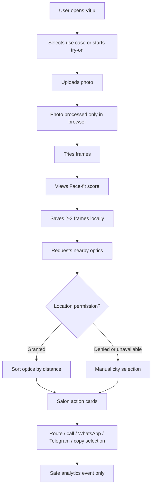

# Premium UI Redesign Plan for ViLu

Status: draft for engineering review  
Branch: `codex/premium-ui-redesign-plan`  
Date: 2026-06-18  
Owner: ViLu / Codex

## CEO Verdict

The current product has the right wedge: online try-on, Face-fit score, saved frames, nearby optics, and local/demo-safe profile mode. The weak point is not the product logic; it is the perceived craft. The UI currently reads closer to a loud demo landing page than to a premium optical decision tool.

Visual score today: 5/10. The app is usable, but the brand impression is not yet strong enough for a product that asks users to trust face photos, fit guidance, optical data, and salon intent.

Primary causes:

- Oversized display typography makes the hero feel uncontrolled on desktop and risky on mobile.
- Visual language mixes VisionLux legacy cues with ViLu positioning.
- Beige-heavy palette and decorative shapes make the product feel less precise than the optical category requires.
- The main value path is not always visible as a crisp workflow: upload photo -> fit score -> saved frames -> nearby optics.
- Product cards and modal cards feel like demo UI, not a confident retail/optical system.
- Trust copy exists, but it is scattered instead of integrated into key moments.
- Catalog and salon UI do not yet feel like a premium partner network.

Recommended mode: SELECTIVE EXPANSION. Do not expand backend scope. Do expand visual system, IA clarity, trust surfaces, and product-led composition.

## Reference Set

The goal is not to copy one site. The goal is to borrow category-proven patterns and adapt them to ViLu's wedge: preliminary frame-fit decision before a salon visit.

| Reference | What to study | Practice to adapt for ViLu |
|---|---|---|
| Warby Parker | Guided shopping, home try-on, product-led cards, trust strip | Use a calm guided flow and put `try on` or `start fit check` as the dominant product action. |
| Ray-Ban | Iconic product focus, customization, strong product photography | Make frames and selected styles the hero objects, not abstract decoration. |
| LensCrafters | Exam/store bridge and optical retail credibility | Make salon visit preparation feel legitimate and useful, not just a directory. |
| Zenni | Affordable online catalog and virtual try-on utility | Keep filters practical and fast, with clear shape/size/lens language. |
| EyeBuyDirect | Category navigation, shape/material/lens browsing, trust cards | Structure catalog around decisions: shape, use case, material, lens type, price. |
| GlassesUSA | Dense ecommerce conversion and prescription flow | Borrow conversion clarity, but avoid overwhelming ViLu with marketplace clutter. |
| Gentle Monster | Editorial premium art direction | Use restraint and strong imagery, but avoid fashion-first mystery that hides utility. |
| Oliver Peoples | Premium restraint, services, face coverage guide, boutique trust | Add fit/coverage language and boutique-service confidence to product and salon surfaces. |
| Persol | Heritage and craftsmanship | Use more tactile language for materials, hinges, acetate, and metal. |
| Oakley | Performance/lens specialization | For sport/sun/computer scenarios, show purpose and lens benefit clearly. |
| Ace & Tate | Modern optical retail and store experience | Keep the brand friendly and direct while preserving premium whitespace. |
| Cubitts | Editorial copy, frame sizing, virtual try-on, stores, exams | Combine witty craft with explicit size/fitting guidance. |
| Specsavers | Mainstream optical clarity and appointment intent | Make route/call/visit actions obvious for non-technical users. |
| JINS | Clean fast eyewear commerce | Use simple product grids and clear price/availability. |
| Moscot | Brand heritage and object photography | Use fewer, stronger visual elements and better frame storytelling. |
| MYKITA | Technical minimalism and precision | Add a more precise system feel for fit-score and measurements. |
| Silhouette | Lightweight premium positioning | Use more air and less heavy card decoration in premium sections. |
| Bailey Nelson | Retail warmth and approachable stores | Make salon cards human, local, and action-oriented. |
| Lenskart | Try-on and omnichannel funnel | Use the online-to-offline path as the central conversion. |
| FramesDirect | Prescription ecommerce conventions | Keep prescription/legal boundaries clear and avoid medical overclaiming. |

Detailed practices confirmed from reviewed sources:

- Warby Parker uses guided entry points like style quiz, try-on-oriented product actions, and reassurance around shipping/returns.
- EyeBuyDirect exposes shopping by shape, material, lens type, help center, free returns, service, and review trust.
- Oliver Peoples uses restrained premium navigation, services, warranties, shipping/returns, and face coverage guidance.
- Cubitts connects virtual try-on, stores, eye exams, frame sizes, product carousels, and editorial brand voice.

## Product North Star

ViLu should feel like a premium optical decision cockpit:

> Upload a photo, understand what fits, save 2-3 frames, and arrive at a nearby salon prepared.

This is not a generic eyewear shop. It is not a map directory. It is not a medical service. It is a trust-building pre-visit selection layer.

## Design Principles

1. Product first, decoration second.
   Frames, face-fit, saved selection, and nearby salons must be the first visual signals.

2. One clear path per screen.
   Each screen should answer: what has the user done, what is the next useful action, and what is safe/not stored.

3. Premium optical restraint.
   Less giant type, fewer decorative cards, tighter hierarchy, calmer spacing, better product imagery.

4. Trust appears at the moment of risk.
   Browser-only photo copy near upload. Local-only data copy near dashboard save. No medical diagnosis copy near recipe/fit score.

5. Dense where users compare, spacious where users decide.
   Catalog/cards can be scannable. Fit result and salon actions should be focused.

## Proposed Information Architecture

Primary navigation:

- `Онлайн-примерка`
- `Каталог`
- `Face-fit score`
- `Салоны`
- `Knowledge Base`

Secondary utility:

- Language toggle
- Demo profile
- Saved selection

Recommended first viewport:

- Brand: ViLu, not VisionLux.
- Hero promise: `Подберите оправу онлайн и найдите, где примерить похожие рядом`.
- Four-step rail: `Фото` -> `Face-fit` -> `Подбор` -> `Салон`.
- Primary CTA: `Начать подбор`.
- Secondary CTA: `Смотреть оправы`.
- Real product/try-on preview, not abstract decorative artwork.

## System Architecture

This redesign should remain frontend-only.

### Application Layers

- `Static shell`: Vite/React app served by GitHub Pages on `vilu.store`.
- `Presentation layer`: React components, Tailwind/CSS tokens, route pages.
- `Local state layer`: React state plus localStorage for saved selection and demo profile.
- `Static data layer`: product catalog and optics directory files.
- `Analytics layer`: safe event wrapper for Yandex Metrika.
- `External action layer`: maps, phone, WhatsApp, Telegram, optional Tally form.

### Key Modules to Preserve

- Product data and catalog routes.
- Try-on CJM and selection flow.
- Optics directory and salon modal/list.
- Knowledge Base pages and SEO assets.
- Analytics sanitizer.
- Demo/local dashboard data behavior.

## System Boundaries

### In Scope

- Visual redesign of home, catalog, product cards, try-on, salon cards, dashboard trust notices.
- Design tokens: type scale, colors, spacing, radii, shadows, focus states.
- Clearer IA and conversion hierarchy.
- Responsive pass for desktop, tablet, and iPhone layouts.
- Accessibility improvements: focus states, contrast, keyboard-safe modals.
- Analytics events for UI journey only, without personal data.

### Out of Scope

- Backend account system.
- Server-side photo storage.
- Server-side recipe/profile storage.
- Real checkout/payments.
- Claims that ViLu diagnoses vision or determines PD with medical accuracy.
- Replacing the optics directory with map/provider APIs.
- Sending personal data to analytics.

## Data Flow



Rules:

- Photo never leaves browser.
- Saved selection can be localStorage.
- Profile/demo data stays localStorage.
- Analytics receives only non-PII event names and coarse parameters.
- Tally, if enabled later, opens only after explicit user action and consent.

## State Transitions

### Try-On Flow

| State | Entry | Exit | UI requirement |
|---|---|---|---|
| `idle` | User lands or opens try-on | selects use case | Show value path and privacy reassurance. |
| `goal_selected` | Use case selected | photo uploaded or catalog explored | Keep next CTA singular. |
| `photo_uploaded` | Local image selected | try-on begins | Show browser-only photo note. |
| `tryon_active` | Frame overlay visible | score requested | Frame controls must be stable on mobile. |
| `fit_score_viewed` | Score generated | save frame | Explain what score can/cannot mean. |
| `selection_empty` | No frames saved | first frame saved | Show `save 2-3` target, not error. |
| `selection_partial` | 1-2 frames saved | 3 frames or optics | Progress should not wrap or look broken. |
| `selection_ready` | 2-3 frames saved | optics opened | Primary CTA becomes `Найти салон`. |
| `location_requested` | User asks nearby optics | granted/denied/manual | Explain location use before browser prompt. |
| `optics_visible` | Optics sorted or filtered | external action | Cards must expose route/call/messenger/copy. |

### Demo Profile Flow

| State | Behavior |
|---|---|
| `demo_default` | Demo values shown, no backend request. |
| `editing_local` | User changes fields locally. |
| `saved_local` | Toast confirms data saved on this device only. |
| `storage_unavailable` | Show in-session fallback notice. |
| `cleared` | Return to demo defaults. |

## Failure Modes

| Failure | Expected fallback |
|---|---|
| Geolocation denied | Manual city selection remains available. |
| Geolocation timeout | Manual city selection plus retry button. |
| No optics in selected city | Show closest known cities and copy-selection fallback. |
| Product/frame image missing | Use neutral frame placeholder and keep card dimensions stable. |
| Uploaded image unsupported | Show retry message, do not upload anything. |
| localStorage unavailable | Use in-memory state and show `not saved after refresh` notice. |
| Yandex Metrika blocked | Product continues normally with no visible error. |
| Tally URL missing | Copy selection to clipboard instead of opening a broken form. |
| External messenger unavailable | Use web fallback URL and keep copy selection action. |
| GitHub Pages direct route refresh | Must return 200 for main routes, not a visible 404. |
| Slow image/network | Skeleton or stable placeholder; no layout jump. |

## Edge Cases

- iPhone SE width and Safari dynamic toolbar.
- Very long Russian city names and addresses.
- User saves more than 3 frames.
- User removes all saved frames after opening optics.
- User denies location and leaves city blank.
- User opens salon modal from catalog without prior selection.
- User opens dashboard without registration.
- User enters real phone/email in demo profile.
- User has ad blocker blocking analytics.
- User has reduced motion enabled.
- Keyboard-only modal navigation.
- High contrast mode.
- Direct routes: `/products`, `/face-fit-score`, `/privacy`, `/terms`, `/disclaimer`.
- Language toggle must not break content hierarchy.

## Trust Boundaries

| Boundary | Rule |
|---|---|
| Browser photo | Process locally only; never send to server or analytics. |
| Demo profile | Store locally only; never send name/phone/email/recipe/complaints. |
| Analytics | Send event names and safe coarse params only. No PII, no prescription values. |
| Optics directory | Label partner vs listed source clearly. Do not promise exact stock. |
| External maps/messengers | User leaves ViLu context; make action explicit. |
| Knowledge Base | Informational only; no diagnosis or medical certainty. |
| Tally leads | Only after explicit CTA and consent. Do not prefill sensitive health/photo data. |

## Test Coverage Plan

### Unit Tests

- Selection reducer: add/remove/limit 3/duplicate behavior.
- Analytics sanitizer: blocks name, phone, email, recipe, complaints, photo fields.
- Optics filtering/sorting: city, manual query, distance fallback.
- Tally URL builder: safe params only, no sensitive fields.
- Fit-score label logic: ranges and disclaimer copy.

### Component Tests

- Hero first viewport: CTA visible at 390px, 768px, 1366px.
- Product card: stable image/card/button dimensions.
- Try-on controls: no wrapping or overlapping on mobile.
- Saved selection module: 0/1/2/3 selected states.
- Salon card: route/call/WhatsApp/Telegram/copy actions visible and not clipped.
- Dashboard demo notice and local save toast.

### E2E / Manual QA

- Home -> start -> upload -> try -> score -> save -> optics -> route/contact/copy.
- Catalog -> product -> try-on -> save -> optics.
- Geolocation grant, deny, timeout, and manual city flows.
- Direct route refresh for all SEO pages.
- Privacy/terms/disclaimer accessible from footer.
- Metrika enabled but no PII in network payloads.
- Keyboard open/close modal and tab through actions.

### Visual QA Viewports

- 390 x 844 iPhone.
- 430 x 932 large iPhone.
- 768 x 1024 tablet.
- 1366 x 768 laptop.
- 1440 x 900 desktop.

Pass condition: no text clipping, no hero overflow, no CTA hidden below accidental fold, no nested-card clutter, no modal content trapped behind footer actions.

### Regression Commands

```bash
npm run typecheck
npm run lint
npm run build
```

Post-deploy:

- Check `https://vilu.store/`.
- Check `https://vilu.store/products`.
- Check `https://vilu.store/face-fit-score`.
- Check `https://vilu.store/privacy`.
- Check Metrika real-time after deploy.

## Implementation Phases

### Phase 0: Branch and Baseline

- Create implementation branch from latest `main`.
- Capture screenshots of current home, products, try-on, salon modal, dashboard.
- Confirm current tests/build pass before edits.

### Phase 1: Design Tokens

- Establish ViLu tokens: type scale, neutral palette, accent palette, card rhythm, focus ring, shadow levels.
- Remove one-note beige dominance.
- Keep premium but not cold: off-white, optical black, mineral green, warm amber accent, cool gray support.
- Use smaller display scale and stronger body readability.

### Phase 2: Home Redesign

- Replace oversized hero with product-led workflow hero.
- Add four-step journey rail.
- Make `Начать подбор` primary and `Смотреть оправы` secondary.
- Show frame/fit/salon preview as actual product state.

### Phase 3: Try-On and Face-Fit

- Make saved selection progress professional: `0 из 3`, `1 из 3`, etc. in a stable badge.
- Create clearer score card with `что хорошо`, `что проверить в салоне`, `ограничения`.
- Make privacy copy visible but quiet.

### Phase 4: Catalog and Product Cards

- Add premium catalog controls: shape, use case, material, lens type.
- Keep cards dense but not cramped.
- Improve hover/focus states and CTA hierarchy.

### Phase 5: Salon Intent Layer

- Redesign salon cards as visit-prep cards, not directory cards.
- Include selected-frame context.
- Keep route/call/WhatsApp/Telegram/copy visible.
- Add `уточните наличие похожих моделей` copy.

### Phase 6: Dashboard Demo/Local Polish

- Keep demo/local mode intact.
- Make local-only notices consistent with the rest of the trust system.
- No backend or personal-data changes.

### Phase 7: QA and Release

- Run checks.
- Do visual QA across viewports.
- Open PR with screenshots before/after.
- Merge only after direct-route and Metrika smoke checks pass.

## Acceptance Criteria

The redesign is ready when:

- A first-time user understands the path in under 5 seconds.
- The first viewport feels premium and optical, not generic ecommerce.
- The app still works without backend and without registration.
- Photo/local profile privacy is clearer than before.
- Salon actions are easier to find after saving frames.
- Mobile layout has no visible overflow or clipped CTAs.
- No PII is sent to analytics.
- SEO/Knowledge Base routes still work.
- Build/typecheck/lint pass.

## What Not To Do

- Do not remove working CJM features.
- Do not add backend dependencies.
- Do not send photos, recipes, names, phones, or emails to analytics.
- Do not make medical claims.
- Do not turn ViLu into a generic map/directory.
- Do not bury the try-on path under a marketing landing page.
- Do not ship visual-only changes without testing state transitions.

## Engineering Manager Handoff

Recommended next step: open a separate implementation branch from `main`, using this document as the scope contract.

Suggested PR structure:

1. `design-tokens` commit.
2. `home-journey-redesign` commit.
3. `tryon-selection-fit-polish` commit.
4. `catalog-product-card-polish` commit.
5. `salon-intent-card-polish` commit.
6. `dashboard-local-trust-polish` commit.
7. `qa-screenshots-and-docs` commit.

Required review gates before deploy:

- Engineering review: architecture, state transitions, privacy/analytics safety.
- Design review: hierarchy, typography, mobile, premium feel.
- QA: live journey and direct routes.
- Canary after deploy on `vilu.store`.

## Sources

- Warby Parker: https://www.warbyparker.com/
- Ray-Ban: https://www.ray-ban.com/
- LensCrafters: https://www.lenscrafters.com/
- Zenni: https://www.zennioptical.com/
- EyeBuyDirect: https://www.eyebuydirect.com/
- GlassesUSA: https://www.glassesusa.com/
- Gentle Monster: https://www.gentlemonster.com/
- Oliver Peoples: https://www.oliverpeoples.com/
- Persol: https://www.persol.com/
- Oakley: https://www.oakley.com/
- Ace & Tate: https://www.aceandtate.com/
- Cubitts: https://cubitts.com/
- Specsavers: https://www.specsavers.com/
- JINS: https://www.jins.com/
- Moscot: https://moscot.com/
- MYKITA: https://mykita.com/
- Silhouette: https://www.silhouette.com/
- Bailey Nelson: https://baileynelson.com/
- Lenskart: https://www.lenskart.com/
- FramesDirect: https://www.framesdirect.com/
