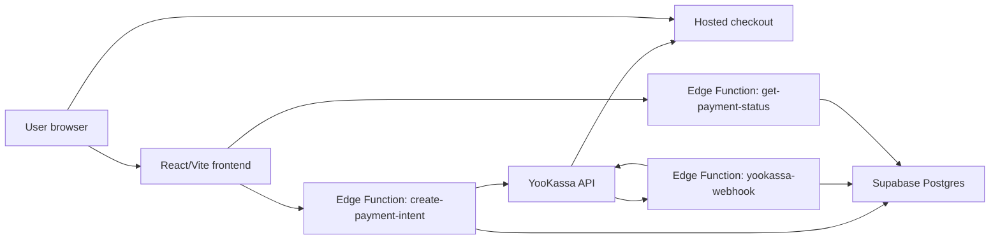
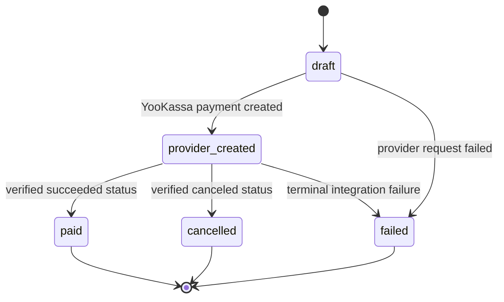
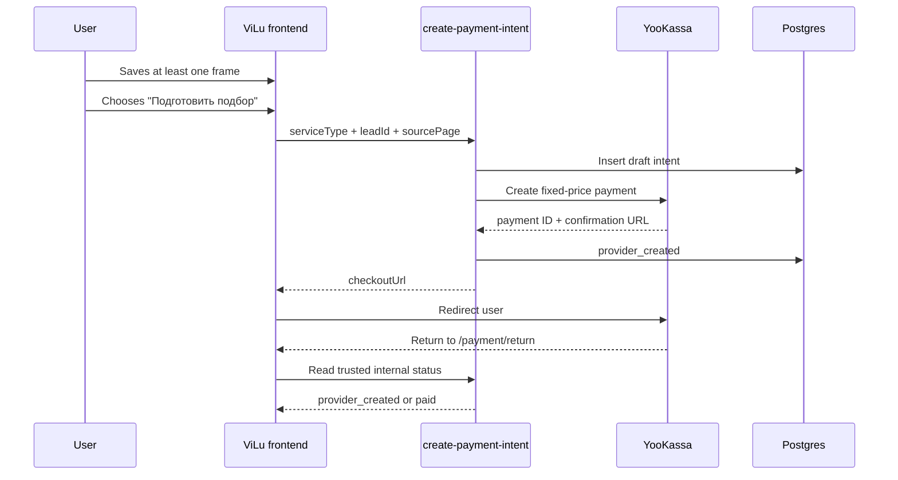

# ViLu Payments: YooKassa Integration Runbook

Status: safe test contour implemented, real charging is not enabled

Last reviewed: 2026-07-17

Owner flow: `visit_preparation` / "Подготовить подбор к визиту"  
Pilot price: 429 RUB

## 1. Purpose

This document describes how to replace the current fake payment door with a production-safe YooKassa redirect checkout without breaking the existing ViLu MVP.

The first paid unit is a service, not a medical product and not a frame purchase:

> ViLu prepares the user's 2-3 selected frames, visit checklist, and store handoff summary for an in-person fitting.

The frontend remains React/Vite on GitHub Pages. Payment creation, provider secrets, status transitions, and webhook processing live in Supabase Edge Functions and Postgres.

## 2. Current State

### Already implemented

- One service checkout at `/checkout` for entry from `/products`, product detail, and `/tryon`.
- A versioned, 24-hour shortlist draft in `src/services/serviceCheckout.ts`.
- The draft contains only 1-3 frame references and a store/city/later preference. It never contains a name, phone, email, messenger handle, or free-text contact.
- Contact and consent exist only in React memory for the active checkout page.
- The server creates the lead before it accepts a payment-intent request.
- Test payment UI and safe analytics events in `src/pages/Checkout.tsx`.
- Frontend payment adapter in `src/services/paymentService.ts`.
- Shared contracts in `src/types/backend.ts`.
- Server-owned 429 RUB offer in `supabase/functions/create-payment-intent/index.ts`.
- Public-safe status lookup in `supabase/functions/get-payment-status/index.ts`.
- RU/EN result pages at `/payment/return`, `/payment/success`, and `/payment/failed`.
- Client-generated idempotency keys and opaque public status tokens.
- `payment_intents` table and enum states in `supabase/migrations/20260715120000_create_visit_preparation_backend.sql`.
- RLS blocks direct public access to payment and lead tables.
- Face photos stay in the browser and are not part of payment payloads.

### Unified checkout contract

1. The catalog or try-on flow normalizes 1-3 frames into `ServiceCheckoutDraft`.
2. The frontend may persist that non-sensitive draft for 24 hours so a redirect or refresh can restore context.
3. The checkout collects an optional name, one contact channel/value, and explicit consent in component state only.
4. `submitVisitLead` validates the payload and creates a lead. No contact value is placed in a URL, browser storage, clipboard fallback, or analytics.
5. Only a successful lead result supplies the required `leadId` to `create-payment-intent`.
6. The Edge Function validates the lead ID and idempotency key, then writes a test intent with the server-owned amount of 429 RUB.
7. The current provider remains `none`; no real payment request or card charge occurs.
8. Payment status pages restore only the shortlist and store preference from the safe draft.

Safe analytics dimensions are limited to source page, selected-frame count, store-choice mode, locale, offer code, provider mode, and non-sensitive error code. Internal lead IDs, payment IDs, public tokens, contact values, store addresses, and exact coordinates are forbidden.

### Not implemented yet

- No YooKassa API call is made.
- No real checkout URL is returned.
- No webhook updates a payment to `paid`.
- No receipt/fiscalization configuration is connected.
- No production merchant credentials are configured.

### Release blockers before real charging

1. Connect the YooKassa test shop and keep `shopId` and `secretKey` in Supabase secrets.
2. Create a real YooKassa payment and persist its provider ID before transitioning to `provider_created`.
3. Add a verified, idempotent webhook; a browser return URL must never produce `paid`.
4. Complete receipt, refund, reconciliation, rate-limit, and restricted-CORS checks.

Do not set `PAYMENT_PROVIDER=yookassa` until these blockers are resolved.

## 3. Target Architecture



Trust boundaries:

- Browser input is untrusted.
- Supabase anon key is public by design; it never grants direct payment-table access.
- YooKassa shop ID and secret key are server secrets.
- Card details are entered only on YooKassa-hosted checkout.
- The frontend never decides price, payment status, or entitlement.
- Yandex Metrika receives event names and non-personal technical dimensions only.

## 4. Payment State Machine



Rules:

- `provider_created` requires a non-empty `provider_payment_id` returned by YooKassa.
- `paid` requires a server-side verification of `succeeded`, expected amount, currency, and internal payment-intent metadata.
- State changes must be idempotent and monotonic. A duplicate webhook must not create a second order or entitlement.
- Client-side return URLs never write payment state.

## 5. Server-Owned Offer Catalog

Create one server-side offer definition. Do not read the payable amount from the request body.

```ts
const PAYMENT_OFFERS = {
  visit_preparation_v1: {
    amountRub: 429,
    currency: 'RUB',
    description: 'ViLu: подготовка подбора к визиту',
  },
} as const;
```

The client sends only:

```json
{
  "leadId": "optional-uuid",
  "offerCode": "visit_preparation_v1",
  "sourcePage": "/tryon",
  "idempotencyKey": "client-generated-uuid"
}
```

The server resolves provider, price, currency, description, and return URL. The browser supplies only an idempotency UUID, never the payable amount.

## 6. API Contracts

### `POST /functions/v1/create-payment-intent`

Responsibilities:

1. Validate origin, payload, rate limit, and optional `leadId`.
2. Resolve `visit_preparation_v1` to 429 RUB on the server.
3. Insert a `draft` payment intent.
4. In the current test contour, save `draft` with provider `none` and return a ViLu status URL.
5. In the future YooKassa contour, create a payment with the same idempotency key.
6. Save `provider_payment_id` and transition to `provider_created` only after provider success.
7. Return the hosted confirmation URL.

Success response:

```json
{
  "paymentIntentId": "internal-uuid",
  "publicToken": "opaque-uuid",
  "offerCode": "visit_preparation_v1",
  "amountRub": 429,
  "currency": "RUB",
  "status": "draft",
  "providerMode": "test_not_connected",
  "returnUrl": "https://vilu.store/payment/return?token=opaque-uuid"
}
```

Safe error response:

```json
{
  "error": "payment_provider_unavailable",
  "requestId": "public-correlation-id"
}
```

Never return provider secrets, raw provider responses, contact values, or stack traces.

### `POST /functions/v1/yookassa-webhook`

Responsibilities:

1. Parse only supported payment events.
2. Load the payment from YooKassa API using the provider payment ID.
3. Compare provider metadata to the internal intent ID.
4. Verify amount, currency, provider payment ID, and expected service.
5. Apply an idempotent state transition.
6. Return `2xx` quickly for already-processed events.

The webhook must not trust a user browser, return URL query string, or analytics event.

### `POST /functions/v1/get-payment-status`

Request:

```json
{ "token": "opaque-public-token" }
```

Returns a minimal public projection:

```json
{
  "publicToken": "opaque-public-token",
  "offerCode": "visit_preparation_v1",
  "amountRub": 429,
  "currency": "RUB",
  "status": "draft",
  "providerMode": "test_not_connected"
}
```

Do not expose contact data, provider payloads, internal payment UUIDs, or other users' payment intents. Rotate or expire public tokens if the projection ever gains sensitive fields.

## 7. Database Changes

Add a new forward-only migration; do not edit the already-applied foundation migration.

Recommended fields:

```sql
alter table public.payment_intents
  add column if not exists idempotency_key uuid,
  add column if not exists paid_at timestamptz,
  add column if not exists failure_code text;

create unique index if not exists payment_intents_idempotency_key_uidx
  on public.payment_intents(idempotency_key)
  where idempotency_key is not null;

create unique index if not exists payment_intents_provider_payment_id_uidx
  on public.payment_intents(provider, provider_payment_id)
  where provider_payment_id is not null;
```

If webhook auditing is required, store a normalized event key and processing result. Do not store full raw provider payloads unless retention and access rules have been approved.

## 8. Secrets and Configuration

Configure these in Supabase project secrets, never in Vite variables or committed files:

```text
YOOKASSA_SHOP_ID
YOOKASSA_SECRET_KEY
YOOKASSA_RETURN_URL=https://vilu.store/payment/return
PAYMENT_PROVIDER=yookassa
PAYMENT_MODE=test
```

Existing server secrets remain required:

```text
SUPABASE_URL
SUPABASE_SERVICE_ROLE_KEY
```

Frontend configuration contains only public values:

```text
VITE_SUPABASE_URL
VITE_SUPABASE_ANON_KEY
```

Never create a `VITE_YOOKASSA_SECRET_KEY` variable.

## 9. Frontend Flow



UX requirements:

- Disable repeated clicks while creation is in progress.
- Show retry for recoverable provider errors.
- Do not show "Оплачено" immediately after redirect.
- Show "Проверяем оплату" until backend state is `paid` or terminal.
- Preserve the selected frame shortlist locally across the redirect.
- Keep RU/EN strings complete for every new state.

## 10. Analytics

Allowed events:

- `payment_door_viewed`
- `payment_intent_clicked`
- `backend_payment_intent_created`
- `payment_checkout_opened`
- `payment_status_paid`
- `payment_status_cancelled`
- `payment_status_failed`

Allowed parameters include service type, source page, currency, coarse amount bucket, and error code.

Forbidden analytics data:

- name, phone, email, messenger handle;
- card, bank, receipt, or provider credentials;
- provider payment ID or internal payment UUID;
- prescription, symptoms, complaints, face photo, landmarks;
- exact location.

Revenue dashboards must use verified backend `paid` records, not fake-door clicks or frontend events.

## 11. Security Checklist

- [ ] Price and currency are resolved server-side.
- [ ] YooKassa credentials exist only in Supabase secrets.
- [ ] CORS allows production and approved local origins only.
- [ ] Create-payment endpoint has rate limiting and payload size limits.
- [ ] Every provider create request has a unique idempotency key.
- [ ] Webhook processing is idempotent.
- [ ] Provider status, amount, currency, and metadata are verified server-side.
- [ ] RLS still denies direct anon access to payment tables.
- [ ] Logs redact authorization headers, contact values, and provider payloads.
- [ ] Return URL cannot mark a payment as paid.
- [ ] Error responses do not leak implementation details.

## 12. Test Matrix

| Case | Expected result |
|---|---|
| Valid test payment | Redirects to YooKassa and eventually becomes `paid` after verified webhook |
| User cancels checkout | Internal status becomes `cancelled`; selection remains available |
| Double-click payment CTA | One provider payment is created |
| Duplicate webhook | No duplicate entitlement or status regression |
| Browser attempts to add or change amount | Server ignores it and creates exactly 429 RUB |
| Forged return URL | UI remains pending; no `paid` transition |
| Forged webhook body | Verification fails; database is unchanged |
| Provider timeout | Intent becomes retryable/failed without duplicate charge |
| Missing Supabase config | Existing fake-door/local fallback remains understandable |
| iPhone Safari redirect | Checkout and return flow preserve the shortlist |
| RU/EN switch | All payment states and errors use the selected language |

Required automated coverage:

- Unit tests for offer lookup and state transitions.
- Contract tests for request validation and safe errors.
- Integration tests using YooKassa test shop.
- Webhook replay/idempotency test.
- E2E test for redirect, return, pending, and paid UI states.
- Regression test proving no photo or prescription enters payment payloads.

## 13. Release Plan

### Phase A: test shop

1. Add forward migration and new Edge Functions.
2. Configure YooKassa test credentials in a non-production Supabase project.
3. Deploy functions with `PAYMENT_MODE=test`.
4. Run the full test matrix on desktop and iPhone.
5. Confirm analytics distinguishes fake intent from verified payment.

### Phase B: guarded production

1. Complete merchant, offer, privacy, refund, receipt, and accounting readiness.
2. Configure production credentials in Supabase secrets.
3. Enable checkout for internal users or a small traffic percentage.
4. Monitor provider error rate, duplicate attempts, webhook delay, and paid conversion.
5. Expand only after reconciled provider and database totals match.

### Rollback

Set `PAYMENT_PROVIDER=none` and redeploy the functions. The frontend must fall back to the existing non-charging intent flow. Do not delete payment records during rollback.

## 14. Operational Reconciliation

Daily during the pilot, compare:

- YooKassa `succeeded` payments;
- ViLu `payment_intents.status = 'paid'`;
- amount and currency totals;
- refunds/cancellations;
- payments without a matching internal intent;
- internal intents without a terminal provider state.

Any mismatch blocks expansion of paid traffic.

## 15. Definition of Done

Real payments may be enabled only when:

1. All release blockers in section 2 are closed.
2. Test-shop E2E and webhook replay tests pass.
3. No secret appears in frontend assets, Git history, logs, or analytics.
4. A verified provider event is the only path to `paid`.
5. Receipt/refund/accounting ownership is documented.
6. Monitoring and rollback have been tested.
7. The fake-door wording is removed only from the traffic segment that can actually pay.

## 16. Primary References

- YooKassa API: https://yookassa.ru/developers/api
- YooKassa quick start: https://yookassa.ru/developers/payment-acceptance/getting-started/quick-start
- YooKassa payment lifecycle: https://yookassa.ru/developers/payment-acceptance/getting-started/payment-process
- YooKassa incoming notifications: https://yookassa.ru/developers/using-api/webhooks
- Supabase Edge Functions secrets: https://supabase.com/docs/guides/functions/secrets

## 17. Current Checkout Retry And Status Contract

The current test contour deliberately separates lead creation from payment creation:

1. Checkout validates contact and consent before any request.
2. A successful lead response is retained in component memory and mirrored in
   `sessionStorage` so a same-tab redirect or refresh can resume the attempt.
3. Payment creation receives that `leadId` and one idempotency key.
4. If payment creation fails, the retry reuses both values and does not create another
   lead.
5. The session record contains only `leadId`, a short-lived payment capability token,
   the idempotency key, and the draft timestamp. It never contains the customer's name,
   contact, selected-frame payload, prescription, or health data.
6. Terminal payment states clear or rotate the stored attempt as appropriate. A new
   browser session may create a new lead because contact data is never persisted.

The Tally fallback opens without contact details in query parameters. The fallback form
must ask the customer to enter their contact again, avoiding personal data in browser
history, referrer headers, and access logs.

The return page checks unfinished `draft` and `provider_created` statuses immediately,
then at 2, 5, 10, and 20 seconds. It stops after five total requests, on a terminal
status, on an API error, or when the component unmounts. After the polling budget is
exhausted, the user can request one manual refresh.

Regression commands:

```powershell
npm run typecheck
npm run lint
npm test
npm run test:checkout
npm run test:e2e
npm run build
npm run smoke
```
