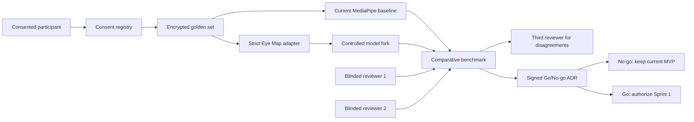

# Periorbital Sprint 0: offline validation spike

## Goal

Decide whether Eye Map creates enough product value to justify a user-facing
pilot. Sprint 0 produces reproducible evidence and a signed Go/No-go ADR. It
does not add a route, upload API, cloud processing, photo storage, or ML code to
the production ViLu application.

## Scope boundary

Sprint 0 runs in a separate private repository named `vilu-eye-map-ml`.
`optica-shop` contains only contracts, architecture, feature flags, and public
documentation. Photos, model weights, generated masks, and benchmark outputs
containing user data must never be committed to either Git repository.

The existing browser-side MediaPipe engine remains the production capture
precheck and fallback. `VITE_FEATURE_EYE_MAP` remains `false`.

## Offline architecture



All processing happens on a controlled machine with encrypted storage. There is
no public endpoint and no cloud photo-processing path in Sprint 0.

## Work packages

### 1. Artifact and licence lock

- Resolve the upstream Git commit SHA and package version.
- Enumerate selected weight files and record SHA-256 hashes.
- Verify preprocessing, architecture, classes, and output schema.
- Obtain written approval for code, dataset, weights, attribution, and
  commercial use.
- Store approved artifacts in a controlled private registry.
- Block the experiment if the weight licence or checksums remain unresolved.

### 2. Strict adapter and controlled fork

- Pin Python and every runtime dependency in the private ML repository.
- Wrap the model behind a ViLu-owned adapter; product code must never import the
  upstream package directly.
- Document each fork patch and its reason.
- Return a discriminated result:

```ts
type EyeMapInferenceResult =
  | {
      status: 'success';
      structures: Record<string, unknown>;
      modelVersion: string;
      artifactChecksum: string;
    }
  | {
      status: 'partial';
      structures: Record<string, unknown>;
      missing: string[];
      limitations: string[];
      modelVersion: string;
      artifactChecksum: string;
    }
  | {
      status: 'failure';
      code: string;
      retryable: boolean;
      modelVersion: string;
      artifactChecksum: string;
    };
```

Missing landmarks, irises, brows, or masks are `null`, `partial`, or `failure`.
Zero coordinates and zero areas must never be used as missing-value sentinels.

### 3. Governed golden set

- Collect exactly 150 explicitly consented real photos.
- Separate identity/contact records from image identifiers.
- Record consent version, allowed purpose, owner, retention deadline, deletion
  status, capture device, and cohort tags.
- Include iOS, Android, and desktop uploads; varied light, skin tones and age
  bands; glasses, makeup and partial occlusion; closed eyes; yaw, pitch, and
  roll; and different face sizes.
- Delete a photo and all derived outputs when consent is withdrawn.

### 4. Comparative product benchmark

Run both the current MediaPipe baseline and Eye Map on the same eligible
images. Report:

- usable-result rate;
- retake rate and retake reason;
- full, partial, and failure distribution;
- p50/p95 processing time, peak memory, and model size;
- no-face, multiple-face, missing-iris, missing-brow, NaN, zero-coordinate,
  impossible-area, and schema failures;
- per-cohort results and differences;
- reproducibility for identical inputs and artifact checksums.

Eye Map must improve usable results by at least 10 percentage points or reduce
retakes by at least 20% relative to MediaPipe. Any cohort regression above five
percentage points blocks Go until it is explained and approved in the ADR.

### 5. Blinded review

Two reviewers independently score anonymized, randomly ordered baseline and Eye
Map outputs using one fixed rubric:

1. required structures are present;
2. overlay follows the visible anatomy;
3. no unsupported measurement is displayed;
4. result is useful for capture guidance or frame placement;
5. retake guidance matches the visible defect.

Reviewers cannot see the model name. A third reviewer adjudicates disagreements.
The benchmark records inter-reviewer agreement and the adjudicated result.

## Go/No-go gates

Go requires every gate below:

1. Code, dataset, and weight licences plus artifact checksums are approved.
2. All 150 photos have valid governance records and deletion controls.
3. Pipeline success is at least 90% on quality-passed images.
4. Eye Map passes the comparative product-value gate.
5. No unexplained cohort regression exceeds five percentage points.
6. Sprint 0 reference-CPU p95 is at most 30 seconds.
7. Peak memory and model size are recorded and accepted.
8. Every invalid numeric artifact becomes an explicit partial/failure result.
9. Blinded dual review and adjudication are complete.
10. Product, engineering, privacy/legal, and medical-copy reviewers sign the
    Go/No-go ADR.

Go authorizes Sprint 1 design and implementation; it does not authorize
production launch. A user pilot additionally requires model p95 no more than
five seconds and end-to-end p95 no more than ten seconds on pilot
infrastructure.

No-go keeps the current MediaPipe capture, Face-fit score, and try-on. Capture
instructions discovered during the spike may still be adopted independently.

## Test matrix

| Layer | Test | Pass condition |
| --- | --- | --- |
| Adapter unit | Success, partial, failure parsing | No ambiguous or zero-sentinel output |
| Artifact | Version and SHA-256 verification | Runtime matches approved manifest |
| Reproducibility | Same input, same pinned artifacts | Equivalent result and stable schema |
| Failure injection | Missing iris/brow, NaN, empty mask | Explicit safe result; no crash |
| Comparative ML | MediaPipe versus Eye Map | Product-value gate met |
| Cohort | Device, light, age, skin tone, occlusion | No unexplained regression over 5 pp |
| Performance | Reference CPU and target pilot host | Sprint 0 and pilot thresholds reported |
| Privacy | Storage, logs, manifests, deletion | No PII leak; deletion removes derivatives |
| Manual | Two blinded reviewers | Adjudicated rubric complete |
| Product regression | Existing ViLu CI | Current routes and try-on remain green |

## Deliverables

- Completed `asset-manifest.json`.
- Private repository lockfile, adapter, fork record, and benchmark runner.
- Golden-set governance ledger and deletion evidence.
- Comparative report with failure, cohort, latency, memory, and model-size data.
- Blinded-review results and adjudication log.
- Signed Go/No-go ADR.

Sprint 1 work cannot begin until the ADR status is `Go`.
