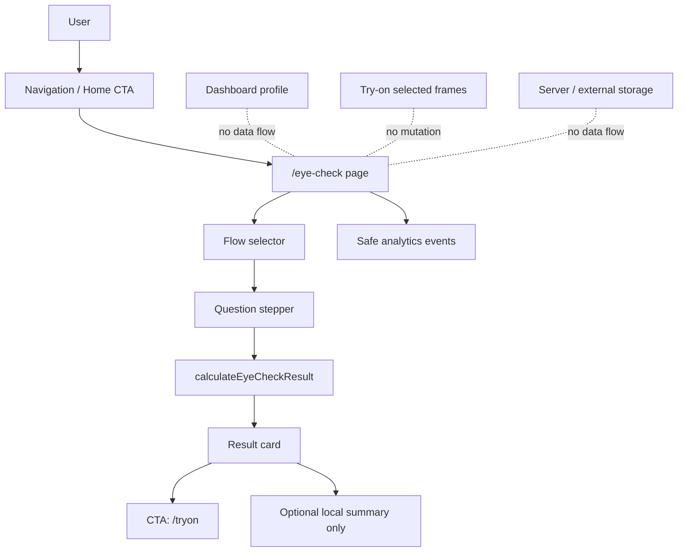
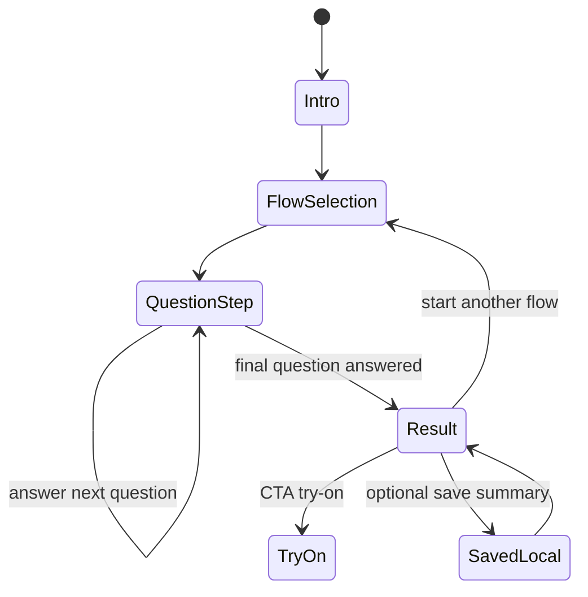

# ViLu Eye Check v0: Safe Standalone Self-Check Module

Updated: 2026-07-02  
Branch: `codex/vision-lifestyle-investor-positioning`  
Project: ViLu / optica-shop  
Stack: React + TypeScript + Vite + Tailwind CSS

## Purpose

Build `ViLu Eye Check` as a standalone, non-diagnostic self-check module that helps users decide whether an in-person vision check may be worth considering.

The feature must preserve the existing MVP:

- online try-on remains the primary product flow;
- Dashboard remains demo/local profile mode;
- prescription storage is not changed;
- eye exercises/training are not changed;
- MediaPipe try-on and Face-fit score are not changed;
- no server storage is introduced.

User-facing positioning:

> Короткий self-check, который помогает понять, стоит ли пройти очную проверку зрения. ViLu не ставит диагноз и не заменяет специалиста.

English:

> A short self-check that helps you understand whether an in-person vision check may be worth considering. ViLu does not diagnose and does not replace a specialist.

## Verified Current State

Checked against the repository on 2026-07-02:

| Area | Current file | Current behavior | Constraint for Eye Check |
|---|---|---|---|
| Routing | `src/App.tsx` | Manual `Page` union and `pathPageMap`; existing pages include `home`, `products`, `product`, `checkout`, `dashboard`, `admin`, `tryon`; Knowledge Base slugs are handled separately. | Add `eyecheck` without changing existing routes or Knowledge Base routing. |
| Navigation | `src/components/Navigation.tsx` | Desktop nav contains try-on, catalog, brand, stores; mobile menu has explicit buttons. | Add Eye Check as a secondary nav item; keep try-on primary. |
| Dashboard | `src/pages/Dashboard.tsx` | Demo/local profile with personal fields, prescription fields, complaints, training sessions; stores profile/session data in localStorage. | Do not import or mutate Dashboard state/storage. |
| Try-on | `src/pages/TryOnPilot.tsx` | Handles try-on, Face-fit score, selected frames, nearby optics intent. | CTA may navigate to try-on, but Eye Check must not change try-on state directly. |
| Analytics | `src/lib/analyticsEvents.ts` | `trackEvent` filters sensitive param keys such as name, phone, email, prescription, photo. | Add safe Eye Check events and extend blocked keys for answer/symptom/child/age/raw health context. |
| Legal pages | `/privacy`, `/terms`, `/disclaimer` | Existing legal pages cover local/demo mode and disclaimers. | Add Eye Check-specific non-diagnostic and local-only wording. |

## Product Principles

Use:

- self-check;
- предварительная оценка;
- признаки, при которых стоит обратиться к специалисту;
- очная проверка зрения;
- не является диагнозом;
- не заменяет офтальмолога / оптометриста / специалиста.

Avoid:

- диагностика зрения онлайн;
- проверить диоптрии онлайн;
- определить миопию;
- тест на глаукому;
- тест на катаракту;
- лечебные упражнения;
- предотвратить снижение зрения;
- сохранить зрение;
- medical diagnosis;
- exact medical screening;
- disease detection.

## Scope v0

Implement four self-check flows:

1. Adult Eye Comfort Check  
   Screen and near-work comfort signs.

2. Child Vision Risk Check  
   Parent checklist for signs that may justify in-person vision check.

3. One-eye Comparison Check  
   Guided comparison between right and left eye without calibrated measurement.

4. Amsler Grid Guide  
   Non-diagnostic central-vision guide with strong in-person-care wording if lines appear distorted, missing, wavy, or different between eyes.

## Non-Goals

Do not build:

- exact visual acuity measurement;
- Snellen/Sivtsev calibrated chart;
- diopter estimation;
- prescription recommendation;
- PD measurement;
- disease detection;
- photo diagnosis;
- face or eye image analysis;
- server-side storage;
- doctor appointment booking;
- medical device claims;
- exercise or treatment plan.

## Architecture



## Data Model

Create `src/types/eyeCheck.ts`:

```ts
export type EyeCheckFlowId =
  | 'adult-comfort'
  | 'child-risk'
  | 'one-eye-comparison'
  | 'amsler-grid';

export type EyeCheckRiskLevel =
  | 'info'
  | 'check-soon'
  | 'do-not-delay'
  | 'urgent';

export interface EyeCheckQuestion {
  id: string;
  text: string;
  helpText?: string;
  type: 'single' | 'boolean' | 'scale';
  options?: Array<{
    value: string;
    label: string;
    score: number;
    redFlag?: boolean;
  }>;
}

export interface EyeCheckFlow {
  id: EyeCheckFlowId;
  title: string;
  subtitle: string;
  audience: 'adult' | 'child' | 'all';
  estimatedMinutes: number;
  questions: EyeCheckQuestion[];
  disclaimer: string;
}

export interface EyeCheckAnswer {
  questionId: string;
  value: string;
  score: number;
  redFlag?: boolean;
}

export interface EyeCheckResult {
  flowId: EyeCheckFlowId;
  totalScore: number;
  riskLevel: EyeCheckRiskLevel;
  title: string;
  summary: string;
  reasons: string[];
  recommendedActions: string[];
  ctaPrimary: 'tryon' | 'nearby-optics' | 'none';
}
```

Important correction from the source spec:

- Do not include `dashboard` in `ctaPrimary`.
- Eye Check must not push users into Dashboard or write to Dashboard localStorage.

## Files To Add

| File | Purpose |
|---|---|
| `src/types/eyeCheck.ts` | Shared types. |
| `src/data/eyeCheckFlows.ts` | RU flow copy and question definitions. |
| `src/lib/eyeCheckScoring.ts` | Pure scoring function. |
| `src/lib/eyeCheckStorage.ts` | Optional local summary storage only. |
| `src/pages/EyeCheck.tsx` | Standalone page. |
| `src/components/eyecheck/EyeCheckIntro.tsx` | Non-diagnostic intro. |
| `src/components/eyecheck/EyeCheckFlowSelector.tsx` | Four flow cards. |
| `src/components/eyecheck/EyeCheckQuestionCard.tsx` | One-question-at-a-time UI. |
| `src/components/eyecheck/EyeCheckResultCard.tsx` | Result, reasons, next actions. |
| `src/components/eyecheck/AmslerGrid.tsx` | CSS/SVG grid and instructions. |

## Files To Update

| File | Change |
|---|---|
| `src/App.tsx` | Add `eyecheck` page and `/eye-check`, `/eyecheck`, `/vision-check` path aliases. |
| `src/components/Navigation.tsx` | Add secondary Eye Check nav item to desktop and mobile. Keep try-on as primary. |
| `src/pages/Home.tsx` | Add one secondary card/section for ViLu Eye Check; do not make it more prominent than try-on. |
| `src/lib/analyticsEvents.ts` | Add safe Eye Check events and strengthen param filtering. |
| `src/pages/Privacy.tsx` or legal content source | Add local-only Eye Check wording. |
| `src/pages/Disclaimer.tsx` or legal content source | Add non-diagnostic Eye Check wording. |
| `public/sitemap.xml` | Add `https://vilu.store/eye-check`. |
| `public/llms.txt` | Add Eye Check as non-diagnostic self-check module. |

## Routing Requirements

Add to `src/App.tsx`:

- `type Page` includes `eyecheck`;
- `pathPageMap` includes:
  - `'eye-check': 'eyecheck'`;
  - `'eyecheck': 'eyecheck'`;
  - `'vision-check': 'eyecheck'`.
- Render:
  - `{currentPage === 'eyecheck' && <EyeCheck onNavigate={handleNavigate} />}`.

Do not change:

- `/`;
- `/tryon`;
- `/catalog`;
- `/products`;
- `/dashboard`;
- `/privacy`;
- `/terms`;
- `/disclaimer`;
- Knowledge Base slug routing.

## Flow State Machine



## Scoring Rules

Implement `calculateEyeCheckResult(flow, answers)` as a pure function.

General thresholds:

| Score | Level |
|---:|---|
| 0-4 | `info` |
| 5-9 | `check-soon` |
| 10-15 | `do-not-delay` |
| 16+ | `do-not-delay` |

Flow-specific rules:

- Adult comfort: keep wording softer unless red flags exist.
- Child risk: lower threshold for `check-soon`.
- One-eye comparison: strong asymmetry should be `do-not-delay`.
- Amsler grid: distortion, missing areas, dark spot, or clear difference between eyes should be `do-not-delay`; sudden onset language should be `urgent`.

Red flags:

- sudden vision loss;
- eye pain;
- eye trauma;
- chemical exposure;
- flashes;
- curtain/shadow in field of vision;
- strong light sensitivity;
- double vision;
- white pupil reflex in child;
- child eye drift/turn;
- strong one-eye asymmetry.

Never output:

- "у вас заболевание";
- "у ребенка миопия";
- "мы обнаружили";
- "диагноз";
- exact disease names as result labels.

Preferred result wording:

`info`:

> По ответам нет явных тревожных признаков. Если вы давно не проверяли зрение, плановая проверка все равно полезна.

`check-soon`:

> Есть признаки зрительной нагрузки или возможной необходимости коррекции. Рекомендуем пройти очную проверку зрения.

`do-not-delay`:

> Есть признаки, при которых лучше не откладывать визит к специалисту.

`urgent`:

> При внезапном ухудшении зрения, боли, травме, вспышках, занавесе, двоении, белом зрачковом рефлексе у ребенка или сильной асимметрии обратитесь за медицинской помощью срочно.

## Analytics

Add safe events:

```ts
EyeCheckOpened: 'eye_check_opened',
EyeCheckFlowSelected: 'eye_check_flow_selected',
EyeCheckCompleted: 'eye_check_completed',
EyeCheckResultViewed: 'eye_check_result_viewed',
EyeCheckSavedLocal: 'eye_check_saved_local',
EyeCheckCtaTryOn: 'eye_check_cta_tryon',
EyeCheckCtaNearbyOptics: 'eye_check_cta_nearby_optics',
```

Do not send `eye_check_question_answered` in v0. This keeps health-context analytics safer.

Allowed params:

- `flow_id`;
- `question_index` only if needed for UI debugging and never with answer values;
- `risk_level`;
- `source`;
- `completed`.

Forbidden params:

- answers;
- raw symptoms;
- child data;
- name;
- phone;
- email;
- birth date;
- age;
- prescription;
- diagnosis;
- photo;
- exact location.

Strengthen `blockedParamPatterns` in `src/lib/analyticsEvents.ts` with:

```ts
/answer/i,
/symptom/i,
/child/i,
/age/i,
/birth/i,
/diagnos/i,
/medical/i,
/health/i,
```

## Storage

Default v0 behavior:

- do not save answers;
- do not save result automatically;
- do not write to Dashboard storage keys;
- do not use server storage.

Optional "Save locally" button may store summary only:

```ts
{
  flowId: EyeCheckFlowId;
  riskLevel: EyeCheckRiskLevel;
  createdAt: string;
  totalScore: number;
  recommendedActions: string[];
}
```

Storage key:

`vilu_eye_check_results`

Do not store:

- answers;
- child name;
- medical history;
- personal data;
- prescription;
- raw symptom text.

## UI Requirements

- Mobile-first.
- One question per screen.
- Large answer buttons.
- Clear progress indicator.
- Short result card.
- Strong local-only notice.
- Strong non-diagnostic disclaimer.
- CTA to existing try-on flow.
- No scary wording unless urgent red flags.
- No disease labels as result.
- No contact fields.
- No login requirement.
- Use existing ViLu color system; do not introduce new accent colors.
- On dark backgrounds: white or ViLu yellow text only.
- On light backgrounds: dark text.

## Required Copy

Global disclaimer:

> ViLu Eye Check не является медицинской диагностикой, не определяет заболевание, не измеряет диоптрии и не заменяет офтальмолога или оптометриста. Результат помогает понять, стоит ли пройти очную проверку.

Emergency disclaimer:

> Если есть внезапное ухудшение зрения, боль, травма глаза, химическое воздействие, вспышки, занавес/тень в поле зрения, сильная светобоязнь, двоение или белый зрачковый рефлекс у ребенка — обратитесь за медицинской помощью срочно.

Child disclaimer:

> Детский чеклист не ставит диагноз. Если вы замечаете, что ребенок щурится, закрывает один глаз, жалуется на головные боли, стал хуже читать или один глаз заметно отклоняется — стоит пройти очную проверку у детского специалиста.

## Privacy / Legal Updates

Privacy page addition:

> Eye Check results are calculated in the browser. Answers are not sent to the server. If the user chooses to save a result, only a local summary is stored in the browser.

Disclaimer page addition:

> Eye Check is not a medical examination, diagnosis, treatment recommendation, or substitute for professional care.

## Failure Modes

| Failure | Expected behavior |
|---|---|
| User opens `/eye-check` directly | Page renders without login. |
| User refreshes mid-flow | Flow may reset; no data loss claim. |
| User leaves before completing | No result is saved or sent. |
| localStorage unavailable | Feature still works; save-local button shows non-blocking error. |
| Analytics unavailable | Feature still works. |
| User selects urgent red flag | Show urgent wording and specialist-care recommendation; do not show disease names. |
| User clicks nearby optics before try-on | Explain that stores are best opened after selecting frames; route to try-on. |

## Testing Plan

| Layer | What | Count |
|---|---|---:|
| Unit | `calculateEyeCheckResult` thresholds and red flags | +8 |
| Unit | `eyeCheckStorage` local summary only | +3 |
| Integration/manual | `/eye-check` direct route and navigation route | +2 |
| Integration/manual | Complete all four flows without login | +4 |
| Integration/manual | CTA from result to `/tryon` | +1 |
| Privacy/manual | Network tab: no answers/personal/health data sent | +1 |
| Regression/manual | Existing routes `/`, `/tryon`, `/catalog`, `/dashboard`, `/privacy`, `/disclaimer` still open | +6 |

Commands:

```bash
npm run typecheck
npm run lint
npm run build
```

If a project script is unavailable or fails due to existing unrelated debt, document the exact failure and still run `npm run build`.

## Acceptance Criteria

1. `/eye-check` opens directly.
2. Navigation opens `/eye-check`.
3. Existing routes still work: `/`, `/tryon`, `/catalog`, `/dashboard`, `/privacy`, `/terms`, `/disclaimer`.
4. Adult Eye Comfort Check can be completed without login.
5. Child Vision Risk Check can be completed without login.
6. One-eye Comparison Check can be completed without login.
7. Amsler Grid Guide can be completed without login.
8. Result shows `riskLevel`, short summary, reasons, and recommended actions.
9. No result uses diagnosis or disease wording.
10. No answers are sent to analytics.
11. Analytics only receives safe event names and safe params.
12. Dashboard profile is not modified.
13. Dashboard exercises are not modified.
14. Try-on state is not modified before explicit CTA navigation.
15. No personal data, prescription data, photo, exact location, or raw symptom text is collected.
16. Privacy and disclaimer pages mention Eye Check.
17. `sitemap.xml` includes `https://vilu.store/eye-check`.
18. `llms.txt` describes Eye Check as non-diagnostic.
19. `npm run build` passes.
20. Feature can be reverted by removing Eye Check files and route additions without affecting try-on.

## Rollback Plan

Revert the Eye Check PR. Because the module is standalone and does not migrate data or mutate Dashboard/TryOn state, rollback is code-only:

- remove `/eye-check` route;
- remove Eye Check nav/home links;
- remove Eye Check files;
- remove sitemap/llms entries;
- remove Eye Check analytics constants.

No data migration or cleanup is required, except optional localStorage summaries in user browsers.

## Implementation Phases

1. Types, flow data, scoring, storage.
2. UI components and standalone page.
3. Routing, navigation, home entry.
4. Legal, sitemap, llms.
5. Build, manual regression, safe analytics check.

## Out Of Scope

- Medical diagnosis.
- Visual acuity calibration.
- Diopter or PD measurement.
- AI/photo eye analysis.
- Server-side storage.
- Doctor booking.
- Dashboard integration.
- Training/exercise recommendations.
- Claims about preventing vision decline.

## Commit Message

`Add standalone ViLu Eye Check self-check module`
