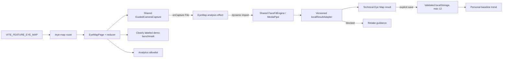
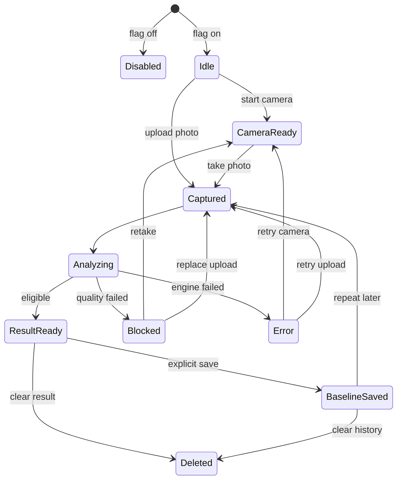

# ViLu Eye Map: клиентская функция и когортные сравнения

Статус: Engineering and design-reviewed execution spec for local v1
Версия: 1.3
Дата: 2026-07-20
Связанная техническая спека: `docs/specs/periorbital-product-technical-spec.md`

## 1. Решение

Eye Map становится отдельной необязательной клиентской функцией ViLu.

Функция помогает:

1. Сделать повторяемый снимок внешней области глаз.
2. Понять, достаточно ли качественный снимок.
3. Создать личную визуальную точку отсчета.
4. Сравнить новый снимок с собственной историей.
5. После отдельного согласия увидеть описательное сравнение с достаточно
   большой анонимной группой похожих пользователей.

Eye Map не является медицинской диагностикой, не оценивает здоровье глаза,
не выявляет заболевания и не заменяет очный осмотр.

### 1.1. Зафиксированный объем local v1

Первый релиз работает полностью в браузере и не создает новый backend-контур.

- отдельный необязательный маршрут `/eye-map`;
- существующие `GuidedCameraCapture`, MediaPipe Face Landmarker и
  `FaceFitMeasurement` переиспользуются без связи с состоянием `/tryon`;
- фотография существует только в памяти вкладки и не сохраняется;
- сохраняются только технические показатели, метаданные совместимости и
  максимум 12 локальных результатов;
- личная динамика строится относительно собственного baseline;
- реальное когортное сравнение, анкета, API, upload, очередь, серверное ML и
  online learning не входят в local v1;
- будущая ценность когорт показывается только отдельным блоком
  `Демонстрационные данные`, без персонального рейтинга и без выдачи
  синтетических цифр за данные пользователей;
- единый аварийный выключатель функции — существующий
  `VITE_FEATURE_EYE_MAP`.

Первый PR включает прямой `/eye-map` и вход из Vision Tracker. Передача уже
снятого фото из `/tryon` намеренно вынесена в Phase 1.1: она не нужна для
проверки самостоятельной ценности Eye Map и не должна расширять контракт
примерки в первом изменении.

Решения инженерного review: D1–D12 — вариант A, кроме D6, где выбран гибрид:
реальная личная динамика плюс явно маркированный демонстрационный пример
будущего когортного интерфейса.

Эта спецификация не отменяет Go/No-go gate из связанной технической спеки.
Phase 1 можно реализовывать в ветке с `VITE_FEATURE_EYE_MAP=false`, но включать
маршрут пользователям разрешено только после подписанного `Go`. При `No-go`
сохраняются только безопасные общие улучшения guided camera, а Eye Map остается
выключенным.

## 2. Продуктовое обещание

Основная формулировка:

> Eye Map помогает делать сопоставимые снимки области вокруг глаз, видеть
> изменения относительно собственной точки отсчета и получать безопасный
> контекст по анонимной группе похожих пользователей.

Короткий вариант:

> Ваша визуальная карта глаз: качество снимка, личная динамика и контекст.

Запрещенные формулировки:

- здоровее или хуже других;
- риск заболевания;
- признаки диагноза;
- медицинская норма;
- точная оценка усталости;
- AI определил состояние глаз;
- результат улучшается автоматически по мере использования сервиса.

## 3. Почему это отдельная функция

Eye Map и онлайн-примерка используют один локальный сценарий съемки, но решают
разные задачи.

| Функция | Пользовательская задача | Результат |
| --- | --- | --- |
| Онлайн-примерка | Понять, как выглядит и сидит оправа | Оверлей оправы, Face-fit score, подбор |
| Eye Map | Получить повторяемый визуальный baseline | Инфографика снимка, личная динамика, когортный контекст |

Отказ Eye Map не должен блокировать примерку, каталог, Eye Check, Vision
Tracker, checkout или поиск салона.

### 3.1. Что уже существует и переиспользуется

- `src/components/tryon/GuidedCameraCapture.tsx` — камера, preview и guidance;
- `src/lib/faceFitEngine.ts` — локальный MediaPipe-анализ;
- `src/pages/TryOnPilot.tsx` — будущий источник контекстного CTA в Phase 1.1;
- `src/pages/EyeCheck.tsx` — экран Vision Tracker и источник CTA
  `Создать Eye Map`;
- `src/App.tsx` — ручная регистрация маршрутов;
- `src/components/Navigation.tsx` — общая шапка без нового Eye Map пункта;
- `useLanguage()` — текущий источник языка; Eye Map получает отдельный
  типизированный словарь и не расширяет DOM-based
  `src/components/LanguageDomBridge.tsx`;
- `src/lib/analyticsEvents.ts` — allowlist-события аналитики.

План не вводит новый UI framework, state-machine package, camera library или
вторую дизайн-систему.

## 4. Ценность по приоритету

Приоритет ценности фиксирован:

1. Личная точка отсчета.
2. Сопоставимость повторных снимков.
3. Понятное качество фотографии.
4. Личная динамика.
5. Когортный контекст.

Когортное сравнение не показывается раньше личного результата и не является
главным выводом экрана.

## 5. Целевой пользовательский сценарий

Eye Map работает как один последовательный сценарий на одной странице. В
каждый момент пользователь видит только текущий шаг, его результат и одно
главное действие. Назад можно вернуться без потери уже полученного безопасного
результата.

| Шаг | Содержание | Главное действие |
| --- | --- | --- |
| 1. Польза и доверие | Коротко объяснить личную точку отсчета, local-only обработку и немедицинское ограничение | `Создать Eye Map` |
| 2. Подготовка | Три требования: смотреть прямо, камера на уровне глаз, лицо занимает 40–60% кадра | `Открыть камеру` |
| 3. Съемка и анализ | Guided camera, один live-hint, затем последовательный статус анализа | `Сделать снимок` |
| 4. Личный результат | Вывод о пригодности снимка, изображение области глаз и четыре технические метрики | `Сохранить точку отсчета` или `Переснять` |
| 5. Baseline и история | Дата baseline, сопоставимость с прошлым снимком, удаление локальной истории | `Сравнить с прошлым` |
| 6. Demo benchmark | Отдельный preview будущего когортного сравнения с постоянной маркировкой | Disabled CTA с объяснением доступности |

Переходы анализа отображаются последовательно:

```text
Проверяем качество снимка
  -> Строим Eye Map
  -> Eye Map готов
```

Загрузка существующего фото остается вторичным действием под камерой. Она не
конкурирует с основным CTA съемки.

## 6. Точки входа

Обязательные:

- `/eye-map` — самостоятельная страница функции;
- Vision Tracker — контекстная карточка `Создать Eye Map`.

Eye Map не добавляется в верхнюю навигацию local v1 и не становится
обязательным шагом основного CJM. Прямой `/eye-map` сохраняется для тестирования.

Phase 1.1 после стабилизации самостоятельного сценария добавляет в примерку
необязательный CTA `Посмотреть Eye Map по этому фото`. Передача снимка будет
возможна только в памяти текущей вкладки. При перезагрузке или открытии новой
вкладки пользователь делает или выбирает фото заново.

## 7. Экран результата

### 7.1. Верхний блок

- заголовок `Ваш Eye Map готов`;
- дата и время снимка;
- статус `Снимок подходит для сравнения` или `Лучше переснять`;
- короткий дисклеймер `Это визуальная, а не медицинская оценка`;
- крупное изображение области глаз;
- переключатель `Показать ориентиры`, выключенный по умолчанию.

Главный вывод всегда предшествует метрикам:

- пригодный снимок: `Снимок подходит для наблюдения`;
- непригодный снимок: `Лучше переснять фотографию`;
- blocked/error: одна конкретная причина и CTA `Переснять`.

Один сводный `Eye Map score 0–100` не показывается: он создает ложную
медицинскую и рейтинговую интерпретацию. Число допустимо только для
`repeatability_score` и только рядом с прямым объяснением
`Сопоставимость с вашей точкой отсчета`.

### 7.2. Инфографика v1

Показывать только проверяемые технические и нормализованные показатели:

| Показатель | Пользовательское название | Представление |
| --- | --- | --- |
| `capture_quality` | Качество снимка | Хорошее / допустимое / переснять |
| `alignment_quality` | Положение лица | Индикатор и короткая подсказка |
| `eye_visibility` | Видимость области глаз | Левый/правый индикатор |
| `repeatability_score` | Сопоставимость с baseline | 0–100 и объяснение |
| `change_from_baseline` | Изменение от вашей точки отсчета | Диапазон, не диагноз |

В интерфейсе показатели выводятся компактными строками под изображением, а не
мозаикой декоративных карточек. Каждая строка содержит название, состояние и
одно предложение `что это значит`. Красный/зеленый не используются как
диагностическая шкала; текст и иконка полностью объясняют состояние.

Текущий `faceFitEngine` не измеряет освещенность. Показатель равномерности
света нельзя выводить, пока не появятся отдельный детерминированный алгоритм,
golden set и тесты. Поля local v1 строятся только через версионированный
адаптер:

| Результат Eye Map | Источник в `FaceFitMeasurement` | Правило |
| --- | --- | --- |
| `capture_quality` | `status`, `confidence` | Пороговые значения живут только в адаптере |
| `alignment_quality` | `eyeLineTiltDeg`, `bridgeOffsetPct` | Показывать нейтральную подсказку, не медицинский вывод |
| `eye_visibility` | `status`, наличие ориентиров обоих глаз | Не сохранять сами `overlayPoints` |
| `repeatability_score` | совместимые версии + нормализованное отклонение | Доступен только при наличии baseline |
| `change_from_baseline` | нормализованный технический вектор | Только диапазон изменения без `лучше`/`хуже` |

`frameCenterX`, `frameCenterY`, `eyeDistanceRatio` и `frameWidthHint`
используются для нормализации и подсказок съемки, но не выдаются за измерение
анатомии или физический размер.

До отдельной клинической и ML-валидации запрещено выводить:

- покраснение;
- отечность;
- темные круги;
- усталость;
- воспаление;
- асимметрию как патологию;
- вероятность заболевания;
- физические размеры в миллиметрах.

### 7.3. Личная динамика

Если baseline отсутствует:

- показать `Это ваша первая точка отсчета`;
- объяснить пользу повторного снимка в похожих условиях;
- предложить напоминание без обязательной регистрации.

Если baseline существует:

- сравнивать только результаты совместимых версий модели;
- явно показывать даты;
- отмечать низкую сопоставимость снимков;
- не делать вывод, что изменение является улучшением или ухудшением здоровья.

## 8. Когортное сравнение

### 8.1. Принцип

В local v1 реального когортного сравнения нет. Основной результат использует
только личный baseline. Ни возраст, ни пол, ни вес, ни экранное время, ни тип
работы, ни семейный статус в local v1 не запрашиваются и не сохраняются.

После личной динамики можно показать отдельный preview-блок:

- заголовок `Пример будущего сравнения с группой`;
- постоянный бейдж `Демонстрационные данные`;
- пояснение, что значения не рассчитаны по текущим пользователям и не
  относятся к состоянию зрения посетителя;
- пример допустимых широких признаков и правило `N >= 100`;
- без численного процентиля, рейтинга и выводов `лучше`/`хуже`.

Остальная часть раздела описывает только будущую серверную фазу и не является
acceptance scope local v1.

Пользователь видит не данные других людей, а агрегированный диапазон:

- медиана;
- межквартильный диапазон;
- широкая позиция пользователя внутри распределения;
- размер группы в округленном виде.

Безопасные тексты:

- `В диапазоне большинства сопоставимых снимков`;
- `Выше медианы по техническому визуальному показателю`;
- `Сравнение пока недоступно: недостаточно данных в группе`;
- `Разница может быть связана с освещением, камерой и условиями съемки`.

Не использовать:

- лучше/хуже;
- норма/отклонение;
- здоровый/нездоровый;
- рейтинг пользователя;
- лидерборд;
- точный процентиль при малой выборке.

### 8.2. Минимальный размер группы

- базовый порог отображения: `N >= 100`;
- порог конфигурируется только сервером;
- при `N < 100` статистика не возвращается клиенту;
- размер группы округляется, например `100+`, `250+`, `500+`;
- запрещена выдача строк отдельных пользователей;
- запрещены произвольные комбинации фильтров на фронтенде.

### 8.3. Основные признаки когорты v1

| Признак | Формат | Обязательность | Причина |
| --- | --- | --- | --- |
| Возраст | диапазон 18–24, 25–34 и т. д. | добровольно | Устойчивый фактор различий |
| Пол | добровольный категориальный ответ | добровольно | Возможны систематические различия |
| Экранное время | <2, 2–4, 4–6, 6–8, 8+ часов | добровольно | Связано с нагрузкой и морганием |
| Тип работы | экранная, смешанная, вождение, улица, ночные смены | добровольно | Описывает характер нагрузки |
| Контактные линзы | нет, иногда, ежедневно | добровольно | Релевантный контекст поверхности глаза |
| Сон | длительность и субъективное качество | добровольно | Влияет на сопоставимость контекста |
| Среда | сухой воздух/кондиционер, обычная, улица | добровольно | Важный внешний контекст |

Для одного сравнения сервер использует не более двух пользовательских
измерений одновременно плюс технические условия съемки. Это предотвращает
слишком маленькие группы.

### 8.4. Дополнительные исследовательские признаки

Собирать только после отдельного решения privacy/clinical review:

- аллергические симптомы;
- использование косметики вокруг глаз;
- курение или вейпинг;
- время на улице;
- ночные смены;
- использование увлажнителя;
- недавние операции на глазах;
- отдельные лекарственные факторы.

Эти поля чувствительны и не должны попадать в аналитику.

### 8.5. Вес и семейный статус

Пользователь запросил сравнение по весу и семейному статусу. В v1 эти признаки
не являются активными фильтрами сравнения.

Причины:

- нет достаточного основания считать их прямыми параметрами визуального Eye
  Map;
- они увеличивают риск стигматизации;
- многомерное сочетание быстро уменьшает размер когорты;
- семейный статус является слабым прокси для сна, стресса и нагрузки.

Допустимый путь:

- вес — только диапазоном и только в исследовательском контуре после
  подтвержденной гипотезы;
- вместо семейного статуса использовать более прямой добровольный вопрос о
  регулярности сна или ночных пробуждениях;
- семейный статус может храниться только при отдельной доказанной продуктовой
  необходимости и не участвует в выводах v1.

### 8.6. Признаки только для fairness-аудита

Этничность, тон кожи и ограничения доступности не используются в
пользовательском рейтинге. Они могут применяться только для контролируемого
аудита качества модели, с отдельным согласием и достаточным размером выборки.

## 9. Условия съемки как обязательная нормализация

Автоматическая нормализация local v1 использует только сигналы, которые
детерминированно доступны из изображения и результата Face Landmarker:

- версии модели, engine и adapter;
- тип источника: камера или загрузка;
- разрешение и ориентацию;
- положение головы и линии глаз;
- относительное расстояние до камеры;
- наличие landmarks обоих глаз;
- итоговый статус качества и сопоставимости снимка.

Снимки с несовместимыми условиями не сравниваются напрямую.

Освещение, движение, время суток, наличие очков или контактных линз в local v1
автоматически не измеряются и не участвуют в рейтинге. До съемки интерфейс
показывает статические рекомендации: равномерно осветить лицо, снять очки при
бликах и несколько секунд держать телефон неподвижно. Автоматическое включение
этих признаков допускается только после появления детерминированного алгоритма,
golden-набора и отдельного quality-gate теста.

## 10. UX анкеты

Анкета не реализуется в local v1. Правила ниже относятся к будущему закрытому
cohort pilot. Личный Eye Map и демонстрационный preview работают без анкеты.

Правила:

- до 6 коротких вопросов за один экранный сценарий;
- каждый вопрос можно пропустить;
- объяснять, зачем нужен ответ;
- показывать, какие признаки реально вошли в сравнение;
- дать отдельное согласие на когортное сравнение;
- дать возможность изменить или удалить ответы;
- не блокировать личный результат при отказе.

## 11. Архитектура



Граница доверия:

- local v1 не отправляет фото, landmarks, baseline, профиль или измерения на
  сервер;
- временный `blob:` освобождается после нового снимка, ухода со страницы или
  удаления результата;
- `localStorage` содержит только versioned технический результат, не фото;
- аналитика получает только allowlist событий и общие reason codes;
- демонстрационный benchmark визуально и семантически отделен от личного
  результата;
- отказ Eye Map не влияет на примерку, каталог, Vision Tracker и checkout.

Границы модулей:

- `EyeMapPage` владеет сценарием и reducer;
- `GuidedCameraCapture` и `faceFitEngine` остаются общими инфраструктурными
  компонентами без Eye Map product copy;
- `eyeMapReducer` является чистой функцией; камера, MediaPipe, storage и
  analytics вызываются эффектами вокруг reducer;
- `localResultAdapter` — единственное место преобразования
  `FaceFitMeasurement` в пользовательский результат;
- `eyeMapStorage` валидирует схему, ограничивает историю и очищает поврежденные
  записи;
- `src/types/eyeMap.ts` остается будущим серверным контрактом без изменений;
  локальные типы живут отдельно в `src/types/eyeMapLocal.ts`;
- новая state-machine библиотека не добавляется.

Контракт общей камеры:

```ts
interface GuidedCameraCaptureProps {
  analyticsSource: 'tryon' | 'eye_map';
  onCapture(file: File): void;
}
```

Live-анализ камеры используется только для подсказок положения. После съемки
Eye Map ровно один раз анализирует сохраненный `File`, чтобы результат
соответствовал показанному кадру. Компонент камеры не знает о baseline,
истории, benchmark или продуктовых состояниях Eye Map.

MediaPipe не входит в начальный bundle маршрута. `faceFitEngine` загружается
через dynamic import только после действия `Открыть камеру`, `Сделать снимок`
или выбора файла. Обычные страницы и первый экран `/eye-map` не запрашивают
WASM и model artifact.

## 12. Состояния функции



Состояния реализуются discriminated union и `useReducer`. Одновременные
`loading`, `ready` и `error` невозможны. Новый снимок инвалидирует старый
асинхронный результат. Каждый запуск получает `activeAnalysisId`; reducer
принимает completion только для текущего id. Back, retake и новый файл
инвалидируют id до запуска следующего эффекта.

## 13. Данные local v1

Исполняемая модель:

```ts
interface EyeMapLocalStoreV1 {
  schemaVersion: 1;
  baselineId?: string;
  results: EyeMapLocalResultV1[]; // newest first, max 12
}
```

`EyeMapLocalResultV1` хранит только:

- случайный локальный id;
- дату;
- `engineVersion`, `modelVersion`, `adapterVersion` и `compatibilityGroup`;
- источник `camera | upload`;
- технический quality status;
- нормализованные технические показатели;
- baseline delta при совместимых версиях;
- ограничения результата.

Запрещено хранить фото, `blob:` URL, landmarks, имя, контакт, возраст, пол,
вес, семейный статус, ответы анкеты, рецепт или жалобы.

Невалидный JSON, неизвестная версия и несовместимая запись не ломают страницу:
запись пропускается. Полная очистка выполняется только после понятного
уведомления пользователю. Quota/security error не скрывает уже рассчитанный
результат: недоступна только история. Пользователь видит команду
`Очистить историю`.

`eyeMapLocalStore` использует строгий allowlist полей и проверяет типы,
диапазоны, `schemaVersion`, версии анализа и максимум 12 записей. Неизвестные
поля не переносятся. IndexedDB в local v1 не используется.

### 13.1. Версии модели и совместимость

Сборка использует frozen model manifest без сегмента `latest`:

```ts
interface EyeMapModelManifest {
  engineVersion: string;
  modelVersion: string;
  artifactUrl: string;
  artifactSha256: string;
  compatibilityGroup: string;
}
```

Манифест фиксирует точный model artifact и checksum. Обновление модели требует
новой версии манифеста, golden-set regression и явного решения, сохраняется ли
`compatibilityGroup`. История несовместимой версии остается видимой, но
числовой delta и сравнение с baseline для нее отключаются.

### 13.2. Будущая серверная модель (вне local v1)

#### `eye_map_sessions`

- `id`;
- `user_id` или псевдонимный идентификатор;
- `status`;
- `purpose_consent_version`;
- `model_version`;
- `quality_gate_version`;
- `capture_source`;
- `quality_status`;
- `created_at`;
- `completed_at`;
- `deleted_at`.

#### `eye_map_artifacts`

- `session_id`;
- private storage path;
- artifact type: original, crop, overlay;
- retention mode: process-only или saved-baseline;
- created/deleted timestamps.

#### `eye_map_feature_values`

- `session_id`;
- `feature_name`;
- normalized value;
- confidence;
- model version;
- compatibility group.

Никаких диагнозов или медицинских labels.

#### `eye_map_cohort_profiles`

- псевдонимный user id;
- broad age band;
- optional sex category;
- screen-time band;
- work-exposure category;
- contact-lens category;
- sleep band;
- environment category;
- consent version;
- updated/deleted timestamps.

Точный возраст, вес, семейный статус, телефон, email и геолокация в таблице
когорт v1 не хранятся.

#### `eye_map_cohort_snapshots`

- cohort definition version;
- model compatibility group;
- included dimensions;
- rounded sample size;
- median;
- quartile bounds;
- generated_at;
- suppression status.

## 14. API

Local v1 не вызывает Eye Map API. Таблица ниже — будущий серверный контракт,
который нельзя реализовывать или включать без отдельного privacy, clinical и
engineering review. Ни один endpoint, bucket или signed upload из этого
раздела не входит в Phase 1.

| Метод | Путь | Назначение |
| --- | --- | --- |
| `POST` | `/eye-map/sessions` | Создать сессию после согласия |
| `POST` | `/eye-map/sessions/:id/upload-url` | Получить signed upload URL |
| `POST` | `/eye-map/sessions/:id/process` | Запустить обработку идемпотентно |
| `GET` | `/eye-map/sessions/:id` | Получить личный результат |
| `PUT` | `/eye-map/cohort-profile` | Сохранить добровольные диапазоны |
| `GET` | `/eye-map/sessions/:id/cohort` | Получить только разрешенный агрегат |
| `DELETE` | `/eye-map/sessions/:id` | Удалить сессию и артефакты |
| `DELETE` | `/eye-map/cohort-profile` | Удалить профиль сравнения |

Все команды изменения состояния используют idempotency key.

## 15. Согласия и хранение

В local v1 перед запуском показывается понятное уведомление:

> Фото обрабатывается только в этой вкладке и не отправляется на сервер.
> Сохранить можно только технический результат без фотографии.

Сохранение baseline является отдельным явным действием. Очистка истории
удаляет ключ `vilu_eye_map_v1`. Уход со страницы удаляет временное фото и
останавливает камеру.

Для будущей серверной фазы нужны независимые согласия:

1. `eye-map-visual-baseline-v1` — обработка фото для личного результата.
2. `eye-map-save-baseline-v1` — сохранение результата для динамики.
3. `eye-map-cohort-comparison-v1` — использование обезличенных признаков в
   агрегированной статистике.
4. Отдельное будущее согласие на использование данных для обучения модели.

Отказ от любого дополнительного согласия не блокирует остальной продукт.

В будущей серверной фазе удаление baseline каскадно удаляет:

- исходное фото, только если отдельная будущая политика вообще разрешит его
  серверное сохранение;
- производные изображения;
- feature values;
- связь с когортным профилем;
- кэш личного результата.

Агрегированные снапшоты пересчитываются по установленной политике.

## 16. ML и обучение

Текущая версия не использует online learning.

```text
Фото пользователя
  -> фиксированная версия модели
  -> inference
  -> результат
```

Использование функции не делает модель автоматически точнее.

Для будущего улучшения требуется отдельный контур:

```text
отдельное согласие
  -> управляемый датасет
  -> разметка
  -> offline training
  -> benchmark и fairness review
  -> новая versioned model
  -> контролируемый rollout
```

Production-данные без отдельного согласия не используются для обучения.

## 17. Feature flags

Local v1 использует один существующий флаг: `VITE_FEATURE_EYE_MAP`.

Он управляет CTA в Vision Tracker, маршрутом, анализом, локальной историей и
демонстрационным benchmark. По умолчанию флаг выключен. Новый пункт верхней
навигации не создается. При прямом переходе с выключенным флагом показывается
безопасное состояние `Функция пока недоступна`. CTA из примерки подключается
этим же флагом только в Phase 1.1.

Отдельные client/cohort/server flags вводятся только вместе с будущей
серверной фазой.

Отключение флага возвращает пользователя к обычной примерке без потери данных
других модулей.

Feature flag не является разрешением на публикацию. Переход boundary gate
оформляется двумя versioned файлами:

- `docs/periorbital/eye-map-local-v1-release-adr.md` — человеческое обоснование,
  риски, rollback и подписи Product, Engineering, Privacy/Legal и Medical Copy;
- `docs/periorbital/eye-map-local-v1-release-decision.json` —
  машинно-проверяемый manifest со `schemaVersion`, решением
  `NO_GO | GO_LOCAL_V1`, четырьмя approvals, датами, путем ADR и SHA-256 ADR.

`scripts/check-eye-map-boundary.mjs` продолжает запрещать `/eye-map`, пока
manifest отсутствует, невалиден, содержит `NO_GO`, не имеет всех четырех
`approve` или SHA не совпадает. Только валидный `GO_LOCAL_V1` разрешает route в
исходном коде. При этом `.env.example` всегда сохраняет
`VITE_FEATURE_EYE_MAP=false`: включение production traffic является отдельным
операционным действием после CI, ручной camera-проверки и rollout approval.

Изменение ADR или manifest проходит обычный PR review. Скрипт не принимает
исключения через переменную окружения, CLI-флаг или имя ветки.

## 18. Аналитика

Eye Map не вызывает общий analytics API с произвольным `Record<string,
unknown>`. Для него создается закрытая карта событий и payload:

```ts
type EyeMapAnalyticsCommon = {
  language: 'ru' | 'en';
  deviceClass: 'mobile' | 'tablet' | 'desktop';
};

type EyeMapAnalyticsPayloads = {
  eye_map_opened: EyeMapAnalyticsCommon & {
    entryPoint: 'direct' | 'navigation';
  };
  eye_map_camera_started: EyeMapAnalyticsCommon;
  eye_map_photo_selected: EyeMapAnalyticsCommon & {
    source: 'camera' | 'upload';
  };
  eye_map_analysis_completed: EyeMapAnalyticsCommon & {
    status: 'good' | 'retake';
  };
  eye_map_analysis_blocked: EyeMapAnalyticsCommon & {
    reason:
      | 'no_face'
      | 'multiple_faces'
      | 'pose'
      | 'distance'
      | 'engine_unavailable'
      | 'unsupported_file';
  };
  eye_map_baseline_saved: EyeMapAnalyticsCommon & {
    historyCountBucket: '1' | '2-5' | '6-12';
  };
  eye_map_history_opened: EyeMapAnalyticsCommon & {
    historyState: 'empty' | 'available';
  };
  eye_map_demo_benchmark_viewed: EyeMapAnalyticsCommon;
  eye_map_history_cleared: EyeMapAnalyticsCommon;
};

function trackEyeMapEvent<K extends keyof EyeMapAnalyticsPayloads>(
  event: K,
  payload: EyeMapAnalyticsPayloads[K],
): void;
```

Реализация собирает новый payload только из перечисленных UI-состояний. Нельзя
передавать или распространять через spread объект результата модели, storage,
анкеты либо профиля. Runtime serializer повторно удаляет неизвестные ключи на
границе с существующим analytics transport; типизация является первой, но не
единственной защитой.

Запрещено передавать:

- фото или URL фото;
- имя, телефон, email;
- ответы анкеты;
- возраст, пол, вес, семейный статус;
- feature values;
- percentile или cohort combination;
- baseline и его изменения;
- landmarks и технические значения лица;
- диагнозы, жалобы и рецепт.

## 19. Дизайн-система и доступность

### 19.1. Визуальное направление

Eye Map выглядит как спокойный инструмент личного наблюдения, а не dashboard,
диагностический прибор или набор SaaS-карточек.

- одна основная рабочая область;
- крупное изображение области глаз;
- ясный текстовый вывод рядом на desktop и под изображением на mobile;
- четыре метрики компактными строками;
- один яркий желтый CTA на экран;
- baseline, история и demo benchmark разделяются линиями и отступами;
- карточка используется только когда сама является интерактивным объектом;
- декоративные градиенты, цветные орбы, медицинские красно-зеленые шкалы и
  дополнительные акцентные палитры запрещены.

### 19.2. Токены

Используются только существующие токены ViLu:

| Роль | Значение |
| --- | --- |
| Dark surface | `#07110d` |
| Paper background | `#f8f3e8` |
| Cream surface | `#fbf7ee` |
| Supporting green | `#2f6658` |
| Primary accent | `#d8ef4f` |
| Light card | `#fffdf7` |

Типографика: Manrope для текста и Unbounded для коротких display-акцентов.
Новые оранжевые, бирюзовые или фиолетовые акценты не вводятся.

На темном фоне текст только белый или желтый; на светлом — темный. Обычный
текст имеет контраст минимум 4.5:1, крупный текст и UI — минимум 3:1. Disabled
контрол остается читаемым и визуально не похож на активный CTA.

### 19.3. Guided camera

Камера занимает основную часть viewport. До запуска камеры показываются
статические рекомендации: равномерно осветить лицо, убрать блики от очков и
держать телефон неподвижно. Во время работы камеры одновременно показывается
только одна автоматически рассчитанная подсказка:

- `Отодвиньте телефон дальше`;
- `Держите камеру на уровне глаз`;
- `Можно снимать`.

На mobile кнопка съемки закреплена у нижнего safe area и имеет минимум
`44x44 px`. После снимка результат заменяет камеру, а не добавляется под ней.
Отладочные landmarks скрыты; переключатель `Показать ориентиры` доступен только
в результате.

### 19.4. Demo benchmark

Demo benchmark расположен после личного результата и baseline:

- заголовок `Как будет выглядеть сравнение`;
- постоянный бейдж `Демонстрационные данные`;
- пример условной когорты без утверждения, что пользователь к ней относится;
- disabled CTA `Сравнение станет доступно после запуска когорт`;
- нейтральная outlined-композиция без желтого primary CTA;
- без персонального percentile, ranking и медицинского вывода.

### 19.5. Responsive и доступность

Mobile:

- компактный header и индикатор текущего шага;
- одна колонка;
- камера почти на всю ширину;
- одна live-подсказка;
- фиксированная кнопка съемки с учетом `env(safe-area-inset-bottom)`;
- результат, метрики, baseline и demo benchmark идут вертикально.

Desktop:

- максимум две колонки;
- камера/изображение — основная колонка;
- вывод и действия — вторичная колонка;
- история и demo benchmark занимают отдельные полноширинные секции ниже.

Обязательные ширины проверки: `320`, `375`, `390`, `430`, `768`, `1280`,
`1440 px`. Проверяются RU, EN и длинные ошибки. Горизонтальный overflow,
обрезанный текст и пересечение sticky/fixed элементов запрещены.

Все интерактивные элементы имеют видимый focus, доступное имя и размер минимум
`44x44 px`. Изменение состояния озвучивается через `aria-live`. Анимация
анализа уважает `prefers-reduced-motion`. Графики имеют текстовое описание,
результат не объясняется одним цветом. RU и EN имеют одинаковый смысл и полный
перевод.

## 20. Режимы отказа

| Сбой | Пользовательский текст и действие |
| --- | --- |
| Доступ к камере отклонен | `Разрешите доступ к камере или загрузите фото` + `Повторить` / `Загрузить фото` |
| Камера отсутствует | `На этом устройстве камера недоступна` + `Загрузить фото` |
| Лицо слишком близко | `Отодвиньте телефон дальше` |
| Камера ниже/выше глаз | `Держите камеру на уровне глаз` |
| MediaPipe не загрузился | `Не удалось проверить снимок` + `Повторить` / `Загрузить другое фото`; результат не сохранять |
| Фото не прошло quality gate | Одна главная причина + `Переснять` |
| Новый снимок во время анализа | Старый результат молча игнорируется по `analysisId` |
| `localStorage` недоступен | Результат показывается, действие сохранения заменено пояснением `История недоступна в этом браузере` |
| Хранилище повреждено | Невалидная запись пропускается; доступна команда безопасной очистки |
| Версии моделей несовместимы | `Снимки нельзя сравнить после обновления анализа`; новый baseline только по явному действию |
| Пользователь очищает историю | Диалог подтверждает удаление только локальных технических результатов |
| Feature flag off | Ссылки скрыты, прямой маршрут показывает `Функция пока недоступна`, основной продукт работает |

Ошибки не показывают технические названия MediaPipe, stack trace, confidence
или код модели. После любой recoverable ошибки остается одно очевидное
действие продолжения.

Цикл live guidance обязан:

- переиспользовать один preview canvas;
- не запускать параллельный анализ;
- приостанавливаться при `document.hidden`;
- освобождать временный object URL и сбрасывать lock в `finally`;
- игнорировать completion после закрытия камеры или unmount.

### 20.1. Матрица отказов

| Кодовый путь | Реальный сбой | Тест | Обработка | Что видит пользователь |
| --- | --- | --- | --- | --- |
| Dynamic engine load | WASM/model недоступны или timeout | component + model smoke | retry и upload fallback | Понятная ошибка без технических деталей |
| Camera guidance loop | исключение оставляет lock или URL | unit/component | `try/catch/finally`, cleanup | Камера продолжает работу или предлагает retry |
| Final photo analysis | старый Promise завершился позже нового | reducer unit | `activeAnalysisId` | Только результат последнего фото |
| Result adapter | NaN, zero или невозможные координаты | unit + golden set | blocked result | Одна причина и `Переснять` |
| Local storage read | malformed/unknown schema | unit | skip invalid record | История доступна без падения |
| Local storage write | quota/security error | unit/component | результат остается в памяти | `История недоступна в этом браузере` |
| Baseline comparison | несовместимая модель | compatibility unit | comparison disabled | Объяснение обновления анализа |
| Language switch | словари расходятся или state сбрасывается | typecheck + component | typed copy, reducer сохранен | Полный RU/EN без потери результата |
| Feature flag off | прямой URL открыт вручную | component/E2E | unavailable state | `Функция пока недоступна` |

Критических silent failure без теста и обработки после выполнения этой
матрицы быть не должно.

## 21. Тестовое покрытие

### Unit

- quality gate;
- versioned `localResultAdapter`;
- reducer и запрещенные переходы;
- compatibility group и baseline delta;
- storage parsing, max 12, migration and clear;
- доказательство отсутствия фото и персональных полей в persisted object;
- copy mapping RU/EN;
- типизированная карта analytics payload по каждому событию;
- runtime-отбрасывание неизвестных analytics-полей;
- compile-time отрицательные тесты: неизвестное событие, неизвестный ключ и
  недопустимый reason code не компилируются;
- runtime-тесты доказывают отсутствие фото, URL, landmarks, baseline, profile и
  feature values в serialized payload.

Для новых чистых модулей (`eyeMapReducer`, adapter, local store,
compatibility helpers) включается `@vitest/coverage-v8`; обязательный порог —
100% lines, functions, branches и statements. Это не распространяется на
legacy-код, JSX, browser camera API и MediaPipe runtime.

### Component / integration

- feature flag on/off;
- capture -> analysis -> result;
- retake;
- save baseline;
- repeat comparison;
- demo benchmark marking;
- corrupted storage fallback;
- full RU/EN copy;
- delete history;
- Eye Map failure does not block try-on.

### E2E

- RU и EN;
- desktop и iPhone;
- камера и upload;
- permission denied;
- MediaPipe error and retry;
- persisted baseline after reload;
- clear history;
- no horizontal overflow;
- no black-on-black text;
- keyboard and screen reader labels.

### Existing engine regression

- representative golden set;
- quality-gate success rate;
- repeatability;
- missing landmarks;
- NaN/zero/impossible coordinates;
- fixed model/version manifest.

Отдельный smoke-тест инициализирует реальный pinned model artifact. В
component/E2E MediaPipe мокируется детерминированными ответами. В репозиторий
не добавляются пользовательские selfie; используется только анонимизированный
fixture. Перед включением feature flag обязательна ручная проверка реальной
камеры в Chrome/Android и Safari/iPhone.

Будущие API contract, cohort suppression, privacy deletion cascade и fairness
tests не входят в local v1 и добавляются до серверного пилота.

## 22. Метрики успеха

Продуктовые:

- доля пользователей, завершивших первый Eye Map;
- доля пригодных снимков с первой попытки;
- доля сохраненных baseline;
- доля повторных снимков за 30 дней;
- понимание результата по короткому UX-опросу;
- просмотры демонстрационного benchmark без интерпретации как личного вывода;
- возврат в примерку или Vision Tracker.

Guardrails:

- пересъемки не растут относительно guided camera;
- Eye Map не снижает completion примерки;
- отсутствие медицинских жалоб из-за неверной интерпретации;
- нулевые утечки чувствительных параметров в аналитику;
- отсутствие фотографий и персональных полей в `localStorage`;
- обычные страницы не загружают MediaPipe из-за Eye Map;
- основная примерка продолжает работать при выключенном Eye Map.

## 23. Этапы реализации

### Phase 0 — подтверждение безопасности

- подписать Go/No-go ADR из базовой Eye Map спеки;
- после успешного Sprint 0 создать
  `docs/periorbital/eye-map-local-v1-release-adr.md` и связанный immutable
  decision manifest; до `GO_LOCAL_V1` route остается запрещен boundary check;
- утвердить copy и consent;
- проверить лицензии и golden set;
- зафиксировать визуальные признаки v1.

### Phase 1 — личный Eye Map

- `/eye-map`;
- переиспользуемая guided camera и upload;
- ленивая загрузка MediaPipe только после действия пользователя;
- quality gate;
- versioned local result adapter;
- личная техническая инфографика;
- локальный baseline и история максимум 12 записей;
- личная динамика совместимых версий;
- очистка истории;
- явно маркированный демонстрационный benchmark без реальных cohort claims;
- analytics allowlist без результатов и профиля;
- RU/EN и mobile;
- без backend, сохранения фото, анкеты и реального когортного сравнения.

### 23.1. Порядок реализации Phase 1

1. Сохранить `src/types/eyeMap.ts` как будущий server lifecycle contract и
   добавить `src/types/eyeMapLocal.ts` с локальным результатом,
   `EyeMapLocalStoreV1` и discriminated union состояния экрана.
2. Добавить frozen model manifest без `latest`, checksum и compatibility group.
3. Добавить `src/lib/eyeMap/localResultAdapter.ts`. Это единственная граница
   между `FaceFitMeasurement` и пользовательским Eye Map.
4. Добавить `src/lib/eyeMap/storage.ts` с валидацией схемы, лимитом 12 записей,
   миграцией/очисткой поврежденных данных и запретом неизвестных полей.
5. Добавить чистый reducer в `src/lib/eyeMap/eyeMapReducer.ts`; stale async
   результат должен отбрасываться по `analysisId`.
6. Переиспользовать `src/components/tryon/GuidedCameraCapture.tsx` через
   обязательный `analyticsSource` и `onCapture(File)`. Усилить cleanup live
   loop, не меняя поведение `/tryon`.
7. Перевести runtime-импорт `faceFitEngine` на dynamic import после camera/photo
   action. Type-only imports остаются статическими.
8. Добавить `src/pages/EyeMap.tsx`. Регистрировать `/eye-map` в `src/App.tsx`
   можно только после валидного `GO_LOCAL_V1`; до этого страница тестируется
   изолированно в component harness.
9. Добавить контекстный CTA в `src/pages/EyeCheck.tsx` только при
   `VITE_FEATURE_EYE_MAP=true`.
   `src/components/Navigation.tsx` не получает новый пункт local v1.
10. Добавить типизированный `src/content/eyeMapCopy.ts` с одинаковыми RU/EN
    ключами через `useLanguage()`. `LanguageDomBridge` не расширять;
    переключение языка не сбрасывает reducer state.
11. Добавить отдельный typed wrapper `src/lib/eyeMap/eyeMapAnalytics.ts` с
    `EyeMapAnalyticsPayloads` из раздела 18. Существующий generic transport
    остается внутренней деталью wrapper; UI не импортирует его напрямую.
12. Добавить unit, component, model smoke и Playwright тесты, coverage gate и
    ручную camera-проверку до включения флага.

Не менять контракт `/tryon`, scoring существующей примерки и данные checkout.
Любое обобщение `GuidedCameraCapture` выполняется обратно совместимо и
проверяется существующими тестами примерки.

### Phase 1.1 — связь с примеркой

- добавить CTA в `src/pages/TryOnPilot.tsx` после пригодного фото;
- передавать `File` только через память текущей вкладки;
- не добавлять фото в URL, storage, analytics или backend;
- при отсутствии фото открывать обычный шаг съемки Eye Map;
- отдельно проверить regression `/tryon`.

### Phase 2 — закрытый cohort pilot

- добровольная анкета;
- серверные агрегаты;
- `N >= 100`;
- только основные признаки;
- privacy/fairness audit;
- никаких синтетических данных под видом пользователей.

### Phase 3 — личная динамика

- повторные снимки;
- совместимость версий;
- тренд без медицинских выводов;
- напоминания.

### Phase 4 — исследовательское расширение

- проверка дополнительных признаков;
- решение по весу;
- отказ или отдельное обоснование семейного статуса;
- offline retraining только с отдельным согласием.

## 24. Acceptance criteria v1

1. Eye Map открывается как отдельная необязательная функция.
2. Основная примерка работает при отключенном или сломанном Eye Map.
3. Пользователь получает понятную инфографику без медицинских claims.
4. Ориентиры скрыты по умолчанию.
5. Первый результат строится без анкеты, регистрации и backend.
6. Личная динамика использует только собственный локальный baseline.
7. Хранилище имеет `schemaVersion: 1`, максимум 12 записей и не содержит фото.
8. Демонстрационный benchmark явно помечен и не выдается за данные
   пользователей или личный результат.
9. Возраст, пол, вес, семейный статус и другие cohort-признаки не собираются.
10. Нет online learning на production-данных.
11. Фото, landmarks, baseline и технические значения не попадают в аналитику.
12. Очистка истории удаляет локальные результаты, временный снимок
    освобождается при выходе.
13. Все тексты полностью работают на RU и EN.
14. Интерфейс проходит mobile E2E и contrast checks.
15. На темном фоне нет темного текста, на светлом нет низкоконтрастного текста.
16. MediaPipe загружается лениво, кэшируется на вкладку и выполняет только один
    анализ одновременно.
17. При выключенном `VITE_FEATURE_EYE_MAP` ссылка скрыта, маршрут безопасен, а
    остальной продукт работает.
18. Local-типы не изменяют будущий server contract `src/types/eyeMap.ts`.
19. Сохраненные записи содержат точные версии engine/model/adapter и
    compatibility group.
20. Сборка и network-тест подтверждают отсутствие `latest` и отсутствие
    MediaPipe-запросов до camera/photo action.

### 24.1. Не входит в local v1

- пункт Eye Map в верхней навигации;
- реальная когортная статистика или анкета;
- backend, upload API и серверное хранение фото;
- персональный percentile, ranking или единый Eye Map score;
- экспорт локального результата;
- push/email-напоминания;
- медицинские рекомендации, диагнозы и красно-зеленые health-индикаторы;
- новая дизайн-система или новая camera/ML зависимость.
- передача готового фото из `/tryon` в первом PR; она входит в Phase 1.1.

## 25. Evidence base

Релевантные факторы и ограничения подтверждаются следующими источниками:

- [National Eye Institute: Dry Eye](https://www.nei.nih.gov/eye-health-information/eye-conditions-and-diseases/dry-eye)
  — возраст, пол, контактные линзы и экранная нагрузка;
- [TFOS DEWS II Epidemiology Report](https://www.tfosdewsreport.org/report-epidemiology_report/71_36/en/)
  — среда, компьютерная работа, сон, линзы и другие факторы;
- [Digital screen use and dry eye review](https://pmc.ncbi.nlm.nih.gov/articles/PMC8439964/)
  — связь экранной нагрузки с изменением моргания;
- [Systematic review and meta-analysis](https://pmc.ncbi.nlm.nih.gov/articles/PMC9390932/)
  — возраст, пол, VDT, контактные линзы и сопутствующие факторы;
- [WHO guidance on ethics and governance of AI for health](https://www.who.int/news/item/28-06-2021-who-issues-first-global-report-on-artificial-intelligence-\(ai\)-in-health-and-six-guiding-principles-for-its-design-and-use)
  — автономия, информированное согласие, приватность и ответственность;
- [WHO data principles](https://data.who.int/about/data/who-data-principles)
  — защита индивидуальных и агрегированных данных.

Эти источники обосновывают контекстные признаки, но не дают ViLu права
интерпретировать selfie как медицинскую диагностику.

## 26. Design acceptance criteria

1. Пользователь за три секунды понимает, что Eye Map создает личную точку
   отсчета, а не медицинский диагноз.
2. На каждом шаге видны текущий статус и одно главное действие.
3. Guided camera показывает только одну актуальную инструкцию.
4. После съемки камера заменяется состояниями анализа, затем результатом.
5. Первый экран результата начинается с текстового вывода о пригодности
   снимка, а не с числа.
6. Сводный Eye Map score отсутствует; `repeatability_score` подписан как
   сопоставимость с личным baseline.
7. Ориентиры скрыты по умолчанию.
8. Результат использует одну рабочую область и компактные строки метрик, без
   декоративной карточной мозаики.
9. Сохранение baseline является отдельным явным действием с подтверждением
   локального хранения.
10. Demo benchmark находится ниже личного результата, всегда имеет бейдж
    `Демонстрационные данные` и не содержит персонального percentile.
11. Eye Map не появляется в верхней навигации local v1.
12. В Phase 1.1 переход из примерки передает фото только в памяти текущей
    вкладки.
13. На `320–1440 px` нет overflow, обрезанного текста и недоступных действий.
14. Все контролы имеют focus, accessible name и touch target минимум `44x44`.
15. В RU и EN отсутствуют untranslated fallback-строки.
16. На темном фоне нет темного текста, на светлом — низкоконтрастного.

## 27. External release gates

До пользовательского включения clinical/legal owner подписывает RU/EN copy,
немедицинский дисклеймер и список допустимых визуальных features. Экспорт
локального результата не входит в local v1. Реальный cohort benchmark,
серверное хранение, inference SLA, fairness benchmark и деидентификация
закрываются отдельным review до Phase 2 и не блокируют реализацию local v1 за
выключенным feature flag.

## 28. Implementation Tasks

Synthesized from the design review. Tasks are flat and build-actionable.

- [ ] **T1 (P1)** — Eye Map page — реализовать шестишаговый reducer-driven
  сценарий с одним главным действием на шаг.
  - Surfaced by: information architecture and user journey.
  - Files: `src/pages/EyeMap.tsx`, `src/lib/eyeMap/eyeMapReducer.ts`.
  - Verify: component tests for forward/back transitions and state retention.
- [ ] **T2 (P1)** — Guided capture — показывать одну live-подсказку и
  последовательные состояния анализа.
  - Surfaced by: interaction states and failure recovery.
  - Files: `src/components/tryon/GuidedCameraCapture.tsx`,
    `src/pages/EyeMap.tsx`, typed Eye Map copy.
  - Verify: camera/upload E2E for ready, blocked, denied and engine error.
- [ ] **T3 (P1)** — Local contracts and compatibility — добавить отдельные
  local-типы, pinned model manifest, versioned adapter и validated store.
  - Surfaced by: architecture and trust-boundary review.
  - Files: `src/types/eyeMapLocal.ts`, `src/lib/eyeMap/modelManifest.ts`,
    `src/lib/eyeMap/localResultAdapter.ts`, `src/lib/eyeMap/storage.ts`.
  - Verify: 100% coverage pure modules, checksum/version and incompatible
    history tests.
- [ ] **T3a (P0)** — Release decision gate — добавить release ADR, JSON Schema
  для decision manifest и обновить `scripts/check-eye-map-boundary.mjs`.
  - Surfaced by: trust-boundary review.
  - Files: `docs/periorbital/eye-map-local-v1-release-adr.md`,
    `docs/periorbital/eye-map-local-v1-release-decision.schema.json`,
    `docs/periorbital/eye-map-local-v1-release-decision.json`,
    `scripts/check-eye-map-boundary.mjs`.
  - Verify: missing/No-Go/incomplete approvals/bad SHA fail; signed
    `GO_LOCAL_V1` passes; `.env.example` remains false.
- [ ] **T4 (P1)** — Result composition — заменить сводный score на текстовый
  вывод, крупное изображение и четыре объясненные строки метрик.
  - Surfaced by: hierarchy, trust and anti-AI-slop review.
  - Files: `src/pages/EyeMap.tsx`, Eye Map styles.
  - Verify: visual snapshots RU/EN and no medical/ranking language.
- [ ] **T5 (P1)** — Responsive and accessibility — реализовать mobile bottom
  capture control, desktop two-column result and full contrast/focus rules.
  - Surfaced by: responsive and accessibility review.
  - Files: Eye Map styles and Playwright specs.
  - Verify: `320`, `375`, `390`, `430`, `768`, `1280`, `1440 px`, keyboard,
    reduced motion and contrast.
- [ ] **T6 (P2)** — Entry point — добавить контекстный CTA из Vision Tracker
  без пункта верхней навигации.
  - Surfaced by: information architecture.
  - Files: `src/pages/EyeCheck.tsx`, `src/App.tsx`.
  - Verify: direct route, feature-off state and Vision Tracker entry work.
- [ ] **T7 (P2)** — Demo benchmark — реализовать отдельный quiet outlined
  preview с постоянным demo badge и disabled explanatory CTA.
  - Surfaced by: trust and cohort-comparison review.
  - Files: `src/pages/EyeMap.tsx`, typed Eye Map copy.
  - Verify: no personalized percentile, ranking or yellow primary CTA.

### NOT in scope

- TryOn-to-Eye-Map photo transfer — deferred to Phase 1.1 to keep the first PR
  independent from the existing try-on state contract.
- Real cohort data and profile questionnaire — require backend privacy,
  suppression and fairness gates.
- Server inference/upload — local v1 validates value before adding a sensitive
  data plane.
- Online learning — no labeled feedback or governed training pipeline exists.
- IndexedDB — max 12 small technical records fit a validated localStorage
  envelope.
- Route-level lazy conversion of all pages — useful later, but the required
  performance boundary is the dynamic MediaPipe import.

### What already exists

- `GuidedCameraCapture` already owns camera permission, preview and guidance;
  it is generalized through a small source/capture contract, not forked.
- `faceFitEngine` already owns MediaPipe analysis; Eye Map adds a lazy loading
  boundary and adapter instead of a second engine.
- `FaceFitMeasurement` already exposes deterministic technical measurements;
  raw landmarks remain outside the saved Eye Map contract.
- `useLanguage()` already holds locale state; Eye Map adds typed copy without
  extending the legacy DOM translation bridge.
- `analyticsEvents` already enforces event names; Eye Map extends its allowlist
  without result values or PII.

### Implementation sequence and parallelization

```text
Lane A: local types -> model manifest -> adapter -> storage -> reducer
                                            |
Lane B: typed copy -> EyeMap page UI --------+
                                            |
Lane C: camera contract + safe loop + lazy engine
                                            |
Integration: route + Vision Tracker CTA -> component/E2E/model smoke
```

Lanes A, B and C can start in separate worktrees because their initial write
sets are disjoint. Integration and all regression tests are sequential after
the three lanes merge. Inline ASCII comments are required only in
`eyeMapReducer.ts` for state transitions and `storage.ts` for
read-validate-trim-write; simple UI components do not need diagram comments.

### Planned verification commands

```powershell
npm run lint
npm test -- --run
npm run test:eye-map:coverage
npm run test:eye-map:model-smoke
npm run build
npm run test:e2e
```

## GSTACK REVIEW REPORT

| Review | Trigger | Why | Runs | Status | Findings |
| --- | --- | --- | ---: | --- | --- |
| CEO Review | `/plan-ceo-review` | Scope & strategy | 0 | — | Not run for this plan |
| Codex Review | `/codex review` | Independent second opinion | 1 | CLEAR | 10 gaps surfaced; all folded into scope, contracts and gates |
| Eng Review | `/plan-eng-review` | Architecture & tests (required) | 2 | CLEAR | Local-only architecture, typed analytics, release ADR gate, failure modes and test boundaries locked |
| Design Review | `/plan-design-review` | UI/UX gaps | 1 | CLEAR | Score 6/10 -> 9/10; 8 decisions resolved across all 7 passes |
| DX Review | `/plan-devex-review` | Developer experience gaps | 0 | — | Not run for this plan |

**VERDICT:** DESIGN + ENG CLEARED — ready to implement Phase 1 behind the
feature flag and signed release decision gate.

NO UNRESOLVED DECISIONS
