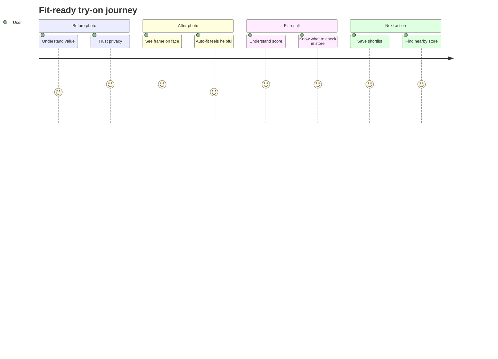

# Design Review: Fit-Ready 3D Frame Pilot

Date: 2026-06-23  
Branch: `codex/next-product-updates-2026-06-23`  
Reviewed specs:

- `docs/specs/fit-ready-3d-frame-pilot.md`
- `docs/specs/fit-ready-3d-eng-review.md`
- `docs/specs/3d-asset-production.md`

## Verdict

Status: cleared after design constraints.

Initial design readiness: 6/10.  
Final design readiness after added constraints: 8.5/10.

The feature is strategically right, but it will fail visually if implemented as another dense technical panel. The user should experience it as a calm fitting assistant, not as 3D/MediaPipe/debug infrastructure.

## Design Principle

The fit-ready layer must answer one user question:

> "Can I take this frame to a store visit, and what should I check there?"

Everything else is secondary. 3D asset status, fit class, PD caveats, RX risk, and model metadata are support evidence, not the first thing a user should see.

## Pass 1: Information Architecture

Initial score: 6/10  
Final score: 8.5/10

Issue: The plan currently adds `Frame3DPreview`, `FitPassportPanel`, `CalibrationGuide`, and `FitConfidenceCard` as separate pieces. If placed as equal-weight cards, the page will feel like an engineering dashboard.

Required IA:

1. Primary layer: live try-on image and frame controls.
2. Result layer: fit confidence summary.
3. Support layer: why this score, what to check in store.
4. Technical layer: 3D asset/passport metadata, collapsed by default.

Recommended section order on `/tryon`:

```text
1. Active frame header
2. Photo try-on canvas
3. Manual/auto placement controls
4. Primary CTA: Оценить посадку
5. Fit result summary
6. Store visit checklist
7. Collapsible: Паспорт оправы
8. Collapsible: 3D-модель и данные
```

Do not place 3D asset status above the try-on canvas. It is not the user's first job.

## Pass 2: States

Initial score: 6/10  
Final score: 9/10

Required states must be designed as product states, not errors:

| State | User-facing title | Primary action | Notes |
| --- | --- | --- | --- |
| No photo | `Добавьте фото для примерки` | `Загрузить фото` | Include 1-line privacy note |
| Analyzing | `Подбираем стартовую посадку` | Disabled/loading | Never block manual controls |
| Auto-fit ready | `Автопосадка готова` | `Оценить посадку` | Hide landmarks by default |
| Low photo quality | `Фото можно улучшить` | `Загрузить другое фото` | Keep scoring available with lower confidence |
| Score ready | `Подходит для первого визита: X/100` | `Сохранить в подбор` | Add in-store checklist |
| Missing 3D asset | `3D-модель скоро появится` | None or secondary info | Treat as normal MVP state |
| Missing passport | `Паспорт оправы пока недоступен` | Continue try-on | No page break |

The missing 3D state must not use warning colors. It is expected in the first release.

## Pass 3: Journey

Initial score: 7/10  
Final score: 8.5/10

Target emotional arc:



The user should not be asked to understand "fit passport" before seeing the frame on their face.

Critical CTA order:

1. `Загрузить фото`
2. `Подстроить автоматически`
3. `Оценить посадку`
4. `Сохранить в подбор`
5. `Найти, где примерить рядом`

Avoid competing primary buttons. At any moment, there should be one obvious next action.

## Pass 4: AI Slop / Debug UI Risk

Initial score: 5/10  
Final score: 8.5/10

Risk: The feature can easily look like a debug panel because it includes model status, confidence, landmarks, dimensions, and asset verification.

Do:

- Use `Автопосадка оправы`, not `MediaPipe Face Landmarker`.
- Use `Качество фото: хорошее / среднее / лучше переснять`, not raw confidence.
- Hide facial landmarks by default.
- Label advanced details as `Технические данные оправы`.
- Use short human summaries before numbers.
- Put dimensions in a compact table inside a collapsible panel.

Do not:

- Show landmark dots by default.
- Show raw model paths in the primary UI.
- Show `scaleVerified=false` as a scary error.
- Use more than two badges in the result header.
- Put long instructions in narrow side cards.
- Introduce another hero-sized card inside `/tryon`.

## Pass 5: Design System

Initial score: 6.5/10  
Final score: 8/10

The feature should reuse ViLu's current high-contrast, editorial-premium style, but with calmer product-tool density.

Required UI tokens:

| Element | Style |
| --- | --- |
| Primary CTA | dark navy fill, 44-52px height, compact uppercase only if it already matches page style |
| Secondary CTA | white/soft border, same height as primary |
| Trust note | pale blue or pale green band, no heavy border |
| Score card | warm off-white surface, strong number, restrained badge |
| Risk copy | amber tint only for actual caution, not missing 3D assets |
| Technical metadata | collapsed, neutral gray surface |
| Landmark toggle | small secondary control, not a primary CTA |

Copy tone:

- Confident but provisional.
- No medical authority voice.
- No exact-fit promises.
- No implementation jargon.

Preferred labels:

- `Посадка перед визитом`
- `Что выглядит хорошо`
- `Что проверить в салоне`
- `Данные оправы`
- `3D-готовность`

## Pass 6: Responsive Layout

Initial score: 5/10  
Final score: 9/10

This is the biggest design gate because `/tryon` has already had mobile overflow problems.

Mobile requirements:

- One-column layout.
- Try-on canvas first.
- Controls wrap into stacked 44px buttons.
- No text blocks narrower than 260px.
- No side panel with long Russian text.
- Sliders keep fixed height and do not resize their parent.
- Result card appears below canvas, not beside it.
- Technical panels are collapsed by default.
- All button labels must fit at 320px viewport.

Desktop requirements:

- Two-column layout is allowed only if the right column remains stable.
- Canvas column should own the visual hierarchy.
- Right column should show visit readiness / selection status, not dense passport metadata.
- Passport and 3D metadata can appear below the main interaction area.

Responsive acceptance checks:

| Viewport | Must pass |
| --- | --- |
| 320px mobile | No horizontal scroll, buttons tappable, no clipped text |
| 390px mobile | Score card readable without layout jump |
| 768px tablet | Canvas and result stack cleanly |
| 1280px desktop | Right rail does not squeeze main content |

## Pass 7: Design Decisions Added

Resolved decisions:

1. 3D asset status is support evidence, not primary UI.
2. Landmarks are hidden by default.
3. Missing GLB is neutral MVP state, not an error.
4. Fit score result owns the user-facing value.
5. Passport metadata is collapsible by default.
6. Mobile layout is one-column with fixed-height controls.
7. Only one primary CTA should be visible per state.
8. All new copy must have RU/EN labels before release.

Deferred decisions:

- Exact visual treatment for a future real 3D viewer after verified GLB assets exist.

## Required Plan Changes Before Implementation

Add these constraints to the implementation plan:

1. `Frame3DPreview` must be collapsed or visually secondary by default.
2. `FitPassportPanel` must support compact and expanded modes.
3. `FitConfidenceCard` must be the first visible result after scoring.
4. `CalibrationGuide` should be a small disclosure or helper row, not a large instruction block.
5. New labels must be added to the language system immediately.
6. All controls must be checked at 320px width before PR merge.
7. The old "debug" naming must not appear anywhere in user-facing UI.

## Suggested Component UX Contracts

### Frame3DPreview

Primary purpose: reassure the user that 3D readiness exists without blocking try-on.

Default visual:

```text
3D-готовность
Модель для этой оправы готовится. Сейчас оценка строится по паспорту оправы и фото-примерке.
[Подробнее]
```

Expanded visual:

```text
Статус модели: placeholder
Масштаб: не подтвержден
Путь: hidden from normal users
```

### FitPassportPanel

Default compact visual:

```text
Данные оправы
49-19-140 · ацетат · посадка A
[Открыть детали]
```

Expanded sections:

- Dimensions.
- Bridge type.
- RX caution.
- What can be assessed online.
- What must be checked in store.

### CalibrationGuide

Default visual should be short:

```text
Точнее с хорошим фото
Смотрите прямо, телефон на уровне глаз, лицо занимает 40-60% кадра.
[Указать PD или ширину лица]
```

Inputs should be tucked behind the disclosure.

### FitConfidenceCard

Primary result:

```text
Подходит для первого визита: 82/100
Средняя уверенность

Что выглядит хорошо
...

Что проверить в салоне
...
```

The card should never say the frame "fits exactly".

## Visual QA Checklist

Before merge, inspect:

- `/tryon` before photo upload.
- `/tryon` after photo upload.
- `/tryon` after auto-fit.
- `/tryon` after score.
- `/tryon` with missing fit passport.
- `/tryon` with missing 3D asset.
- `/tryon` in RU and EN.
- Mobile 320px and 390px.
- Desktop 1280px.

Failure examples:

- Text squeezed into a narrow vertical column.
- Two primary buttons competing.
- Technical jargon visible above the fold.
- Large badges wrapping awkwardly.
- Debug landmarks visible by default.
- Missing 3D asset styled as a red error.

## Completion Summary

```text
+====================================================================+
| DESIGN PLAN REVIEW — COMPLETION SUMMARY                            |
+====================================================================+
| System Audit         | UI scope: /tryon fit-ready layer             |
| Step 0               | initial rating: 6/10, focus: debug risk      |
| Pass 1  (Info Arch)  | 6/10 -> 8.5/10 after IA constraints          |
| Pass 2  (States)     | 6/10 -> 9/10 after state naming              |
| Pass 3  (Journey)    | 7/10 -> 8.5/10 after CTA sequencing          |
| Pass 4  (AI Slop)    | 5/10 -> 8.5/10 after jargon removal          |
| Pass 5  (Design Sys) | 6.5/10 -> 8/10 after token guidance          |
| Pass 6  (Responsive) | 5/10 -> 9/10 after mobile gates              |
| Pass 7  (Decisions)  | 8 resolved, 1 deferred                       |
+--------------------------------------------------------------------+
| NOT in scope         | live visual mockups, product code changes    |
| Overall score        | 6/10 -> 8.5/10                               |
+====================================================================+
```

Plan is design-complete enough to implement. Run live `/design-review` after implementation for visual QA.

## Review Readiness

Design review outcome: cleared with constraints.

Unresolved decisions: none blocking. The future real 3D viewer treatment is intentionally deferred until scale-verified GLB assets exist.
