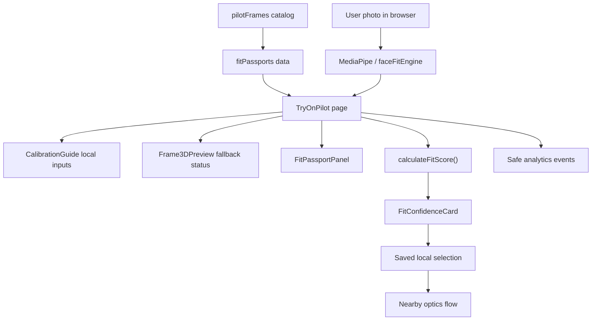
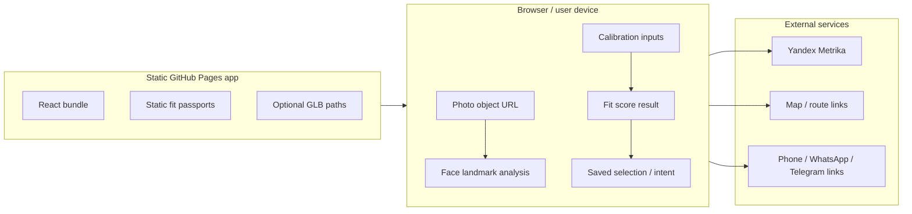
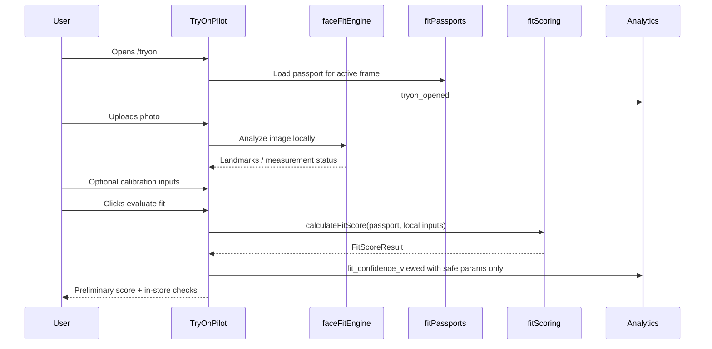
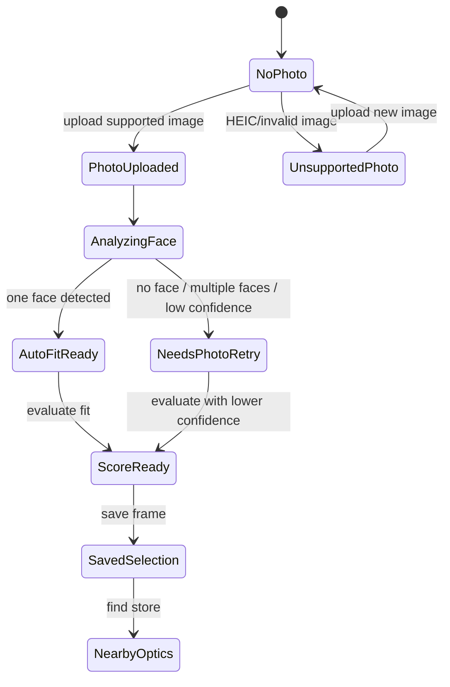

# Engineering Review: Fit-Ready 3D Frame Pilot

Date: 2026-06-23  
Branch: `codex/next-product-updates-2026-06-23`  
Reviewed specs:

- `docs/specs/fit-ready-3d-frame-pilot.md`
- `docs/specs/3d-asset-production.md`

## Verdict

Status: cleared with implementation guardrails.

The plan is technically sound if the first release stays additive: six pilot passports, fallback-only 3D preview, no `@google/model-viewer`, no GLB rendering dependency, no biometric analytics, and no claims of exact fit.

The highest-risk area is not the scoring formula. The highest-risk area is accidental product overclaiming: users may interpret a fit score as real physical or medical certainty. The implementation must keep the result framed as a shortlist tool for in-store fitting.

## Key Engineering Decisions

| Decision | Recommendation | Why |
| --- | --- | --- |
| SKU scope | Implement 6 pilot frames now, keep data model expandable to 20 | Reduces QA surface while preserving the asset contract |
| 3D preview | Fallback-only for first release | Avoids new dependency and broken model-loading states before verified GLB assets exist |
| Scoring | Pure deterministic function | Easier to test, safer than embedding scoring inside UI |
| Calibration inputs | Local React state only | Prevents accidental personal/biometric data storage |
| Analytics | Explicit event allowlist | Current sanitizer helps, but fit data needs stricter guardrails |
| Rollout | Hidden/additive integration on `/tryon` | Existing try-on flow must not regress |

## Architecture



Recommended module boundaries:

- `src/types/fit.ts`: shared type contract only.
- `src/data/fitPassports.ts`: static passport data for current frames.
- `src/lib/fitScoring.ts`: pure scoring function, no browser APIs, no React.
- `src/components/fit/*`: presentation components.
- `src/pages/TryOnPilot.tsx`: orchestration only.

Do not put scoring rules, GLB status logic, or analytics filtering directly inside `TryOnPilot.tsx`.

## System Boundaries



Trust boundary rules:

- User photo stays in browser.
- Calibration values stay in React state unless a future explicit local-only save is added.
- Face width, PD, prescription, and photo-derived values must not be sent to analytics.
- Static fit passports are public product metadata, not user data.
- Route/call/messenger clicks may be tracked only with non-sensitive frame IDs and action names.

## Data Flow



Sensitive values must not cross into analytics:

- `estimatedFaceWidthMm`
- `knownPdMm`
- prescription/RX values
- landmark coordinates
- image URL/object URL
- user name, phone, email

## State Transitions



Required UI states:

- No photo: explain value and ask for upload.
- Analyzing: show non-blocking progress.
- Auto-fit ready: show human-readable result, landmarks hidden by default.
- Needs retry: keep manual try-on available.
- Score ready: show preliminary score and salon checks.
- Missing 3D asset: show fallback status, not an error.

## Failure Modes

| Failure | Expected behavior | Test |
| --- | --- | --- |
| Missing fit passport for a frame | Try-on works, fit-ready panel hidden or shows safe unavailable state | Add frame without passport in test |
| Missing `.glb` file | `Frame3DPreview` shows fallback message | Simulate absent model path |
| MediaPipe load fails | Manual try-on still works | Mock `status: error` |
| Unsupported image format | Explain JPEG/PNG/WebP requirement | Upload HEIC fixture |
| Multiple faces | Ask for one face, do not block manual mode | Mock `multiple_faces` |
| Missing PD / face width | Neutral scoring plus in-store check | Unit test score with empty inputs |
| Strong RX + high-risk frame | Lower RX score and show risk | Unit test |
| Analytics param leak | Event drops sensitive fields | Unit test `trackFitEvent` helper |
| Narrow mobile viewport | No text overflow, controls remain tappable | Playwright mobile screenshot |

## Edge Cases

- Frame exists in `pilotFrames` but not in `fitPassports`.
- Fit passport exists for a removed frame.
- `size` string is malformed or incomplete.
- `recommendedFaceWidthMm.min > max` due to data mistake.
- `knownPdMm` is outside human-plausible range.
- User evaluates fit before uploading a photo.
- User changes active frame after scoring.
- User toggles language after score is visible.
- Analytics blocker or Metrika unavailable.
- Browser cannot decode uploaded image.

Implementation should fail soft: show the manual try-on and never blank the page.

## Performance Review

Current plan is safe because it avoids a 3D runtime dependency.

Performance requirements:

- `calculateFitScore` must be synchronous and cheap.
- Fit passport data should remain static and small.
- Do not import heavy 3D viewer code in the first release.
- If `@google/model-viewer` is added later, lazy-load it only inside `Frame3DPreview`.
- Do not preload `.glb` files on `/tryon` until the user explicitly opens a 3D preview.

Asset performance target from production spec:

- Preferred GLB size: `1-3 MB`.
- Maximum GLB size: `5 MB` unless approved.

## Code Quality Review

`TryOnPilot.tsx` already owns many flows: photo upload, MediaPipe, manual controls, saved selection, lead CTA, and nearby optics. The fit-ready implementation must reduce pressure on this file, not add another large inline block.

Required code-quality constraints:

- New fit UI goes under `src/components/fit/`.
- Scoring rules stay in `src/lib/fitScoring.ts`.
- Fit passport data stays in `src/data/fitPassports.ts`.
- `TryOnPilot.tsx` should only wire active frame, inputs, and rendered components.
- Copy must be passed through current language approach before release if the page supports EN/RU toggle.
- Do not add user-data persistence unless separately approved.

## Test Coverage Plan

| Layer | Required tests | Priority |
| --- | --- | --- |
| Unit | `calculateFitScore` complete/missing inputs, PD range, face width range, RX risk, confidence thresholds | P0 |
| Unit | analytics helper blocks sensitive fit params | P0 |
| Component | `Frame3DPreview` with verified, unverified, and missing asset states | P1 |
| Component | `FitConfidenceCard` renders strengths, risks, and disclaimer | P1 |
| Integration | `/tryon` evaluate score, save frame, open nearby optics | P0 |
| Integration | unsupported image keeps app usable | P1 |
| Visual | desktop and mobile `/tryon` screenshot after fit-ready panel added | P0 |
| Accessibility | buttons have clear labels and remain keyboard/touch usable | P1 |

Minimum ship gate:

```text
npm run typecheck
npm run lint
npm run build
manual /tryon smoke test on desktop
manual /tryon smoke test on mobile width
```

## Recommended Implementation Order

1. Add `src/types/fit.ts`.
2. Add `src/data/fitPassports.ts` for six current frame IDs.
3. Add `src/lib/fitScoring.ts` and unit-test the score rules first.
4. Add fit components with static demo data.
5. Integrate components into `TryOnPilot.tsx` behind soft/fallback states.
6. Add safe analytics events and explicit allowlist.
7. Add docs and `.gitkeep`.
8. Run typecheck, lint, build, and manual QA.

## Required Spec Tightening Before Implementation

The current specs are strong enough to implement, but add these clarifications before coding if possible:

1. Define plausible numeric bounds for optional calibration fields:
   - PD: reject or ignore values outside a safe human range.
   - Face width: reject or ignore implausible values.
2. Define whether `FitConfidenceCard` is shown before photo upload. Recommendation: allow it, but confidence should be low/medium and copy must say photo improves placement only.
3. Define a missing-passport fallback. Recommendation: hide fit passport and show existing try-on only.
4. Define EN/RU copy handling for all new labels. Recommendation: add translation keys immediately because the site already supports language switching.
5. Define exact analytics helper shape. Recommendation: add a fit-specific tracking wrapper with an allowlist, not just a blocklist.

## Release Criteria

Do not release if:

- Any sensitive fit input is present in analytics event params.
- The page fails when a GLB is missing.
- The score copy implies exact physical or medical certainty.
- `/tryon` manual controls regress.
- The new panel causes mobile overflow similar to the prior auto-fit UX issue.

Release is acceptable if:

- The feature is additive and fallback-safe.
- All six pilot frames have passports.
- Missing 3D assets are treated as normal MVP state.
- The score clearly sends the user toward in-store validation.
- Build and smoke tests pass.

## Review Readiness

Eng review outcome: cleared with guardrails.

Unresolved decisions: none blocking. The only intentional deferred decision is whether to add `@google/model-viewer`, which should wait until verified GLB assets exist.
