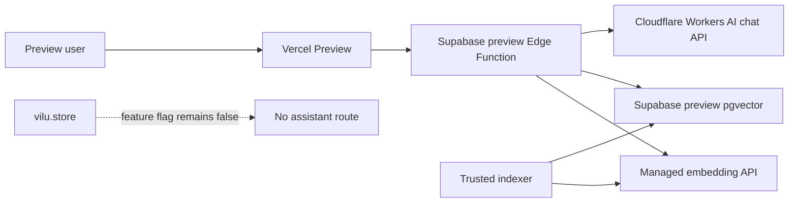

# Knowledge Assistant preview rollout

## Status

Executable rollout specification. Production remains disabled until an explicit
manual go/no-go decision.

## Objective

Deploy the existing ViLu Knowledge Assistant into an isolated preview stack,
validate the complete retrieval and answer path, and preserve a one-step
rollback. The rollout must not expose provider credentials, change production
data, or enable the assistant on `vilu.store`.

## Locked decisions

- Use the OpenAI-compatible Cloudflare Workers AI chat provider documented in
  `docs/deployment/knowledge-assistant.md` for preview.
- Keep provider URLs, keys, and model names in Supabase Secrets.
- Require a multilingual OpenAI-compatible embedding model that returns exactly
  1024 dimensions.
- Use a separate Supabase preview project.
- Use a separate Vercel Preview deployment with the feature flag enabled.
- Index only the six approved ViLu-owned Russian documents.
- Keep OcuLearning and other external resources as outbound `link-only`
  metadata. Do not store, translate, embed, or summarize their article bodies.
- Keep production disabled until manual safety, editorial, and product approval.

## System boundary

## Environments

| Setting | Vercel Preview | Supabase Preview | Production |
| --- | --- | --- | --- |
| `VITE_FEATURE_KNOWLEDGE_ASSISTANT` | `true` | n/a | `false` |
| `VITE_SUPABASE_URL` | preview URL | n/a | unchanged |
| `VITE_SUPABASE_ANON_KEY` | preview anon key | n/a | unchanged |
| Provider credentials | never | Supabase Secrets | not configured in this phase |
| Service-role key | never | trusted indexer only | unchanged |
| Indexed sources | n/a | six ViLu-owned sources | unchanged |

## Data flow

1. A trusted operator validates the reviewed source registry with
   `npm run knowledge:index:dry`.
2. The indexer embeds only approved, indexable ViLu-owned chunks and replaces
   each source transactionally in the preview database.
3. The browser sends a bounded query and preferences to the preview Edge
   Function. The browser never receives provider or service-role credentials.
4. The function embeds the query, retrieves reviewed chunks, asks the
   configured Cloudflare Workers AI chat model for a grounded answer, and
   returns citations plus link-only external resources.
5. Urgent and disallowed questions use deterministic responses even when the
   provider or database is unavailable.

## Trust boundaries

- Provider keys, service-role keys, and rate-limit salt are server-only.
- Preview and production Supabase projects must not share database credentials.
- Request and response bodies must not be logged.
- Only `review_status=approved`, `indexable=true`, ViLu-owned sources may be
  embedded in this phase.
- External links are presentation metadata, not retrieval evidence.
- The assistant provides informational guidance and must not diagnose,
  prescribe, or claim certainty.

## Rollout procedure

1. Create a separate Supabase project and record its project ref outside Git.
2. Link Supabase CLI to the preview project and apply migrations.
3. Configure the server-only secrets listed in the deployment runbook.
4. Deploy `knowledge-assistant` with request-body logging disabled.
5. Run `npm run knowledge:preview:check` to validate configuration shape.
6. Run `npm run knowledge:index:dry`, review the six sources and hashes, then
   run `npm run knowledge:index` from a trusted environment.
7. Run `npm run knowledge:preview:check:live` to verify provider compatibility,
   source count, and an end-to-end grounded response.
8. Create a Vercel Preview with the preview Supabase values and feature flag.
9. Complete the acceptance matrix below.
10. Record a manual go/no-go. Do not modify production variables in this phase.

## Acceptance matrix

| Area | Required result |
| --- | --- |
| Source registry | exactly 6 indexed ViLu-owned sources |
| External source | OcuLearning remains `indexable=false` |
| Embeddings | exactly 1024 numeric dimensions |
| RU answer | grounded answer contains at least one valid ViLu citation |
| EN answer | safe translated/synthesized answer with ViLu citations |
| Urgent query | deterministic urgent guidance without provider dependency |
| Unsupported query | abstention, not an invented answer |
| Rate limit | HTTP 429 after configured threshold |
| Provider outage | user-safe retry state; no secrets or raw errors |
| Local history | stays in browser and can be cleared |
| Mobile | usable at 320 px width without horizontal overflow |
| Production | `/assistant` remains unavailable on `vilu.store` |

## Failure modes and rollback

- **Provider unavailable:** return normalized `provider_unavailable`; retain
  deterministic urgent guidance.
- **Retrieval unavailable:** return normalized `retrieval_unavailable`; do not
  answer from model memory.
- **Wrong embedding size:** stop indexing and fail readiness checks.
- **Unexpected indexed source:** fail readiness checks before UI acceptance.
- **Preview UI regression:** set the Vercel preview feature flag to `false` and
  redeploy. No database rollback is required.
- **Credential exposure:** revoke the credential, remove the deployment, rotate
  all affected secrets, and inspect Git history before continuing.

## Production gate

Production activation is a separate change. It requires explicit approval after
preview QA, editorial review, secret scan, and product sign-off. The activation
change must configure production Supabase independently and set the production
feature flag only after all checks pass.
