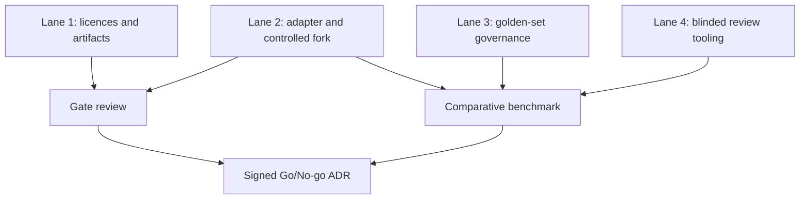

# ViLu Eye Map: executable product and technical specification

Status: Sprint 0 only
Source: `docs/specs/source/ViLu_Periorbital_Product_Technical_Spec.docx`
Adapted for repository: 2026-07-18

## Context

ViLu currently provides a browser-side path from photo upload to MediaPipe
landmarks, preliminary Face-fit score, a shortlist of frames, and an optical
store visit. Eye Map may improve photo quality checks and create a repeatable
visual baseline, but it must not turn the current try-on flow into a medical
diagnostic product.

The source document assumes a Next.js BFF. The actual application is React 18,
Vite, TypeScript, GitHub Pages, and optional Supabase Edge Functions. This
specification keeps that stack. A Python inference service is introduced only
behind a typed adapter after Sprint 0 passes.

## Verified current state

| Area | Current implementation | Decision |
| --- | --- | --- |
| Photo analysis | `src/lib/faceFitEngine.ts`, MediaPipe in the browser | Keep as precheck and fallback |
| Try-on | `src/pages/TryOnPilot.tsx` | Do not rewrite |
| Backend | Optional Supabase client and Edge Functions | Extend after Sprint 0; app remains autonomous |
| Storage | No server-side face-photo storage | Preserve until purpose consent and deletion are implemented |
| Analytics | `src/lib/analyticsEvents.ts` removes sensitive properties | Add only allowlisted technical status codes |
| Routing | Manual route map in `src/App.tsx` | Add Eye Map routes only in Sprint 1 |
| Deployment | GitHub Pages at `vilu.store` | ML service must be independently deployable |

## Product boundary

Eye Map is a non-medical visual baseline and capture-quality layer.

It may:

- check whether a photo is suitable;
- segment visible external eye-area structures;
- create an overlay and normalized ratios;
- improve frame placement and repeat-photo consistency;
- combine user answers with approved, rules-based guidance.

It must not:

- diagnose a disease or infer a medical risk from a photo;
- determine diopters, PD, or physical millimetres from an uncalibrated selfie;
- recommend treatment, medication, or supplements;
- create identity embeddings or perform face recognition;
- send raw photos, prescriptions, or health answers to analytics or partners;
- block the existing try-on or store journey when ML is unavailable.

## Delivery gates

```text
Sprint 0 evidence
  -> license and artifact approval
  -> representative golden-set benchmark
  -> Go/No-go decision
      -> No-go: keep MediaPipe capture + Face-fit fallback
      -> Go: Sprint 1 consent/capture behind feature flag
```

The production flag remains off until all of the following are recorded:

1. Code, package, dataset, weights, and paper are pinned in the asset manifest.
2. Licences for code, data, and weights are independently approved.
3. A governed set of exactly 150 explicitly consented real photos exists.
4. Pipeline success is at least 90% after the quality gate.
5. End-to-end p95 is at most 30 seconds in pilot-like infrastructure.
6. NaN, zero-coordinate, missing-iris, missing-brow, and impossible-mask outputs
   become explicit failures.
7. Medical/legal reviewers approve RU and EN copy, red-flag flow, consent,
   retention, and deletion wording.
8. Eye Map improves usable results by at least 10 percentage points or reduces
   retakes by at least 20% relative to the current MediaPipe baseline.
9. No unexplained cohort regression exceeds five percentage points.
10. Two blinded reviewers complete the fixed rubric and a third reviewer
    adjudicates disagreements.

## Architecture decision

- Frontend remains React/Vite.
- Existing MediaPipe analysis is the local capture precheck and fallback.
- Public APIs are implemented as Supabase Edge Functions or a future BFF.
- Periorbital inference runs in an isolated, replaceable Python service.
- Original photos and derived assets use separate private object-storage keys.
- Recommendation eligibility is rules-first and cannot be decided by an LLM.
- Every output carries `modelVersion`, `artifactChecksum`, `schemaVersion`, and
  a non-sensitive `correlationId`.
- Feature flag `VITE_FEATURE_EYE_MAP` defaults to `false`.
- Sprint 0 runs offline in a separate private `vilu-eye-map-ml` repository.
- The upstream package is wrapped by a strict ViLu adapter and controlled fork.
- No upload API, cloud photo processing, or user-facing route is implemented
  before a signed Go ADR.

## Engineering review decisions

1. **Scope:** Sprint 0 is an offline validation spike; production architecture
   remains a target, not current work.
2. **Value gate:** Eye Map must improve usable results by at least 10 percentage
   points or reduce retakes by at least 20%.
3. **Dataset:** benchmark exactly 150 consented real photos with governed
   deletion and separate identity records.
4. **Dependency boundary:** use a strict adapter and controlled fork instead of
   importing the upstream package into product code.
5. **Repository boundary:** ML code lives in private `vilu-eye-map-ml`;
   `optica-shop` keeps contracts and documentation.
6. **Processing boundary:** Sprint 0 is offline on controlled encrypted storage.
7. **Result model:** every inference is `success`, `partial`, or `failure`;
   missing data is never represented by a valid-looking zero.
8. **Review:** two independent blinded reviewers use one rubric, with a third
   adjudicator.
9. **Performance:** Sprint 0 reference-CPU p95 is at most 30 seconds; a later
   user pilot requires model p95 at most 5 seconds and end-to-end p95 at most
   10 seconds.
10. **Release control:** a signed Go/No-go ADR is mandatory before Sprint 1;
    production contains no Eye Map route or loaded ML code until then.

## State model

```text
disabled
  -> capture_precheck
      -> blocked (retake or MediaPipe-only fallback)
      -> eligible
          -> consent_required
          -> upload_pending
          -> queued
          -> processing
              -> succeeded
              -> partial (safe baseline only)
              -> failed (retake or fallback)
              -> timed_out (resume or fallback)
```

Reloads must resume from a non-sensitive session identifier. Repeated completion
requests must use an idempotency key and create at most one inference job.

## Private inference-adapter contract (Sprint 0)

The isolated adapter emits only a versioned discriminated result:

```ts
type EyeMapInferenceResult =
  | {
      status: 'success';
      structures: EyeMapStructures;
      limitations: string[];
      modelVersion: string;
      artifactChecksum: string;
      correlationId: string;
      schemaVersion: 1;
    }
  | {
      status: 'partial';
      structures: EyeMapStructures;
      missing: EyeMapStructureName[];
      limitations: string[];
      modelVersion: string;
      artifactChecksum: string;
      correlationId: string;
      schemaVersion: 1;
    }
  | {
      status: 'failure';
      code: EyeMapInferenceFailureCode;
      retryable: boolean;
      modelVersion: string;
      artifactChecksum: string;
      correlationId: string;
      schemaVersion: 1;
    };
```

Runtime validation lives in `src/lib/eyeMap/inferenceContract.ts`. Empty,
zero-area, non-finite, missing, and schema-incompatible artifacts cannot be
silently treated as success.

## Public product contract (target after Sprint 0)

```ts
interface CreatePhotoSessionRequest {
  locale: 'ru' | 'en';
  consentVersion: string;
  purposes: Array<'try_on' | 'visual_baseline'>;
  retentionMode: 'process_only' | 'saved_baseline';
}

interface CreatePhotoSessionResponse {
  sessionId: string;
  uploadUrl: string;
  uploadExpiresAt: string;
  correlationId: string;
}

interface EyeMapProductResult {
  sessionId: string;
  correlationId: string;
  status: 'succeeded' | 'partial' | 'failed';
  quality: 'good' | 'borderline' | 'unavailable';
  overlayUrl?: string;
  normalizedFeatures?: Record<string, number>;
  limitations: string[];
  modelVersion: string;
  artifactChecksum: string;
  schemaVersion: 1;
}
```

The adapter and product contracts are deliberately different. The BFF may map
validated `success` to product-level `succeeded`, but the private adapter does
not expose sessions or URLs. Physical millimetres are intentionally absent.

## Trust boundaries

| Boundary | Allowed | Forbidden |
| --- | --- | --- |
| Browser to analytics | event, locale, reason code, latency bucket | photo, URL, answers, free text, measurements |
| Browser to BFF | consented image upload metadata | secrets, provider credentials |
| BFF to ML | private object key, model version, correlation ID | user contact, questionnaire answers |
| ML to BFF | masks, normalized features, explicit failure codes | diagnosis, treatment eligibility |
| BFF to optical partner | selected salon/frame and explicit consent snapshot | raw photo, masks, health answers |

## Failure modes

| Failure | User outcome | System outcome |
| --- | --- | --- |
| No face / multiple faces | Retake guidance | No upload |
| Eye closed / iris missing | Retake or existing try-on | Explicit `missing_required_structure` |
| Brow missing | No brow-derived output | Explicit partial/failure; never zero as valid data |
| Network loss | Retry and resume | Same session and idempotency key |
| ML timeout | Existing try-on remains available | Job can resume; no duplicate |
| Model unavailable | Face-fit fallback | Circuit breaker; no user-facing stack trace |
| Consent revoked | Stop new processing | Delete/expire original and derived assets by scope |

## Sprint plan

### Sprint 0: technical evidence, 3-5 days

1. Pin source artifacts and licences in
   `docs/periorbital/asset-manifest.json`.
2. Reproduce package `0.1.3` in an isolated Python environment.
3. Build the governed 150-photo golden set and verify deletion controls.
4. Benchmark MediaPipe and Eye Map on the same inputs, including usable-result
   and retake rates, cohorts, CPU latency, memory, model size, and failures.
5. Add post-processing checks for two irises, brow availability, mask area,
   finite values, and compatible output schema.
6. Run the two-reviewer blinded rubric and adjudicate disagreements.
7. Produce a signed Go/No-go ADR.

### Sprint 1: consent and capture

Only after Go: add `/eye-map`, purpose-specific consent, local quality guidance,
private upload, deletion policy, RU/EN parity, and mobile E2E.

### Sprint 2: asynchronous ML vertical slice

Add Edge Function/BFF contracts, private storage, queue, Python worker, overlay,
resume, retries, timeout, and fallback.

### Later slices

Assessment and rules, seven-day plan, check-ins, weekly report, repeat photo,
vision passport, then explicitly consented booking.

## Acceptance criteria for this repository change

1. `VITE_FEATURE_EYE_MAP` is false when omitted or not exactly `true`.
2. Eye Map has a typed lifecycle and user-safe error contract.
3. Existing MediaPipe output is converted into `eligible` or `blocked` without
   sending a photo or health-context value to a server.
4. No Eye Map route or production UI is exposed in this change.
5. Asset manifest records verified package and dataset hashes and marks
   unresolved weight licence/checksums as blockers.
6. Unit tests cover disabled, ready, low-confidence, no-face, multiple-face,
   unsupported-photo, and engine-error states.
7. Existing typecheck, build, lint, unit, checkout, and E2E suites pass.

## Testing pyramid

| Layer | Coverage |
| --- | --- |
| Unit | Feature flag, quality gate, status/error mapping |
| Contract | Frontend/BFF and BFF/ML schemas, version compatibility |
| Integration | Signed upload, queue, worker, storage, deletion |
| ML regression | Golden images, masks, failures, checksums, latency |
| E2E | Retake, consent, resume, timeout, fallback, deletion, RU/EN, mobile |
| Security | MIME spoofing, oversized/decompression inputs, authz, URL expiry, PII log scan |

## Sprint 0 execution lanes



Lanes 1, 2, 3, and 4 may begin in parallel. The benchmark is sequential after
the adapter and golden set are ready. Sprint 1 is sequential after the ADR.

## Engineering acceptance matrix

| Concern | Evidence | Blocking criterion |
| --- | --- | --- |
| Licence | Approved manifest with versions and checksums | Any unresolved weight right/checksum |
| Privacy | Consent ledger and deletion test | Missing consent, owner, retention, or deletion |
| Contract | Adapter unit and failure-injection tests | Ambiguous status or zero sentinel |
| Product value | Comparative MediaPipe/Eye Map report | Neither value threshold is met |
| Fairness | Per-cohort report | Unexplained regression over 5 pp |
| Reliability | Success and failure distribution | Success below 90% |
| Performance | CPU p50/p95, peak memory, model size | Sprint 0 p95 over 30 seconds |
| Human quality | Blinded rubric and adjudication | Review incomplete |
| Product safety | Existing ViLu CI and feature flag check | Existing flow regresses or route leaks |

## Rollback

The Sprint 0 code is inert by default. Rollback is a normal commit revert. If a
later pilot is active, set `VITE_FEATURE_EYE_MAP=false` first; existing try-on,
Face-fit, catalogue, and optical-store flows remain available.

## Out of scope

- Production photo upload or storage.
- A user-facing Eye Map route.
- Medical diagnosis or medical recommendations.
- Real millimetre measurements from selfies.
- Notifications, partner sharing, or longitudinal photo history.
- Downloading model weights or the 190 MB dataset into Git.

## GSTACK REVIEW REPORT

| Review | Trigger | Why | Runs | Status | Findings |
| --- | --- | --- | ---: | --- | --- |
| CEO Review | Not run in this pass | Product premise already established | 0 | NOT RUN | - |
| Design Review | Not run in this pass | No user-facing UI is authorized | 0 | NOT RUN | - |
| Eng Review | Requested | Lock Sprint 0 architecture and evidence gates | 1 | CLEAR (PLAN) | 10 decisions folded, 0 unresolved |
| Diff Review | Not run | Documentation-only plan update | 0 | NOT RUN | - |

- **VERDICT:** ENG CLEARED - Sprint 0 is executable; Sprint 1 remains blocked
  until the signed ADR records `Go`.

NO UNRESOLVED DECISIONS
