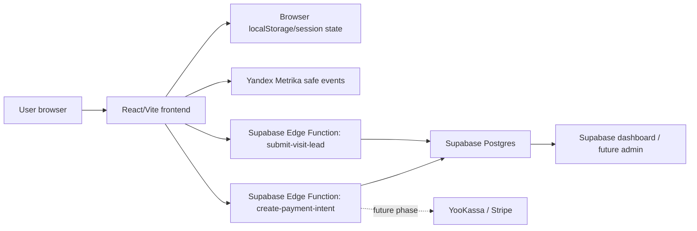
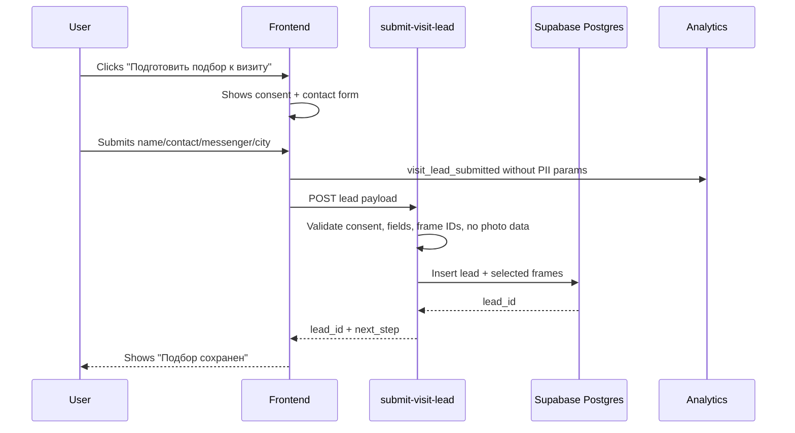
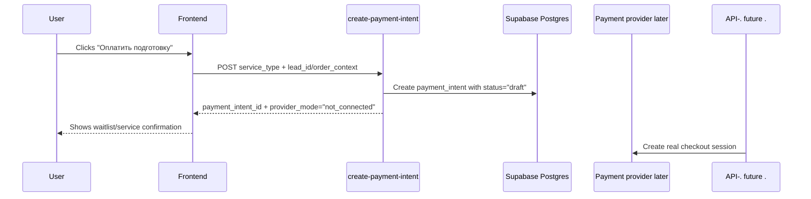

# ViLu Production Backend Foundation

Status: ready for engineering review  
Branch: `codex/production-backend-foundation-spec`  
Verified current state: 2026-07-15  
Owner intent: move ViLu from MVP/local/demo mode toward a production product with leads, paid intent, and future payment integration without breaking the current try-on flow.

## Context

ViLu already has a working frontend MVP: online try-on, Face-fit score, nearby optics, local/demo personal cabinet, analytics events, and a fake payment intent door. The next production step is not to connect a payment provider first. The next step is to create a safe backend foundation for the paid service scenario: "Подготовить подбор к визиту".

The first paid/service unit should be a visit-preparation order: the user completes try-on, saves 2-3 frames, chooses a store/contact path, and asks ViLu to prepare a short selection/checklist for a store visit. This creates a clear service value before real payment is introduced.

## Current State

| Area | Current implementation | Gap |
|---|---|---|
| Frontend | React + Vite + TypeScript + Tailwind | Keep. Do not rewrite the frontend. |
| Supabase client | `src/lib/supabase.ts:1` creates a Supabase client from `VITE_SUPABASE_URL` and `VITE_SUPABASE_ANON_KEY`, with demo fallback values | Client exists, but production tables/functions for leads and payment intents do not. |
| Lead fallback | `src/config/leads.ts:1` supports `VITE_TALLY_FORM_URL` | Useful fallback, but not enough for production lead/order tracking. |
| Analytics | `src/lib/analyticsEvents.ts:1` defines safe event names and strips sensitive params | Keep the no-PII analytics rule. Add backend-specific events without sending personal data. |
| Database | `supabase/migrations/20260207130150_create_optical_ecommerce_schema.sql:1` defines old products, vision profiles, subscriptions | Existing schema is ecommerce-oriented and stores vision profile fields; do not expand it for this phase. |
| Payment intent | Fake payment door exists in frontend and analytics events | Needs production-safe backend recording before real provider integration. |
| Photo handling | Try-on photo is browser-local | Must remain browser-local for this phase. No server photo upload. |

## Product Decision

The first production backend scope is:

1. Save visit-preparation leads.
2. Save selected frames metadata without face photo.
3. Save payment-intent clicks as backend records.
4. Prepare a payment-provider abstraction, but do not charge cards in this phase.
5. Keep the MVP usable without registration.

The first chargeable service:

`visit_preparation`

User-facing phrasing:

"Подготовить подбор к визиту"

What the user pays for later:

- saved 2-3 frame shortlist;
- visit checklist;
- optician/store handoff-ready summary;
- contact routing via phone, WhatsApp, Telegram, or email;
- future partner-store delivery.

## Non-Negotiable Trust Boundaries

1. Face photos are processed only in the browser and are not uploaded.
2. Prescription/medical fields are not collected in the production lead form in this phase.
3. Analytics never receives name, phone, email, prescription, complaints, photo data, or exact location.
4. Payment provider secrets are never exposed to the frontend.
5. The frontend never writes directly to payment tables.
6. Anonymous users can create a visit-preparation lead only through validated backend endpoints.
7. Exact geolocation is not persisted; store/city intent may be persisted.

## Architecture



## Data Flow

### Visit lead submission



### Payment intent recording



## Database Schema

Create a new migration:

`supabase/migrations/YYYYMMDDHHMMSS_create_visit_preparation_backend.sql`

### Enum types

```sql
create type public.lead_status as enum (
  'new',
  'contact_requested',
  'sent_to_partner',
  'closed',
  'spam'
);

create type public.contact_channel as enum (
  'phone',
  'whatsapp',
  'telegram',
  'email'
);

create type public.payment_intent_status as enum (
  'draft',
  'provider_created',
  'paid',
  'cancelled',
  'failed'
);

create type public.payment_provider as enum (
  'none',
  'yookassa',
  'stripe'
);
```

### `visit_preparation_leads`

```sql
create table public.visit_preparation_leads (
  id uuid primary key default gen_random_uuid(),
  created_at timestamptz not null default now(),
  updated_at timestamptz not null default now(),

  status public.lead_status not null default 'new',
  locale text not null default 'ru' check (locale in ('ru', 'en')),

  customer_name text,
  contact_value text not null,
  contact_channel public.contact_channel not null,
  city text,
  preferred_store_id text,
  preferred_store_name text,

  consent_personal_data boolean not null default false,
  consent_version text not null,
  privacy_version text not null,

  source_page text not null default '/tryon',
  utm_source text,
  utm_medium text,
  utm_campaign text,

  notes text,

  constraint contact_value_min_length check (char_length(contact_value) >= 3),
  constraint consent_required check (consent_personal_data = true)
);
```

Important: do not add face photo URL, prescription, symptoms, complaints, age, birthdate, or exact latitude/longitude to this table in phase 1.

### `visit_preparation_frames`

```sql
create table public.visit_preparation_frames (
  id uuid primary key default gen_random_uuid(),
  lead_id uuid not null references public.visit_preparation_leads(id) on delete cascade,
  created_at timestamptz not null default now(),

  frame_id text not null,
  frame_name text not null,
  frame_brand text,
  frame_category text,
  frame_size text,
  frame_price_rub integer,
  fit_score integer check (fit_score >= 0 and fit_score <= 100),
  use_case text,

  sort_order integer not null default 0
);
```

### `payment_intents`

```sql
create table public.payment_intents (
  id uuid primary key default gen_random_uuid(),
  created_at timestamptz not null default now(),
  updated_at timestamptz not null default now(),

  lead_id uuid references public.visit_preparation_leads(id) on delete set null,
  service_type text not null check (service_type in ('visit_preparation')),
  status public.payment_intent_status not null default 'draft',
  provider public.payment_provider not null default 'none',

  amount_rub integer not null check (amount_rub >= 0),
  currency text not null default 'RUB',

  provider_payment_id text,
  provider_checkout_url text,
  provider_payload jsonb,

  source_page text not null default '/tryon',
  metadata jsonb not null default '{}'::jsonb
);
```

### `partner_optics`

This can be separate from the static frontend optics directory later. Phase 1 may keep the current static directory, but the backend should reserve the production shape.

```sql
create table public.partner_optics (
  id text primary key,
  created_at timestamptz not null default now(),
  updated_at timestamptz not null default now(),

  name text not null,
  city text not null,
  address text not null,
  phone text,
  whatsapp text,
  telegram text,
  partner_status text not null default 'listed' check (partner_status in ('listed', 'partner', 'verified')),
  source text not null default 'manual',
  is_active boolean not null default true
);
```

## RLS and Access Rules

Enable RLS:

```sql
alter table public.visit_preparation_leads enable row level security;
alter table public.visit_preparation_frames enable row level security;
alter table public.payment_intents enable row level security;
alter table public.partner_optics enable row level security;
```

Phase 1 policies:

```sql
create policy "Anyone can read active partner optics"
  on public.partner_optics
  for select
  to anon, authenticated
  using (is_active = true);
```

No direct anon insert policies for `visit_preparation_leads`, `visit_preparation_frames`, or `payment_intents` in phase 1. Writes should go through Edge Functions using service role after validation.

## Edge Functions

### `submit-visit-lead`

Endpoint:

`POST /functions/v1/submit-visit-lead`

Request:

```ts
type SubmitVisitLeadRequest = {
  locale: 'ru' | 'en';
  customerName?: string;
  contactValue: string;
  contactChannel: 'phone' | 'whatsapp' | 'telegram' | 'email';
  city?: string;
  preferredStoreId?: string;
  preferredStoreName?: string;
  consentPersonalData: true;
  consentVersion: string;
  privacyVersion: string;
  sourcePage: '/tryon' | '/products' | '/vision-tracker';
  utm?: {
    source?: string;
    medium?: string;
    campaign?: string;
  };
  selectedFrames: Array<{
    frameId: string;
    frameName: string;
    frameBrand?: string;
    frameCategory?: string;
    frameSize?: string;
    framePriceRub?: number;
    fitScore?: number;
    useCase?: string;
  }>;
};
```

Response:

```ts
type SubmitVisitLeadResponse = {
  leadId: string;
  status: 'new';
  nextStep: 'payment_optional' | 'contact_pending';
};
```

Validation:

- `consentPersonalData` must be `true`.
- `contactValue` must be present.
- `selectedFrames.length` must be 1-3.
- Strip/ignore unknown keys.
- Reject any payload containing `photo`, `image`, `base64`, `sph`, `cyl`, `axis`, `complaints`, `symptoms`, `birthdate`, `age`, `medical`.
- Rate-limit by IP or add captcha in phase 2.

### `create-payment-intent`

Endpoint:

`POST /functions/v1/create-payment-intent`

Request:

```ts
type CreatePaymentIntentRequest = {
  leadId?: string;
  serviceType: 'visit_preparation';
  amountRub: number;
  currency: 'RUB';
  provider: 'none' | 'yookassa' | 'stripe';
  sourcePage: '/tryon' | '/products';
};
```

Response for phase 1:

```ts
type CreatePaymentIntentResponse = {
  paymentIntentId: string;
  status: 'draft';
  providerMode: 'not_connected';
};
```

Future response:

```ts
type CreatePaymentIntentProviderResponse = {
  paymentIntentId: string;
  status: 'provider_created';
  provider: 'yookassa' | 'stripe';
  checkoutUrl: string;
};
```

## Frontend Service Boundaries

Add service files when implementation begins:

| File | Responsibility |
|---|---|
| `src/services/leadService.ts` | Submit visit-preparation lead. No UI logic. |
| `src/services/paymentService.ts` | Create payment intent. No provider-specific UI logic. |
| `src/services/selectionService.ts` | Convert current local selection into backend-safe frame payload. |
| `src/services/privacyGuard.ts` | Assert payload has no photo/prescription/medical fields before network send. |
| `src/types/backend.ts` | Shared TypeScript request/response shapes. |

Do not call Supabase table inserts directly from React components for leads or payment intents.

## Analytics Events

Keep existing events:

- `payment_door_viewed`
- `payment_intent_clicked`
- `payment_door_dismissed`
- `visit_lead_opened`
- `visit_lead_submitted`
- `consent_checked`

Add only if needed:

- `backend_lead_submit_started`
- `backend_lead_submit_succeeded`
- `backend_lead_submit_failed`
- `backend_payment_intent_created`
- `backend_payment_intent_failed`

Allowed analytics params:

```ts
{
  source: 'tryon' | 'products';
  frame_count: number;
  service_type: 'visit_preparation';
  provider_mode: 'none' | 'yookassa' | 'stripe';
  error_code?: string;
}
```

Forbidden analytics params:

- name;
- phone;
- email;
- messenger handle;
- exact address;
- exact coordinates;
- photo/image/base64;
- prescription fields;
- complaints/symptoms;
- child/age/birthdate/medical/health data.

## UI Scope for First Backend PR

The first implementation PR should preserve current UX and only convert fake/demo actions into backend-aware actions.

Required UI changes:

1. On "Подготовить подбор к визиту", open a compact contact form.
2. Show consent checkbox with links to `/privacy`, `/terms`, `/disclaimer`.
3. Show "Фото не отправляется на сервер" near the form.
4. Save selected frame IDs and metadata, not photo.
5. On success, show lead confirmation and optional payment door.
6. If backend is unavailable, fall back to local/demo state with a clear message.

Do not add a full account system in this phase.

## Failure Modes

| Failure | User behavior | Engineering behavior |
|---|---|---|
| Supabase URL/key missing | Keep local/demo behavior | `leadService` returns `backend_disabled` |
| Edge Function unavailable | Show retry + fallback | Track safe failure event |
| Consent not checked | Disable submit | No network request |
| User selected 0 frames | Ask to save at least 1 frame | No network request |
| User selected more than 3 frames | Send first 3 only or ask user to reduce | Deterministic behavior, no silent overflow |
| Payload contains forbidden fields | Block request client-side and server-side | Return `privacy_payload_rejected` |
| Payment provider unavailable | Record draft intent only | Do not show fake "paid" state |

## Acceptance Criteria

1. A new Supabase migration exists for `visit_preparation_leads`, `visit_preparation_frames`, `payment_intents`, and `partner_optics`.
2. RLS is enabled on all new tables.
3. Public anonymous users cannot directly insert leads, frames, or payment intents by table policy.
4. Lead submission happens only through `submit-visit-lead`.
5. Payment intent creation happens only through `create-payment-intent`.
6. The frontend never sends face photo data to the backend.
7. The frontend never sends prescription, complaint, symptom, age, or birthdate fields to the backend in this phase.
8. Yandex Metrika receives only safe non-PII event params.
9. `/tryon` remains usable without login and without backend configuration.
10. If backend env vars are absent, existing MVP flow still works.
11. User sees explicit consent before submitting contact data.
12. Success state includes `leadId` but does not expose internal provider payload.
13. `npm run typecheck`, `npm run lint`, `npm run build`, and `npm run smoke` pass.

## Testing Plan

| Layer | What | Count |
|---|---|---:|
| Unit | `privacyGuard` blocks forbidden keys | +8 |
| Unit | `selectionService` maps 1-3 frames and rejects empty selection | +4 |
| Unit | `leadService` handles disabled backend/unavailable backend/success | +3 |
| Integration | Submit lead with consent and 2 frames | +1 |
| Integration | Submit lead without consent | +1 |
| Integration | Create draft payment intent | +1 |
| E2E smoke | `/tryon` happy path with backend disabled | +1 |
| E2E smoke | `/tryon` contact form validation | +1 |

Manual QA:

1. Open `/tryon`.
2. Save 2 frames.
3. Click "Подготовить подбор к визиту".
4. Try submit without consent: submit stays blocked.
5. Submit with consent: success state appears.
6. Open DevTools Network and verify no `photo`, `image`, `base64`, `sph`, `cyl`, `axis`, `complaints`, `symptoms`, or exact coordinates are sent.
7. Switch EN/RU and verify the form copy translates.
8. Test mobile width 390px and desktop width 1440px.

## Rollback Plan

Frontend rollback:

- Revert the PR. Existing local/demo MVP flow remains intact.

Database rollback:

- New tables are additive. Do not mutate existing `products`, `vision_profiles`, or `subscriptions` in this phase.
- If rollback is needed before real data collection, drop the new tables/types in reverse dependency order.
- If production data exists, disable Edge Functions and stop writes before destructive rollback.

## Effort Estimate

| Work | Estimate |
|---|---:|
| Supabase migration and RLS | 3-4h |
| Edge Function specs + implementation | 5-7h |
| Frontend service layer | 3-4h |
| Try-on contact form integration | 4-6h |
| Privacy guard + tests | 2-3h |
| Payment intent draft flow | 2-3h |
| QA and mobile/desktop checks | 3-4h |
| Total | 22-31h |

## Sequencing

```text
#1 Migration + RLS
   -> #2 Edge Functions
      -> #3 Frontend service layer
         -> #4 Try-on lead form
            -> #5 Draft payment intent
               -> #6 QA + deploy
```

Rationale:

- Data schema and trust boundaries come first because payment/contact flows depend on them.
- Edge Functions come before frontend integration to avoid direct table writes from UI.
- Real payment provider comes after draft payment intents are measurable.

## Out of Scope

- Real card charging.
- Saving face photos.
- Saving prescriptions or medical context.
- Full account system migration.
- Admin panel.
- Partner portal.
- Automated email/SMS/Telegram notifications.
- Exact geolocation persistence.
- AI medical recommendations.

## Open Decisions Before Implementation

1. Payment provider order: YooKassa first for Russia, Stripe later for global expansion.
2. Whether to use Supabase Edge Functions immediately or a small Node API on Vercel.
3. Consent text version naming: start with `privacy-v1-2026-07`.
4. Whether phase 1 lead submission requires captcha/rate-limit or ships without it behind low traffic.

Recommended defaults:

- Provider order: YooKassa first, Stripe later.
- Backend runtime: Supabase Edge Functions first.
- Consent versions: `privacy-v1-2026-07`, `personal-data-consent-v1-2026-07`.
- Rate limiting: add in phase 2 unless spam appears immediately.

