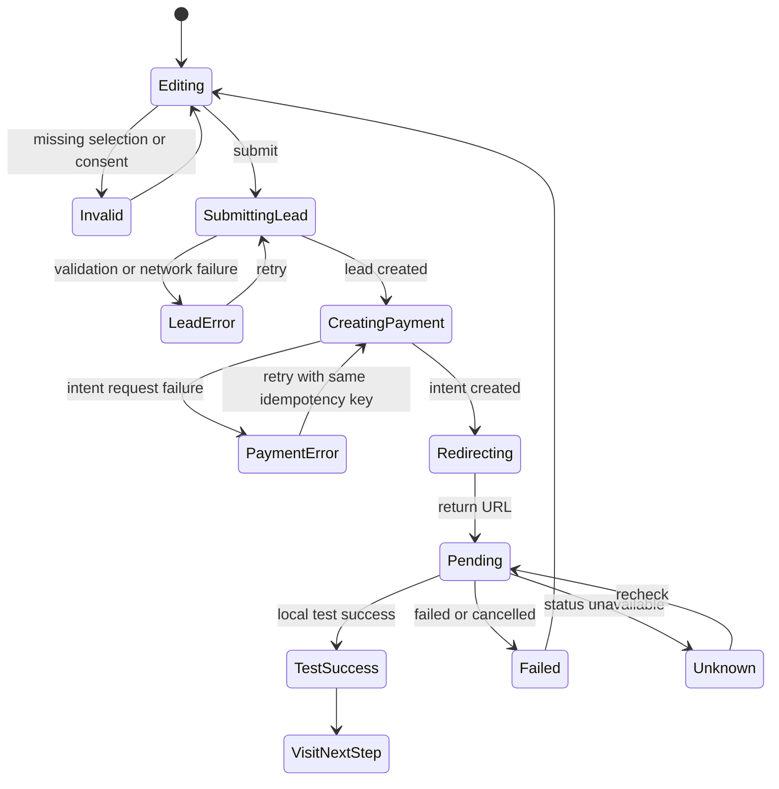

# Service checkout v1: frame selection to prepared store visit

## Context

ViLu currently has two connected product journeys:

1. A user chooses a frame in the catalog or saves 1-3 frames during virtual try-on.
2. ViLu offers a 429 RUB visit-preparation service and opens the existing test payment contour.

The commercial offer is a service, not an online frame purchase. However, the current product checkout mixes a frame estimate, base lenses, fulfillment, courier delivery, and the separate 429 RUB service. A user can reasonably read the screen as an order for a 15,490 RUB frame even though the payment intent is fixed at 429 RUB.

This change makes the payment promise unambiguous and adopts the useful part of the fitting-before-payment commerce pattern: reduce purchase risk, preserve the selected items, and make the amount charged now explicit.

## Why this matters

- Users need to understand exactly what they receive for 429 RUB before sharing a contact or starting payment.
- Product analytics need to measure demand for a service, not accidental clicks caused by a misleading product total.
- Engineering needs one checkout contract for catalog and try-on entries before a real payment provider is connected.
- Partner optics must not receive a promise that a specific frame is reserved or available unless that capability exists.

## Verified current state

Verified on 2026-07-17 at commit `d506b5f`.

| Component | Current behavior | Gap |
|---|---|---|
| `src/pages/Checkout.tsx` | Shows one product, its estimate, base lenses, store pickup, courier fulfillment, delivery amount, and the 429 RUB service | Mixes frame commerce and service checkout |
| `src/pages/TryOnPilot.tsx` | Holds a local 1-3 frame shortlist and can create `visit_preparation_v1` directly | Does not use the same checkout information hierarchy |
| `src/services/leadService.ts` | Submits a consented visit lead with 1-3 selected frames | Product checkout does not create or link a lead |
| `src/services/paymentService.ts` | Creates an idempotent fixed-price payment intent and preserves a safe local receipt | No checkout-context restoration contract |
| `supabase/functions/create-payment-intent/index.ts` | Resolves `visit_preparation_v1` to 429 RUB on the server | Correct and must remain server-owned |
| `src/pages/PaymentStatus.tsx` | Shows pending, test success, failed, and unknown states | Does not show the frame/store context or a concrete next step |
| `src/App.tsx` | Keeps selected product and fitting cart in component state | Does not expose one normalized service-checkout draft |

## What's working well and must not change

- The server owns the 429 RUB amount, currency, offer code, provider, and initial status.
- A browser return URL cannot create a verified paid state.
- Repeated intent creation uses an idempotency key.
- Payment status is read through an opaque public token.
- Real charging remains disabled in this release.
- Face photos, prescriptions, symptoms, and exact location do not enter payment payloads.
- Try-on, Face-fit score, frame saving, nearby optics, and knowledge pages remain available without registration or payment.

## Product decision

The paid unit is:

> Preparation of a selected frame shortlist for an in-store visit — 429 RUB.

It includes:

1. A compact 1-3 frame shortlist.
2. A store handoff summary with frame names, sizes, use case, and available preliminary fit score.
3. A visit checklist covering frame width, bridge fit, and final in-store comfort checks.
4. A follow-up step for confirming the store and visit details.

It does not include:

- the frame or lenses;
- guaranteed stock or reservation of an exact model;
- courier delivery;
- a medical examination, diagnosis, or prescription validation.

## Target customer journey

```text
Catalog frame or try-on shortlist
        |
Review selected 1-3 frames
        |
Review service deliverables and fixed price
        |
Choose a store, city, or "choose later"
        |
Enter minimum contact and grant consent
        |
Submit visit lead
        |
Create fixed 429 RUB payment intent
        |
Test payment return
        |
Pending / test success / failure
        |
Show shortlist, store choice, and one next action
```

### Entry rules

| Entry | Selection | Source |
|---|---|---|
| Product detail | Current product only | `/products` |
| Catalog fitting cart | Up to 3 selected frames | `/products` |
| Virtual try-on | 1-3 saved frames | `/tryon` |

The normalized checkout accepts 1-3 frames. If more than 3 catalog items are selected, use the first 3 in selection order and explain the limit before checkout.

## Information architecture

### Step 1: Your selection

- Show frame image, name, brand, size, and optional preliminary Face-fit score.
- Keep the selection editable.
- Use the shortlist as the visual anchor.

### Step 2: Service for 429 RUB

- Show one ordered list of deliverables.
- Show the limitation: similar models and final fit are confirmed in store.
- Do not describe the service as a frame order.

### Step 3: Store preference

Options:

1. Select a listed store.
2. Select a city and choose the exact store later.
3. Choose both later.

Do not request browser geolocation inside checkout. Existing nearby-optics functionality remains separate.

### Step 4: Contact and consent

- Name: optional.
- Phone or messenger contact: required for a real visit-preparation request.
- Personal-data consent: required before backend submission.
- Privacy-policy link: required.
- Do not persist name, phone, email, or messenger handle in `localStorage`, `sessionStorage`, analytics, or URL parameters.

### Step 5: Summary

The summary must show these lines in this order:

```text
Frame price: confirmed in store
Visit preparation: 429 RUB
Amount charged now: 429 RUB
```

There is no courier or delivery line.

Primary test-mode CTA:

```text
Continue to 429 RUB test payment
```

Production copy is reserved for the future provider-enabled release:

```text
Pay for visit preparation — 429 RUB
```

## Normalized client model

```ts
type ServiceCheckoutSource = '/products' | '/tryon';

type ServiceCheckoutFrame = {
  frameId: string;
  frameName: string;
  frameBrand?: string;
  frameCategory?: string;
  frameSize?: string;
  framePriceRub?: number;
  fitScore?: number;
  useCase?: string;
  imageUrl?: string;
};

type ServiceCheckoutStorePreference =
  | { mode: 'store'; city: string; storeId: string; storeName: string }
  | { mode: 'city'; city: string }
  | { mode: 'later' };

type ServiceCheckoutDraft = {
  version: 1;
  sourcePage: ServiceCheckoutSource;
  selectedFrames: ServiceCheckoutFrame[];
  storePreference: ServiceCheckoutStorePreference;
  createdAt: string;
};
```

Only this non-contact draft may be stored locally under:

```text
vilu_service_checkout_draft_v1
```

The draft expires after 24 hours. Invalid, stale, or malformed drafts are discarded without crashing the page.

## Backend contracts

### Lead submission

Reuse `SubmitVisitLeadRequest`. Map the normalized checkout as follows:

```ts
{
  locale,
  customerName,
  contactValue,
  contactChannel,
  city,
  preferredStoreId,
  preferredStoreName,
  consentPersonalData: true,
  consentVersion,
  privacyVersion,
  sourcePage,
  selectedFrames
}
```

The browser must not send frame images, face photos, landmarks, prescription values, symptoms, or exact coordinates.

### Payment creation

Keep the existing request:

```ts
{
  offerCode: 'visit_preparation_v1',
  leadId,
  sourcePage,
  idempotencyKey
}
```

The server continues to resolve:

```ts
{
  amountRub: 429,
  currency: 'RUB',
  provider: 'none',
  status: 'draft'
}
```

`leadId` is required after successful consented lead submission. A new payment intent must not be created if lead submission failed.

## State machine



## Failure modes

| Failure | User-visible behavior | Data behavior |
|---|---|---|
| No selected frame | Disable continue and link back to selection | No lead or intent |
| Stale local draft | Explain that the selection expired | Delete malformed/stale draft |
| Missing consent | Keep form values in memory and focus consent | No backend request |
| Lead validation error | Keep selection and non-sensitive store choice | Do not create payment intent |
| Lead network error | Show retry | Reuse current form state in memory |
| Payment creation timeout | Show retry | Reuse the same idempotency key |
| Repeated click | Preserve button width and loading state | One lead submission and one payment intent |
| Missing payment token | Show unknown state | Never infer success |
| Test failure or cancellation | Restore checkout context | No verified entitlement or revenue |
| Storage unavailable | Continue without persistence and explain return risk | Never fall back to storing contact |

## Analytics

Add:

```ts
ServiceCheckoutOpened = 'service_checkout_opened'
ServiceCheckoutSelectionViewed = 'service_checkout_selection_viewed'
ServiceCheckoutStoreSelected = 'service_checkout_store_selected'
ServiceCheckoutContactCompleted = 'service_checkout_contact_completed'
ServiceCheckoutSubmitStarted = 'service_checkout_submit_started'
ServiceCheckoutSubmitFailed = 'service_checkout_submit_failed'
```

Allowed parameters:

- source page;
- selected frame count;
- store-choice mode;
- locale;
- normalized error code;
- offer code;
- provider mode.

Forbidden parameters:

- name, phone, email, messenger handle;
- contact value;
- store address;
- exact location;
- internal lead or payment ID;
- public payment token;
- photo, prescription, symptoms, or answers.

Existing payment events remain unchanged. Test status must never be counted as verified revenue.

## Files reference

| File | Change |
|---|---|
| `src/pages/Checkout.tsx` | Replace mixed product/order UI with the service checkout |
| `src/App.tsx` | Pass normalized checkout selection and preserve route behavior |
| `src/types/backend.ts` | Add service-checkout draft and store-preference types |
| `src/services/leadService.ts` | Submit the consented lead before payment creation |
| `src/services/paymentService.ts` | Add safe draft persistence and return-context restoration |
| `src/pages/PaymentStatus.tsx` | Show restored shortlist/store context and one next action |
| `src/lib/analyticsEvents.ts` | Register safe checkout-funnel events |
| `src/pages/ProductDetail.tsx` | Rename checkout CTA to service-oriented copy |
| `src/pages/TryOnPilot.tsx` | Route the paid service entry through the unified checkout |
| `scripts/smoke-routes.mjs` | Add the checkout route to smoke coverage |
| `docs/payments/yookassa-integration.md` | Document the unified pre-provider checkout contract |

## Acceptance criteria

1. Catalog and try-on entries both open the same service-checkout structure with 1-3 frames.
2. Checkout never presents the 429 RUB payment as payment for a frame, lenses, delivery, or reservation.
3. The summary displays `Frame price: confirmed in store`, `Visit preparation: 429 RUB`, and `Amount charged now: 429 RUB`.
4. Courier and delivery-price controls are absent from service checkout.
5. A user can choose a listed store, a city, or `choose later`.
6. Browser geolocation is not requested inside checkout.
7. A contact is submitted only after explicit personal-data consent.
8. Name, contact values, internal IDs, payment tokens, health data, and exact location do not enter analytics.
9. Name and contact values are never written to browser storage or URL parameters.
10. A successful lead response supplies the `leadId` used to create the payment intent.
11. Lead failure prevents payment-intent creation and preserves recoverable in-memory form state.
12. Double-clicking the CTA produces one lead submission and one payment intent.
13. Retrying payment creation reuses the same idempotency key.
14. The server, not the browser, determines the 429 RUB amount and RUB currency.
15. The return URL cannot create a paid state.
16. A valid non-sensitive checkout draft survives the test redirect and expires after 24 hours.
17. Test success is visibly labelled and is not reported as verified revenue.
18. All new static, loading, validation, error, pending, success, and failed copy is complete in RU and EN.
19. RU remains the default language.
20. At 390 px and 1440 px, the checkout and payment-result layouts have no clipping or horizontal overflow.
21. Existing try-on, Face-fit score, frame saving, nearby optics, lead submission, catalog, dashboard, and knowledge routes continue to work.
22. `npm run typecheck`, `npm run lint`, `npm run build`, and `npm run smoke` pass.

## Testing plan

| Layer | What | Count |
|---|---|---:|
| Unit | Draft validation, 24-hour expiry, safe persistence, selection normalization | +8 |
| Unit | Checkout state transitions and duplicate-submit guard | +6 |
| Contract | Lead payload omits forbidden fields | +3 |
| Contract | Payment payload contains only offer, lead, source, and idempotency key | +3 |
| Integration | Lead success to payment-intent creation | +2 |
| Integration | Lead failure prevents payment creation | +2 |
| E2E | Product to checkout to pending to test success/failure | +2 |
| E2E | Try-on shortlist to checkout and restored return context | +2 |
| Responsive | RU and EN at 390 px and 1440 px | +4 |
| Regression | Try-on, catalog, nearby optics, payment status, dashboard | +5 |

## Dependency order

```text
Normalized checkout draft
    ├── Catalog entry adapter
    ├── Try-on entry adapter
    └── Safe local persistence
             |
             v
Unified service checkout UI
             |
             v
Lead submission and consent
             |
             v
Existing payment intent
             |
             v
Return context and result UX
             |
             v
Analytics and complete QA
```

The normalized draft comes first because every UI and backend step depends on one stable representation of the selected frames and store preference. Lead submission precedes payment creation so a paid or tested service always has an operational handoff target.

## Effort estimate

| Area | Estimate |
|---|---:|
| Normalized model and safe persistence | 2-3 hours |
| Catalog and try-on entry adapters | 3-4 hours |
| Service checkout UI and translations | 5-7 hours |
| Lead/payment orchestration and failures | 4-5 hours |
| Payment-result context | 2-3 hours |
| Analytics and documentation | 2 hours |
| Automated and responsive QA | 4-6 hours |
| Total | 22-30 hours |

## Rollback

Revert the implementation commits and restore the current product-specific checkout. Do not roll back or delete payment/lead migrations or audit records. The server-owned 429 RUB offer and existing payment status routes remain compatible throughout the rollback.

## Out of scope

- Real YooKassa charging or production credentials.
- Production webhook processing.
- Fiscal receipts, refunds, reconciliation, and accounting.
- Online frame or lens sales.
- Courier fulfillment.
- Exact frame stock, reservation, or guaranteed availability.
- Browser card fields or storage of banking data.
- New admin tooling for partner optics.

## Related

- PR #35 — fixes the current checkout-to-payment transition.
- `docs/specs/payment-return-status-v1.md`
- `docs/payments/yookassa-integration.md`
- Official Lamoda delivery and fitting reference: https://academy.lamoda.ru/news/12-3-sposoby-dostavki/
- Official Lamoda mobile order reference: https://www.lamoda.by/help/article/oformlenie-zakaza-v-mob-versii-sayta-by/
