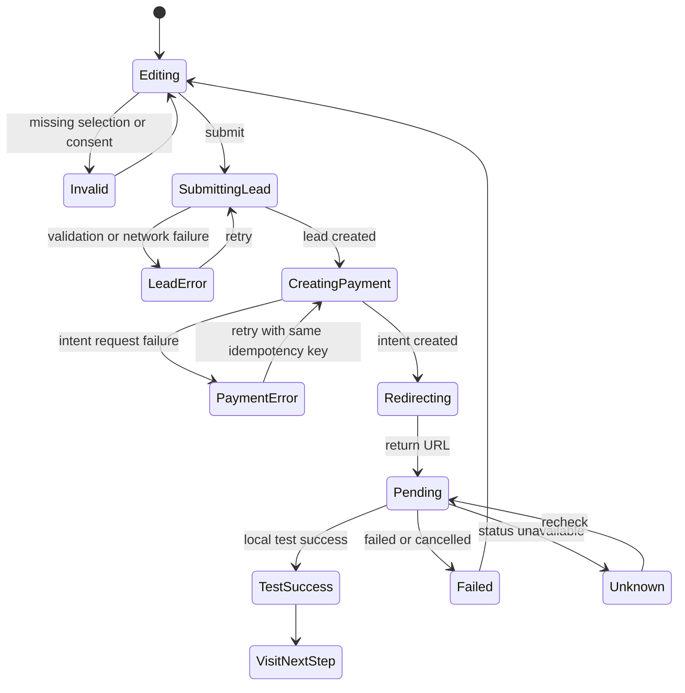
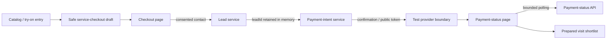
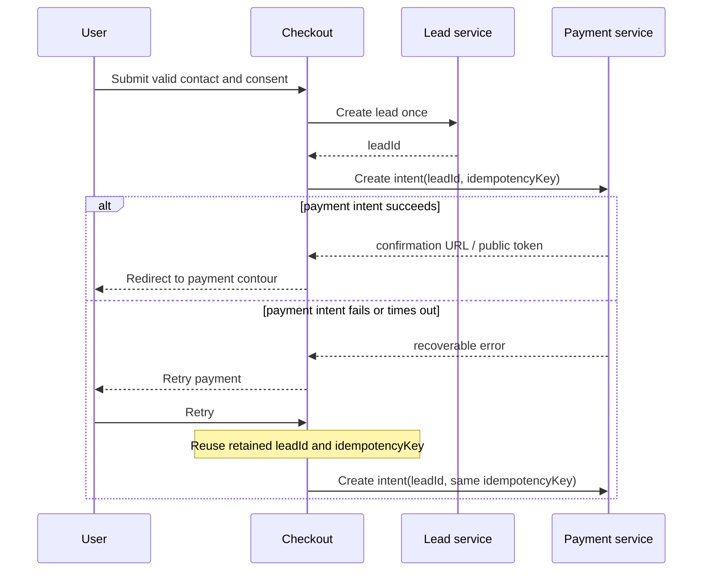
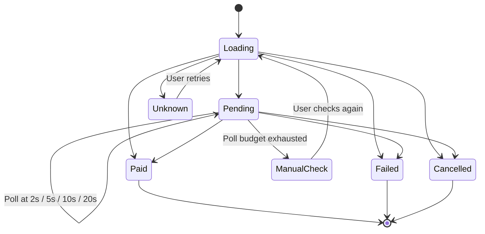

# Service checkout v1: frame selection to prepared store visit

## Context

ViLu currently has two connected product journeys:

1. A user chooses a frame in the catalog or saves 1-3 frames during virtual try-on.
2. ViLu offers a 429 RUB visit-preparation service and opens the existing test payment contour.

The commercial offer is a service, not an online frame purchase. However, the current product checkout mixes a frame estimate, base lenses, fulfillment, courier delivery, and the separate 429 RUB service. A user can reasonably read the screen as an order for a 15,490 RUB frame even though the payment intent is fixed at 429 RUB.

This change makes the payment promise unambiguous and adopts the useful part of the fitting-before-payment commerce pattern: reduce purchase risk, preserve the selected items, and make the amount charged now explicit.

## Why this matters

- Users need to understand exactly what they receive for 429 RUB before sharing a contact or starting payment.
- Product analytics need to measure demand for a service, not accidental clicks caused by a misleading product total.
- Engineering needs one checkout contract for catalog and try-on entries before a real payment provider is connected.
- Partner optics must not receive a promise that a specific frame is reserved or available unless that capability exists.

## Verified current state

Verified on 2026-07-17 at commit `898b4ca`.

| Component | Current behavior | Gap |
|---|---|---|
| `src/pages/Checkout.tsx` | Implements the unified 429 RUB service checkout, consented lead creation, payment-intent creation, duplicate-submit guard, and safe draft restoration | Payment-creation retry currently restarts lead submission; validation is generic rather than field-linked |
| `src/pages/TryOnPilot.tsx` | Holds a local 1-3 frame shortlist and routes it through the normalized service checkout | No hardening gap in this phase |
| `src/services/leadService.ts` | Submits a consented visit lead with 1-3 selected frames and applies the privacy guard | No hardening gap in this phase |
| `src/services/paymentService.ts` | Creates an idempotent fixed-price payment intent, preserves a safe receipt, and reads payment status | Caller must retain the successful `leadId` and idempotency key across payment retry |
| `supabase/functions/create-payment-intent/index.ts` | Resolves `visit_preparation_v1` to 429 RUB on the server | Correct and must remain server-owned |
| `src/pages/PaymentStatus.tsx` | Shows pending, test success, failed, cancelled, and unknown states with safe restored context | Performs one automatic status request only; pending state requires bounded polling |
| `src/services/serviceCheckout.ts` | Normalizes a safe 1-3-frame draft, rejects unsafe data, and expires it after 24 hours | Existing contract checks cover only part of the runtime behavior |
| `scripts/check-service-checkout.mjs` | Checks source ordering, server-owned price, route presence, and pure draft behavior | No component-level or browser-level regression coverage |

## What's working well and must not change

- The server owns the 429 RUB amount, currency, offer code, provider, and initial status.
- A browser return URL cannot create a verified paid state.
- Repeated intent creation uses an idempotency key.
- Payment status is read through an opaque public token.
- Real charging remains disabled in this release.
- Face photos, prescriptions, symptoms, and exact location do not enter payment payloads.
- Try-on, Face-fit score, frame saving, nearby optics, and knowledge pages remain available without registration or payment.

## Product decision

The paid unit is:

> Preparation of a selected frame shortlist for an in-store visit — 429 RUB.

It includes:

1. A compact 1-3 frame shortlist.
2. A store handoff summary with frame names, sizes, use case, and available preliminary fit score.
3. A visit checklist covering frame width, bridge fit, and final in-store comfort checks.
4. A follow-up step for confirming the store and visit details.

It does not include:

- the frame or lenses;
- guaranteed stock or reservation of an exact model;
- courier delivery;
- a medical examination, diagnosis, or prescription validation.

## Target customer journey

```text
Catalog frame or try-on shortlist
        |
Review selected 1-3 frames
        |
Review service deliverables and fixed price
        |
Choose a store, city, or "choose later"
        |
Enter minimum contact and grant consent
        |
Submit visit lead
        |
Create fixed 429 RUB payment intent
        |
Test payment return
        |
Pending / test success / failure
        |
Show shortlist, store choice, and one next action
```

### User journey and emotional arc

| Step | User does | Desired feeling | UI support |
|---|---|---|---|
| 1. Opens checkout | Reviews the selected frames | Recognition: `These are my choices` | Frame images and names appear before forms or payment language |
| 2. Reviews the service | Learns what 429 RUB buys | Clarity, not sales pressure | One fixed-price service definition plus a short exclusion list |
| 3. Chooses store preference | Selects a store/city or postpones the choice | Control | `Choose later` is a valid option and geolocation is not requested |
| 4. Enters contact | Provides the minimum operational contact | Trust | Visible purpose, consent, privacy link, and no browser persistence |
| 5. Starts payment | Confirms the exact amount charged now | Certainty | Sticky/visible summary repeats `Amount charged now: 429 RUB` |
| 6. Returns from payment | Waits for confirmation | Reassurance | Bounded automatic status checks, frame context, elapsed-time explanation, and safe retry |
| 7. Sees success | Confirms what was received | Completion | Explicit test-success status and prepared shortlist preview |
| 8. Continues service | Opens the visit preparation | Momentum | One primary action: `Open visit shortlist`; store discovery follows inside that flow |

### Time-horizon design

- **First 5 seconds:** the user recognizes their selected frames, the service name, and `429 RUB`.
- **First 5 minutes:** the user can complete checkout, recover from validation/payment delays, and open the prepared shortlist without losing context.
- **Long-term trust:** the interface consistently distinguishes a paid preparation service from frame purchase, medical care, reservation, and verified payment revenue.

### Successful payment result

The success screen must lead with:

```text
Test payment confirmed
Your visit shortlist is ready
```

Show:

1. The 1-3 selected frames.
2. The chosen store/city preference or `Choose later`.
3. A compact visit checklist.
4. The test-mode limitation.

Primary action:

```text
Open visit shortlist
```

Inside the prepared shortlist, the next primary action is store selection or route/contact for the already selected store. Secondary actions such as catalog, profile, or home must not compete with the success action.

### Entry rules

| Entry | Selection | Source |
|---|---|---|
| Product detail | Current product only | `/products` |
| Catalog fitting cart | Up to 3 selected frames | `/products` |
| Virtual try-on | 1-3 saved frames | `/tryon` |

The normalized checkout accepts 1-3 frames. If more than 3 catalog items are selected, use the first 3 in selection order and explain the limit before checkout.

## Information architecture

### Screen hierarchy

The checkout must preserve the same decision order on every viewport:

```text
Checkout
├── Header: service name and fixed price context
├── Selected frames: 1-3 editable items
├── Service scope: what 429 RUB includes and excludes
├── Store preference: store, city, or choose later
├── Contact and consent
├── Order summary
└── Primary action: continue to the 429 RUB test payment
```

If only three things fit in the first meaningful viewport, show:

1. The selected frame shortlist.
2. `Visit preparation — 429 RUB`.
3. The next required action.

Frame retail prices, technical payment terms, and secondary explanations must not compete with these three elements.

### Desktop composition

- Use a two-column layout at `1024px` and wider.
- The editable flow occupies the main column as one continuous light workspace.
- The order summary occupies a sticky secondary column and remains visible while the user completes store and contact sections.
- The summary contains the fixed amount, test-mode label, primary CTA, and one compact trust statement.
- Sticky behavior must stop before the page footer and must not overlap browser zoomed content.

### Surface and container rules

The checkout is an application workflow, not a marketing card grid.

- Use one light main workspace for selection, service scope, store preference, and contact.
- Separate workflow sections with headings, 24-32px vertical spacing, and thin dividers.
- Do not wrap every workflow step in another large rounded card.
- Frame items remain cards because each frame is an editable object.
- The order summary remains a card because it is a persistent, actionable object.
- Consent may use a compact trust surface, but it must not become a card nested inside another card.
- Payment-result pages use one dominant status composition and one context region, not a dashboard mosaic.
- Use radius hierarchy from `DESIGN.md`; do not apply the largest radius to every surface.
- Remove any decorative icon that does not communicate status, safety, navigation, or action.

### Design tokens and contrast contract

The implementation must follow the active product tokens in `src/index.css` and `tailwind.config.js`:

| Role | Token | Value | Required pairing |
|---|---|---:|---|
| Primary action | `vilu-lime` | `#d8ef4f` | `vilu-ink` text and icons |
| Dark surface/text | `vilu-ink` | `#07110d` | `vilu-paper` text on dark surfaces |
| Main page surface | `vilu-paper` | `#f8f3e8` | `vilu-ink` text |
| Raised card | `vilu-card` | `#fffdf7` | `vilu-ink` text |
| Trust/selection | `vilu-green` | `#2f6658` | Use for selected borders, trust labels, and non-CTA status |
| Error | `vilu-error` | `#b91c1c` | Use with a text/icon cue; never color alone |

Rules:

- All primary checkout and payment-result CTAs use `vilu-lime` with `vilu-ink`.
- Dark sections use `vilu-paper` for headings and body copy; inherited dark text is forbidden.
- Light sections use `vilu-ink` for headings and body copy.
- `vilu-green` communicates trust, confirmation, or selection; it is not a competing primary CTA color.
- Amber is not introduced into this checkout flow.
- Disabled controls use a neutral surface plus readable text and an explicit explanation; do not simulate disabled state using low contrast alone.
- Body text and form labels meet WCAG AA `4.5:1`; large text and non-text controls meet at least `3:1`.
- Every implementation review must test the computed foreground/background pair, not only the Tailwind class name, to catch inherited black-on-dark text.

### Mobile composition

At widths below `1024px`, use one continuous page in this exact order:

1. Selected frames.
2. Service deliverables and limitation.
3. Store preference.
4. Contact and consent.
5. Expanded order summary.

A fixed bottom action bar remains visible after the header leaves the viewport:

```text
To pay now: 429 RUB                 [Continue]
```

- The action bar respects `env(safe-area-inset-bottom)`.
- The bar never covers the focused field, validation message, consent text, or final page content.
- While the software keyboard is open, the bar may become non-fixed if the available visual viewport would be obstructed.
- Before the form is valid, the button remains disabled and the nearest inline helper explains the missing requirement.
- The disabled button must not be the only indication of what is missing.
- The expanded summary remains in the document flow so price and service details are available to screen readers and users who dismiss or cannot use sticky positioning.

### Step 1: Your selection

- Show frame image, name, brand, size, and optional preliminary Face-fit score.
- Keep the selection editable.
- Use the shortlist as the visual anchor.
- On mobile, render all 1-3 frames as a compact vertical list; do not hide frames in a carousel or `+N` summary.
- Each row uses a fixed thumbnail, brand, a frame name limited visually to two lines, size/score metadata, and a 44px removal control.
- Preserve the full frame name in accessible text and in the prepared visit shortlist.
- A long name or untranslated product value must wrap or truncate inside the row without changing thumbnail/control dimensions or causing horizontal scroll.
- When only one frame remains, keep the removal control visible but disabled and explain that at least one frame is required.

### Step 2: Service for 429 RUB

- Show one ordered list of deliverables.
- Show the limitation: similar models and final fit are confirmed in store.
- Do not describe the service as a frame order.

### Step 3: Store preference

Options:

1. Select a listed store.
2. Select a city and choose the exact store later.
3. Choose both later.

Do not request browser geolocation inside checkout. Existing nearby-optics functionality remains separate.

### Step 4: Contact and consent

- Name: optional.
- Phone or messenger contact: required for a real visit-preparation request.
- Personal-data consent: required before backend submission.
- Privacy-policy link: required.
- Do not persist name, phone, email, or messenger handle in `localStorage`, `sessionStorage`, analytics, or URL parameters.

### Step 5: Summary

The summary must show these lines in this order:

```text
Frame price: confirmed in store
Visit preparation: 429 RUB
Amount charged now: 429 RUB
```

There is no courier or delivery line.

Primary test-mode CTA:

```text
Continue to 429 RUB test payment
```

Production copy is reserved for the future provider-enabled release:

```text
Pay for visit preparation — 429 RUB
```

## Normalized client model

```ts
type ServiceCheckoutSource = '/products' | '/tryon';

type ServiceCheckoutFrame = {
  frameId: string;
  frameName: string;
  frameBrand?: string;
  frameCategory?: string;
  frameSize?: string;
  framePriceRub?: number;
  fitScore?: number;
  useCase?: string;
  imageUrl?: string;
};

type ServiceCheckoutStorePreference =
  | { mode: 'store'; city: string; storeId: string; storeName: string }
  | { mode: 'city'; city: string }
  | { mode: 'later' };

type ServiceCheckoutDraft = {
  version: 1;
  sourcePage: ServiceCheckoutSource;
  selectedFrames: ServiceCheckoutFrame[];
  storePreference: ServiceCheckoutStorePreference;
  createdAt: string;
};
```

Only this non-contact draft may be stored locally under:

```text
vilu_service_checkout_draft_v1
```

The draft expires after 24 hours. Invalid, stale, or malformed drafts are discarded without crashing the page.

## Backend contracts

### Lead submission

Reuse `SubmitVisitLeadRequest`. Map the normalized checkout as follows:

```ts
{
  locale,
  customerName,
  contactValue,
  contactChannel,
  city,
  preferredStoreId,
  preferredStoreName,
  consentPersonalData: true,
  consentVersion,
  privacyVersion,
  sourcePage,
  selectedFrames
}
```

The browser must not send frame images, face photos, landmarks, prescription values, symptoms, or exact coordinates.

### Payment creation

Keep the existing request:

```ts
{
  offerCode: 'visit_preparation_v1',
  leadId,
  sourcePage,
  idempotencyKey
}
```

The server continues to resolve:

```ts
{
  amountRub: 429,
  currency: 'RUB',
  provider: 'none',
  status: 'draft'
}
```

`leadId` is required after successful consented lead submission. A new payment intent must not be created if lead submission failed.

## State machine



## Interaction state coverage

Every state must preserve the user's orientation: selected frames, service name, and the fixed 429 RUB amount remain available unless the draft is invalid or expired.

| Feature | Loading | Empty | Error | Success | Partial / delayed |
|---|---|---|---|---|---|
| Selected frames | Stable image placeholders that preserve card height | Explain that at least one frame is required and link back to catalog/try-on | Replace a failed image with a frame icon; keep frame text | Show 1-3 editable frames | Show the first 3 and explain the limit |
| Store preference | Preserve selected control dimensions | `Choose later` is a valid warm default, not an error | Keep the previous selection and show an inline retry only if remote store data failed | Selected store/city is visibly marked | City is selected but exact store remains optional |
| Contact form | Preserve values in memory and disable duplicate submission | Visible labels and neutral placeholders | Put a concise message next to the invalid field, move focus to the first error, and retain all entered values | Consent and contact are ready for submission | Contact is valid but consent or one required detail is missing |
| Lead submission | Button copy changes to `Saving request...`; width does not change | Not applicable | Explain that payment has not started; offer retry without clearing the form | Continue automatically to payment creation | A slow response keeps the same loading state and prevents a second request |
| Payment creation | Button copy changes to `Opening test payment...` | Not applicable | Explain that the request is saved but payment did not open; retry with the same idempotency key | Redirect to provider/test contour | Timeout is treated as unknown until the same intent can be checked or retried safely |
| Payment return | Show `Checking payment status` with elapsed-time context | Missing token produces an unknown-state explanation, never success | Show failure/cancellation reason in user language and a route back to checkout | Show explicit test success and the next service step | Keep the pending screen, continue limited automatic checks, and expose manual recheck |
| Draft restoration | Use a short skeleton only while safe local data is read | Explain that the selection expired and offer catalog/try-on actions | Continue without persistence and explain that return context may be lost | Restore frames and store preference | Never restore contact or consent from browser storage |

### Pending payment behavior

After returning from the payment contour:

1. Show `Checking payment status` immediately.
2. Poll the existing payment-status endpoint with the existing public token; never create a new payment intent.
3. Use a bounded schedule, for example `0s`, `2s`, `5s`, `10s`, and `20s`.
4. Keep selected-frame and store context visible while checking.
5. Announce status changes through an `aria-live="polite"` region.
6. Provide `Check again` after the first delayed response and keep it available after automatic checks stop.
7. Disable the manual action while a check is active.
8. After the bounded checks finish, show:

```text
Payment confirmation is taking longer than usual.
Checking again will not create a new payment or charge you twice.
```

The user can leave the page and return through the safe receipt context. A pending client return never becomes verified success without a server-confirmed status.

## Responsive and accessibility contract

### Validation and focus

- Keep visible labels above every input; placeholders are examples, never the only label.
- On submit with invalid data, render an error summary before the contact section.
- Move programmatic focus to the error-summary heading using `tabIndex="-1"`.
- The summary lists each invalid field as a link that moves focus to that field.
- Each invalid field keeps an inline error message until corrected.
- Connect each inline message with `aria-describedby` and expose invalid state with `aria-invalid="true"`.
- Announce submit, payment, and status errors through `role="alert"`; use `aria-live="polite"` for non-error progress.
- Do not clear form values or selection when validation fails.

### Keyboard and touch

- All actions, store choices, frame-removal controls, consent, and status retries are reachable and operable by keyboard.
- Visible focus indicators must have at least `3:1` contrast against adjacent colors and must not rely on color alone.
- Touch targets are at least `44x44px`; the primary CTA is `48-52px` high.
- Focus order follows the visual order and does not jump into the sticky summary before the related form content.
- Sticky UI must not hide focused controls at `200%` browser zoom.
- Escape must not discard checkout data; no modal is required for the core checkout flow.

### Responsive verification

Required manual and automated viewports:

| Viewport | Required behavior |
|---|---|
| `320x568` | One column; full labels fit; no horizontal scroll; sticky CTA respects safe area |
| `390x844` | One column; mobile keyboard does not cover focused field or error |
| `768x1024` | One column or compact transitional layout; no narrow side panel |
| `1024x768` | Two columns allowed; summary remains usable without covering footer |
| `1440x900` | Two columns; main workspace and summary maintain readable line lengths |
| `200% zoom` | Content reflows without clipping, lost controls, or overlapping sticky UI |

Test both RU and EN at every shipping viewport. Long Russian button labels must be shortened before reducing type below the design-system minimum.

## Failure modes

| Failure | User-visible behavior | Data behavior |
|---|---|---|
| No selected frame | Disable continue and link back to selection | No lead or intent |
| Stale local draft | Explain that the selection expired | Delete malformed/stale draft |
| Missing consent | Keep form values in memory and focus consent | No backend request |
| Lead validation error | Keep selection and non-sensitive store choice | Do not create payment intent |
| Lead network error | Show retry | Reuse current form state in memory |
| Payment creation timeout | Show retry | Reuse the same idempotency key |
| Repeated click | Preserve button width and loading state | One lead submission and one payment intent |
| Missing payment token | Show unknown state | Never infer success |
| Test failure or cancellation | Restore checkout context | No verified entitlement or revenue |
| Storage unavailable | Continue without persistence and explain return risk | Never fall back to storing contact |

## Analytics

Add:

```ts
ServiceCheckoutOpened = 'service_checkout_opened'
ServiceCheckoutSelectionViewed = 'service_checkout_selection_viewed'
ServiceCheckoutStoreSelected = 'service_checkout_store_selected'
ServiceCheckoutContactCompleted = 'service_checkout_contact_completed'
ServiceCheckoutSubmitStarted = 'service_checkout_submit_started'
ServiceCheckoutSubmitFailed = 'service_checkout_submit_failed'
```

Allowed parameters:

- source page;
- selected frame count;
- store-choice mode;
- locale;
- normalized error code;
- offer code;
- provider mode.

Forbidden parameters:

- name, phone, email, messenger handle;
- contact value;
- store address;
- exact location;
- internal lead or payment ID;
- public payment token;
- photo, prescription, symptoms, or answers.

Existing payment events remain unchanged. Test status must never be counted as verified revenue.

## Files reference

| File | Change |
|---|---|
| `src/pages/Checkout.tsx` | Replace mixed product/order UI with the service checkout |
| `src/App.tsx` | Pass normalized checkout selection and preserve route behavior |
| `src/types/backend.ts` | Add service-checkout draft and store-preference types |
| `src/services/leadService.ts` | Submit the consented lead before payment creation |
| `src/services/paymentService.ts` | Add safe draft persistence and return-context restoration |
| `src/pages/PaymentStatus.tsx` | Show restored shortlist/store context and one next action |
| `src/lib/analyticsEvents.ts` | Register safe checkout-funnel events |
| `src/pages/ProductDetail.tsx` | Rename checkout CTA to service-oriented copy |
| `src/pages/TryOnPilot.tsx` | Route the paid service entry through the unified checkout |
| `scripts/smoke-routes.mjs` | Add the checkout route to smoke coverage |
| `docs/payments/yookassa-integration.md` | Document the unified pre-provider checkout contract |

## Acceptance criteria

1. Catalog and try-on entries both open the same service-checkout structure with 1-3 frames.
2. Checkout never presents the 429 RUB payment as payment for a frame, lenses, delivery, or reservation.
3. The summary displays `Frame price: confirmed in store`, `Visit preparation: 429 RUB`, and `Amount charged now: 429 RUB`.
4. Courier and delivery-price controls are absent from service checkout.
5. A user can choose a listed store, a city, or `choose later`.
6. Browser geolocation is not requested inside checkout.
7. A contact is submitted only after explicit personal-data consent.
8. Name, contact values, internal IDs, payment tokens, health data, and exact location do not enter analytics.
9. Name and contact values are never written to browser storage or URL parameters.
10. A successful lead response supplies the `leadId` used to create the payment intent.
11. Lead failure prevents payment-intent creation and preserves recoverable in-memory form state.
12. Double-clicking the CTA produces one lead submission and one payment intent.
13. Retrying payment creation reuses the same idempotency key.
14. The server, not the browser, determines the 429 RUB amount and RUB currency.
15. The return URL cannot create a paid state.
16. A valid non-sensitive checkout draft survives the test redirect and expires after 24 hours.
17. Test success is visibly labelled and is not reported as verified revenue.
18. All new static, loading, validation, error, pending, success, and failed copy is complete in RU and EN.
19. RU remains the default language.
20. At 390 px and 1440 px, the checkout and payment-result layouts have no clipping or horizontal overflow.
21. Existing try-on, Face-fit score, frame saving, nearby optics, lead submission, catalog, dashboard, and knowledge routes continue to work.
22. `npm run typecheck`, `npm run lint`, `npm run build`, and `npm run smoke` pass.

## Testing plan

| Layer | What | Count |
|---|---|---:|
| Unit | Draft validation, 24-hour expiry, safe persistence, selection normalization | +8 |
| Unit | Checkout state transitions and duplicate-submit guard | +6 |
| Contract | Lead payload omits forbidden fields | +3 |
| Contract | Payment payload contains only offer, lead, source, and idempotency key | +3 |
| Integration | Lead success to payment-intent creation | +2 |
| Integration | Lead failure prevents payment creation | +2 |
| E2E | Product to checkout to pending to test success/failure | +2 |
| E2E | Try-on shortlist to checkout and restored return context | +2 |
| Responsive | RU and EN at 390 px and 1440 px | +4 |
| Regression | Try-on, catalog, nearby optics, payment status, dashboard | +5 |

## Dependency order

```text
Normalized checkout draft
    ├── Catalog entry adapter
    ├── Try-on entry adapter
    └── Safe local persistence
             |
             v
Unified service checkout UI
             |
             v
Lead submission and consent
             |
             v
Existing payment intent
             |
             v
Return context and result UX
             |
             v
Analytics and complete QA
```

The normalized draft comes first because every UI and backend step depends on one stable representation of the selected frames and store preference. Lead submission precedes payment creation so a paid or tested service always has an operational handoff target.

## Effort estimate

| Area | Estimate |
|---|---:|
| Normalized model and safe persistence | 2-3 hours |
| Catalog and try-on entry adapters | 3-4 hours |
| Service checkout UI and translations | 5-7 hours |
| Lead/payment orchestration and failures | 4-5 hours |
| Payment-result context | 2-3 hours |
| Analytics and documentation | 2 hours |
| Automated and responsive QA | 4-6 hours |
| Total | 22-30 hours |

## Rollback

Revert the implementation commits and restore the current product-specific checkout. Do not roll back or delete payment/lead migrations or audit records. The server-owned 429 RUB offer and existing payment status routes remain compatible throughout the rollback.

## What already exists

- A working catalog and try-on flow that can produce a shortlist of 1-3 frames.
- A lead service, payment-intent service, payment-status route, and test-provider mode.
- Shared ViLu navigation, localization, analytics helpers, and current lime/ink/paper tokens.
- Local browser persistence patterns that can be narrowed to non-sensitive checkout context.
- Smoke coverage for the main product routes.

These foundations are reused. This phase does not introduce card collection, a second
payment architecture, a new design system, or a competing checkout route.

## Design review decisions

| ID | Decision | Outcome |
|---|---|---|
| D2 | Mobile checkout structure | Sequential single-column page with one safe-area-aware sticky bottom action |
| D3 | Pending payment behavior | Bounded polling at 0, 2, 5, 10, and 20 seconds plus a manual status check |
| D4 | Success-page priority | Open the prepared visit shortlist; store choice follows inside that context |
| D5 | Container hierarchy | One light workspace with dividers; cards only for frames and the order summary |
| D6 | Palette | ViLu lime is the primary action color; ink, paper, card, and green retain semantic roles |
| D7 | Validation | Focused error summary plus linked inline errors without clearing entered data |
| D8 | Mobile frame selection | Show all 1-3 selected frames as a compact vertical list |
| D9 | Global token-document conflict | Track the stale amber guidance in `TODOS.md`; do not widen this checkout change into a product-wide migration |

Review outcome: the checkout now has a complete hierarchy, emotional arc, responsive
model, state coverage, contrast contract, and accessible validation behavior. No
design decision remains open for implementation.

## Engineering review decisions

| ID | Decision | Outcome |
|---|---|---|
| E1 | Scope | Harden the implemented checkout; do not rebuild its architecture or visual foundation |
| E2 | Retry ownership | After lead success, retain `leadId` and the payment idempotency key in component memory; retry payment creation only |
| E3 | Payment status | Poll at 0, 2, 5, 10, and 20 seconds, then stop and expose a manual status check |
| E4 | Validation | Use field-level errors, `aria-invalid`, `aria-describedby`, a focused summary, and focus the first invalid field |
| E5 | Automated coverage | Add Vitest, React Testing Library, and Playwright while retaining contract and route smoke scripts |
| E6 | Design token debt | Keep the approved `TODOS.md` item for the stale amber guidance in `DESIGN.md`; do not widen this hardening phase |

No engineering decision remains open.

## Authoritative hardening scope

The unified checkout foundation described earlier in this document is already present
at commit `898b4ca`. The tasks below supersede the older build plan. Implementers must
not recreate the checkout model, lead service, payment service, route adapters, or
server-owned offer.

### Component boundaries



Trust boundaries:

- Contact values cross the browser boundary only through the consented lead request.
- Contact values, `leadId`, payment token, and provider identifiers never enter
  analytics.
- Only the safe draft may enter browser storage; contact values remain in memory.
- The server remains the sole owner of amount, currency, offer code, and provider.
- A browser return or local draft can restore context but can never assert `paid`.

### Checkout sequence with payment retry



The retained `leadId` is intentionally session-memory only. Reloading checkout may
require a new lead; persistence of personal or operational lead state is not introduced
in this phase.

### Payment-status state machine



All scheduled timers are cancelled on terminal status and component unmount. Responses
arriving after unmount or after a newer request must not update visible state.

## Failure modes and recovery

| Failure | User-visible behavior | System behavior | Required test |
|---|---|---|---|
| Invalid contact or missing consent | Linked inline message plus focused error summary | No network request | Component test |
| Rapid double submit | One loading state | One lead request and one payment request | Component test |
| Lead request fails | Recoverable lead error; entered values remain | No payment request | Component test |
| Lead succeeds, payment fails | Payment-specific retry; entered values remain | Retain `leadId` and idempotency key; do not recreate lead | Component + E2E |
| Payment request outcome is unknown | Explain that no second payment should be started blindly | Retry with the same key | Component test |
| Status remains pending | Visible progress, then manual check | Poll at 0/2/5/10/20 seconds and stop | Fake-timer test |
| Status API fails | Generic recoverable error, no false success | Stop automatic loop until manual retry | Component test |
| Terminal status arrives | Stable paid/failed/cancelled result | Cancel timers and ignore stale responses | Fake-timer test |
| Missing or expired public token | Unknown-result recovery state | Never infer payment | Component + E2E |
| Safe draft is expired or invalid | Return to try-on/catalog with explanation | Reject draft and clear only unsafe context | Existing contract + E2E |

## Test coverage map

```text
CODE PATHS                                      USER FLOWS
[+] serviceCheckout draft                      [+] Product / try-on -> checkout
  +-- [★★★ TESTED] valid / unsafe / expired      +-- [★ TESTED] route presence
[+] Checkout submit                             +-- [GAP -> E2E] invalid form recovery
  +-- [GAP] field validation                   [+] Lead -> payment intent
  +-- [GAP] double-click guard                   +-- [GAP -> E2E] happy path
  +-- [GAP] lead failure                         +-- [GAP -> E2E] payment-only retry
  +-- [★ TESTED] lead before payment           [+] Payment return
  +-- [GAP] payment-only retry                    +-- [GAP -> E2E] pending -> paid
[+] PaymentStatus                                +-- [GAP -> E2E] failed / cancelled
  +-- [★ TESTED] route presence                  +-- [GAP -> E2E] missing token
  +-- [GAP] bounded polling
  +-- [GAP] terminal cleanup
  +-- [GAP] manual retry

CURRENT: 3 behavior groups have meaningful checks; 13 runtime paths are gaps.
TARGET: all listed gaps covered by RTL/Vitest or Playwright in T3.
Legend: ★★★ behavior + edge + error | ★ smoke/static contract
```

### Code paths

| Code path | Current coverage | Required coverage |
|---|---|---|
| Safe draft normalization, unsafe keys, and 24-hour expiry | Contract script | Retain contract script |
| Invalid contact | Gap | RTL component test |
| Missing consent | Gap | RTL component test |
| Lead pending and double click | Gap | RTL component test |
| Lead failure blocks payment | Static ordering check only | RTL component test |
| Lead success creates payment intent | Static ordering check only | RTL component test |
| Payment failure retains `leadId` and key | Gap | RTL component test |
| Payment retry does not recreate lead | Gap | RTL component test |
| Payment success redirect | Gap | RTL + Playwright |
| Status initial request | Route smoke only | RTL component test |
| Poll schedule 0/2/5/10/20 | Gap | Vitest fake-timer test |
| Paid/failed/cancelled stops polling | Gap | Vitest fake-timer test |
| Poll budget exhaustion and manual retry | Gap | RTL component test |
| Unmount cancels timers and stale updates | Gap | Vitest fake-timer test |
| RU/EN checkout and result copy | Manual | Playwright desktop/mobile |
| 390 px and 1440 px layout | Manual | Playwright screenshot/overflow assertions |

Current meaningful automated coverage is limited to the safe draft, source-order
contract, and route presence. The hardening suite closes every behavior-changing path
in this phase; no planned state is left silently untested.

### User-flow matrix

| Flow | Desktop | Mobile | RU | EN | Failure path |
|---|---:|---:|---:|---:|---:|
| Product -> checkout -> validation | Yes | Yes | Yes | Yes | Invalid contact / consent |
| Try-on shortlist -> checkout | Yes | Yes | Yes | Yes | Expired draft |
| Lead -> payment intent | Yes | Yes | Yes | Yes | Lead failure |
| Payment failure -> retry | Yes | Yes | Yes | Yes | No duplicate lead |
| Return pending -> paid | Yes | Yes | Yes | Yes | Poll exhaustion |
| Failed/cancelled -> checkout | Yes | Yes | Yes | Yes | Missing token |

## Code quality review

- Keep orchestration explicit in the two page components for this narrow hardening
  change; introducing a new workflow framework would increase abstraction without
  reducing current complexity.
- Name lead and payment phases separately. A single generic `stage` must not erase
  whether a successful lead already exists.
- Use one polling schedule constant and one cleanup path. Do not duplicate timer logic
  across effects and manual retry handlers.
- Mock service module boundaries in tests; do not add test flags to production service
  implementations.
- Add a short inline ASCII state comment only beside the payment-retry state and the
  polling schedule, where future edits could otherwise reintroduce duplicate work.

## Performance review

- Automatic status traffic is capped at five requests per page visit. This avoids an
  unbounded interval and requires no cache or realtime subscription.
- Only one status request may be active at a time. A manual retry is disabled while a
  request is pending.
- Timer handles and stale async responses are released on unmount, preventing retained
  component state and post-navigation updates.
- Checkout retry reuses in-memory identifiers and sends no extra lead request after
  lead success.
- No N+1 database path, large asset, or memory-heavy processing is introduced.

## Parallel implementation plan

```text
Lane A: Checkout state + accessible validation
Lane B: Test tooling setup (Vitest / RTL / Playwright)
              \              /
               merge contracts
                     |
Lane C: Payment-status polling + component/E2E coverage
                     |
Docs, full verification, responsive QA
```

Lane A and the tooling-only part of Lane B can run in parallel because they touch
separate files. Payment-status tests begin after the polling contract lands. Checkout
tests begin after validation IDs and retry state are stable. `package.json` and
`package-lock.json` have one owner.

## Implementation Tasks

- [ ] **T1 (P1, human: ~4h / Codex: ~60min) — Checkout hardening — Preserve lead identity and make validation accessible**
  - Files: `src/pages/Checkout.tsx`.
  - Dependencies: none.
  - Verify: invalid field focus, linked errors, duplicate-submit guard, lead failure,
    payment failure, and payment-only retry.

  Separate lead and payment retry state. Once lead creation succeeds, retain `leadId`
  and the generated payment idempotency key for the lifetime of the checkout instance.
  A payment retry must call only payment-intent creation with those retained values.
  Add field-specific validation, a focused summary, `aria-invalid`,
  `aria-describedby`, and error preservation without clearing user input.

- [ ] **T2 (P1, human: ~3h / Codex: ~45min) — Payment status — Add bounded polling and deterministic cleanup**
  - Files: `src/pages/PaymentStatus.tsx`.
  - Dependencies: none for implementation; merge before final status tests.
  - Verify: fake-clock schedule, terminal stop, unmount cleanup, stale-response guard,
    exhausted-budget state, and manual retry.

  Fetch immediately, then at 2, 5, 10, and 20 seconds while status is pending. Cancel
  all timers on terminal status or unmount. After the final pending response, show a
  manual status check instead of polling indefinitely. Keep the prepared shortlist as
  the primary success destination.

- [ ] **T3 (P1, human: ~6h / Codex: ~90min) — Automated coverage — Add Vitest, RTL, and Playwright**
  - Files: `package.json`, `package-lock.json`, `vitest.config.ts`,
    `playwright.config.ts`, `src/test/setup.ts`,
    `src/pages/__tests__/Checkout.test.tsx`,
    `src/pages/__tests__/PaymentStatus.test.tsx`,
    `e2e/service-checkout.spec.ts`.
  - Dependencies: tooling setup may run with T1/T2; behavior assertions require T1/T2.
  - Verify: new unit/component/E2E commands plus existing `test:checkout` and smoke
    commands all pass.

  Mock lead and payment boundaries rather than weakening production services. Cover
  every code path in the coverage map, RU/EN, 390 px and 1440 px, double click,
  payment-only retry, polling, terminal states, and horizontal overflow.

- [ ] **T4 (P2, human: ~2h / Codex: ~25min) — Contract documentation — Record the hardened state machine and QA commands**
  - Files: `docs/payments/yookassa-integration.md`, this specification.
  - Dependencies: T1-T3.
  - Verify: another engineer can reproduce the retry and polling contracts without
    reading component internals.

  Document lead retention, idempotency reuse, polling limits, test commands, test-mode
  limitations, privacy boundary, and rollback. Keep the product-wide lime-token
  documentation migration in `TODOS.md`.

## Out of scope

- Rebuilding the implemented checkout architecture or visual hierarchy.
- Persisting contact values, successful `leadId`, or retry state across page reloads.
- Adding lead idempotency or deduplication schema changes on the server.
- Supabase Realtime or unbounded payment-status polling.
- A product-wide design-token migration; the stale `DESIGN.md` guidance remains tracked
  in `TODOS.md`.
- Real YooKassa charging or production credentials.
- Production webhook processing.
- Fiscal receipts, refunds, reconciliation, and accounting.
- Online frame or lens sales.
- Courier fulfillment.
- Exact frame stock, reservation, or guaranteed availability.
- Browser card fields or storage of banking data.
- New admin tooling for partner optics.

## Related

- PR #35 — fixes the current checkout-to-payment transition.
- `docs/specs/payment-return-status-v1.md`
- `docs/payments/yookassa-integration.md`
- `docs/qa/service-checkout-hardening-test-plan.md`
- Official Lamoda delivery and fitting reference: https://academy.lamoda.ru/news/12-3-sposoby-dostavki/
- Official Lamoda mobile order reference: https://www.lamoda.by/help/article/oformlenie-zakaza-v-mob-versii-sayta-by/

## GSTACK REVIEW REPORT

| Review | Trigger | Why | Runs | Status | Findings |
|--------|---------|-----|------|--------|----------|
| CEO Review | `/plan-ceo-review` | Scope & strategy | 0 | NOT RUN | No current review recorded |
| Codex Review | `/codex review` | Independent 2nd opinion | 0 | NOT RUN | No current review recorded |
| Eng Review | `/plan-eng-review` | Architecture & tests | 1 | CLEAR | Scope reduced to four hardening tasks; retry ownership, polling, accessibility, failure recovery, and automated coverage are locked |
| Design Review | `/plan-design-review` | UI/UX gaps | 2 | CLEAR | Score: 8/10 to 10/10, 8 decisions; repeat audit found no new gaps |
| DX Review | `/plan-devex-review` | Developer experience gaps | 0 | NOT RUN | No current review recorded |

**VERDICT:** READY FOR HARDENING IMPLEMENTATION.

Completion summary:

- Engineering issues surfaced: 6.
- User decisions recorded: 6.
- Implementation tasks: 4 (3 P1, 1 P2).
- Critical gaps flagged: 0 unresolved; all identified P1 paths have explicit remediation
  and tests.
- Performance risk: bounded to at most five automatic status requests per page visit.
- Outside voice: skipped.

NO UNRESOLVED DECISIONS
