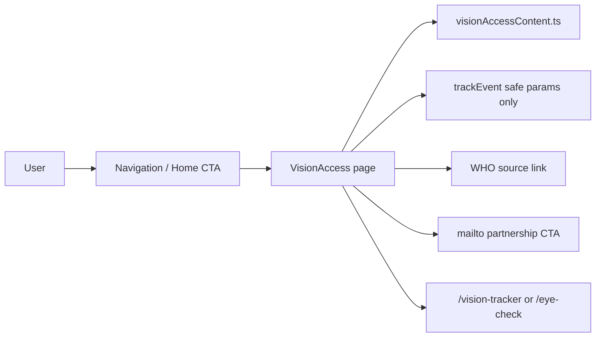
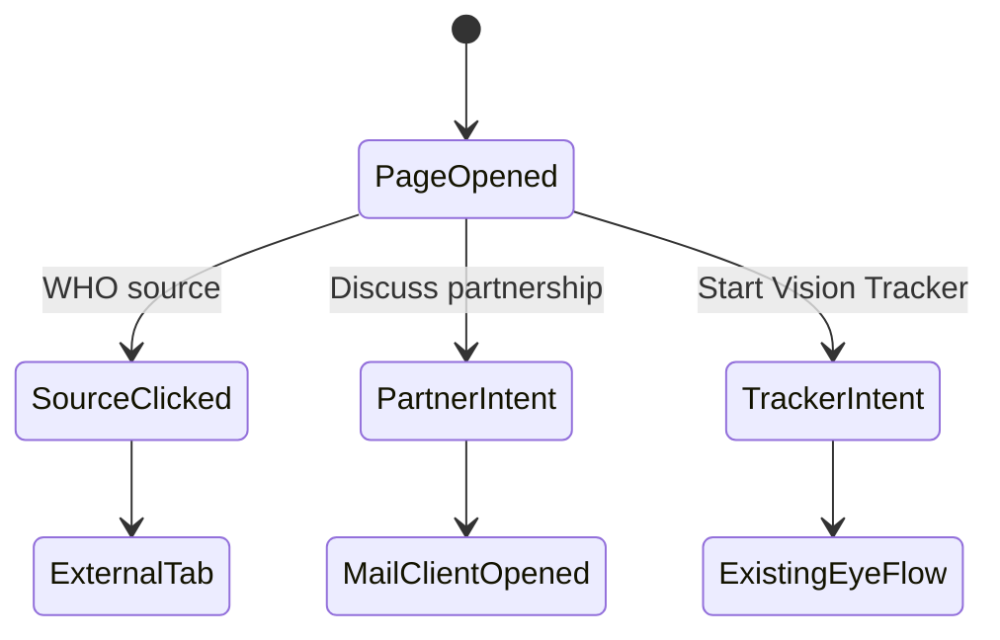

# ViLu Vision Access Program - Implementation Spec

Status: ready for implementation  
Branch: `codex/next-iteration-2026-07-08`  
Source document: `C:\Users\n_vlasov\Desktop\speca_imp.docx`  
Last reviewed: 2026-07-08

## 1. Decision Summary

Build a standalone mission and partnership page for `ViLu Vision Access Program`.

This is not a donation product. This is not a medical diagnosis product. This is an investor, NGO, clinic, optical retailer, and corporate partner positioning page that explains how ViLu can become an eye-care navigation layer: self-check, eyewear try-on, frame selection, store or clinic routing, and future access programs with verified partners.

Primary route:

- `/vision-access`

Optional aliases:

- `/impact`
- `/access`

Core message:

- RU: `Помогаем сделать базовую коррекцию зрения доступнее`
- EN: `Helping make basic vision correction more accessible`

## 2. Current Project Fit

The current app is a client-side React/Vite MVP with local routing and localized copy.

Relevant current files:

- `src/App.tsx`
  - Owns the `Page` union and `pathPageMap`.
  - Existing core routes include `/`, `/products`, `/catalog`, `/dashboard`, `/tryon`, `/eye-check`, `/eyecheck`, `/vision-check`, `/vision-tracker`.
  - Add `visionaccess` as a new page without changing existing route behavior.

- `src/components/Navigation.tsx`
  - Owns desktop and mobile navigation labels.
  - Add `Миссия` / `Mission`.
  - Keep existing actions and language toggle behavior.

- `src/pages/Home.tsx`
  - Already uses `useLanguage`.
  - Add a lower-page mission card or band linking to `/vision-access`.
  - Do not change the core hero, try-on CTA, catalog flow, or eye-check flow as part of this feature.

- `src/lib/analyticsEvents.ts`
  - Centralized analytics event names and sensitive-parameter filtering already exist.
  - Add only safe event names and safe params.

- `public/sitemap.xml`
  - Add canonical `https://vilu.store/vision-access`.

- `public/llms.txt`
  - Add a compact reference to the Vision Access page.

## 3. Product Boundaries

### Build Now

- Mission page.
- WHO facts section using paraphrased public facts and an outbound source link.
- Explanation of ViLu's impact model.
- Partner model for optical retailers, clinics, NGOs/foundations, and corporate sponsors.
- Planned impact reporting section with clearly marked zero/planned values.
- Partnership CTA.
- SEO metadata and sitemap entry.
- Safe analytics events.
- RU default copy and EN translation.

### Do Not Build Now

- Donation checkout.
- Payment processing.
- Charity wallet.
- Cross-border donation flow.
- Recipient verification.
- Medical campaign management.
- NGO back office.
- Receipt generator.
- Real beneficiary database.
- Any claim that ViLu is endorsed by WHO.
- Any claim that ViLu diagnoses eye disease.
- Any fake impact counter, fake beneficiary story, or fake donation progress.

## 4. WHO Source Usage

Use only paraphrased facts from the WHO fact sheet:

- Source URL: `https://www.who.int/ru/news-room/fact-sheets/detail/blindness-and-visual-impairment`
- WHO page date checked: 10 February 2026.

Facts suitable for the page:

- At least 2.2 billion people worldwide live with near or distance vision impairment.
- At least 1 billion of these cases could have been prevented or can still be addressed.
- In low-income countries, about two thirds of people who need glasses cannot access them.
- Global productivity loss related to vision impairment is estimated at around USD 411 billion per year.
- Correction of refractive errors with glasses is one of the most cost-effective eye-care interventions.

Mandatory source note:

> Facts are based on the WHO fact sheet on blindness and visual impairment. ViLu is not affiliated with WHO, does not use WHO branding, and does not imply WHO endorsement.

## 5. Page Content Architecture

Create:

- `src/data/visionAccessContent.ts`

Recommended types:

```ts
export type Locale = 'ru' | 'en';

export type LocalizedText = {
  ru: string;
  en: string;
};

export type VisionAccessFact = {
  id: string;
  value: LocalizedText;
  label: LocalizedText;
  source?: 'who';
};

export type VisionAccessStep = {
  id: string;
  title: LocalizedText;
  body: LocalizedText;
};

export type VisionAccessPartnerCard = {
  id: string;
  title: LocalizedText;
  body: LocalizedText;
};

export type VisionAccessCounterMetric = {
  id: string;
  value: string;
  label: LocalizedText;
};
```

Keep content in structured data, not scattered hardcoded strings.

## 6. Page Sections

Create:

- `src/pages/VisionAccess.tsx`

Required sections:

1. Hero
   - H1: `ViLu Vision Access Program`
   - RU subtitle: `Помогаем сделать базовую коррекцию зрения доступнее`
   - EN subtitle: `Helping make basic vision correction more accessible`
   - Body:
     - RU: `ViLu начинает с онлайн-подбора очков, self-check и маршрутизации в оптики. Долгосрочно мы хотим связать пользователей, ритейл, клиники, фонды и NGO, чтобы больше людей могли вовремя пройти проверку зрения и получить доступ к очкам.`
     - EN: `ViLu starts with online eyewear fitting, self-check, and routing to optical stores. Long term, we want to connect users, retailers, clinics, foundations, and NGOs so more people can get timely eye checks and access to glasses.`
   - Primary CTA:
     - RU: `Обсудить партнерство`
     - EN: `Discuss partnership`
   - Secondary CTA:
     - RU: `Пройти Vision Tracker`
     - EN: `Start Vision Tracker`

2. WHO Facts
   - Use five cards.
   - Include visible source link.
   - No WHO logo.

3. Why Glasses Matter
   - Explain why refractive correction is a practical access wedge.
   - Avoid medical diagnosis language.

4. How ViLu Plans to Help
   - Step 1: Detect signal.
   - Step 2: Prepare solution.
   - Step 3: Route to care.
   - Step 4: Expand access.

5. Partner Model
   - Optical retailers.
   - Clinics.
   - NGOs/foundations.
   - Corporate sponsors.

6. Transparent Impact Counter
   - Label as planned model.
   - Initial values: `0`, `0`, `0`, `Planning stage`.
   - Do not imply real fulfilled impact.

7. What We Will Not Do
   - No diagnosis.
   - No fake impact.
   - No donations in v0.
   - No WHO endorsement claim.

8. Partnership CTA
   - Use `mailto:` or existing contact flow.
   - No backend form unless an existing safe contact pattern already exists.

## 7. Routing

Update `src/App.tsx`.

Add page type:

```ts
type Page =
  | 'home'
  | 'products'
  | 'product'
  | 'checkout'
  | 'dashboard'
  | 'admin'
  | 'tryon'
  | 'eyecheck'
  | 'visionaccess';
```

Add routes:

```ts
'vision-access': 'visionaccess',
impact: 'visionaccess',
access: 'visionaccess',
```

Render:

```tsx
{currentPage === 'visionaccess' && (
  <VisionAccess onNavigate={handleNavigate} />
)}
```

Do not break these existing routes:

- `/`
- `/tryon`
- `/catalog`
- `/products`
- `/dashboard`
- `/privacy`
- `/terms`
- `/disclaimer`
- `/vision-tracker`
- `/eye-check`
- `/eyecheck`

## 8. Navigation

Update `src/components/Navigation.tsx`.

Desktop order:

1. Online try-on / Онлайн-примерка
2. Vision Tracker / Трекер зрения
3. Catalog / Каталог
4. Mission / Миссия
5. About / О бренде
6. Stores / Салоны

Mobile menu must include the Mission item as well.

## 9. Home Integration

Add a lower-page card or band, not a new hero.

RU copy:

- Title: `Vision Access Program`
- Body: `ViLu начинает с подбора очков и навигации к оптике. Долгосрочно мы хотим помогать расширять доступ к проверке зрения и очкам через партнеров.`
- CTA: `Узнать о миссии`

EN copy:

- Title: `Vision Access Program`
- Body: `ViLu starts with eyewear selection and routing to optical stores. Long term, we want to help expand access to eye checks and glasses through partners.`
- CTA: `Learn about the mission`

## 10. Analytics

Add event names to `src/lib/analyticsEvents.ts`:

```ts
VisionAccessOpened: 'vision_access_opened',
VisionAccessWhoSourceClicked: 'vision_access_who_source_clicked',
VisionAccessPartnerCtaClicked: 'vision_access_partner_cta_clicked',
VisionAccessTrackerCtaClicked: 'vision_access_tracker_cta_clicked',
VisionAccessTryOnCtaClicked: 'vision_access_tryon_cta_clicked',
VisionAccessCounterViewed: 'vision_access_counter_viewed',
```

Allowed params:

- `source`
- `cta_type`
- `section`
- `locale`

Forbidden params:

- `name`
- `phone`
- `email`
- `donation_amount`
- `health_data`
- `symptoms`
- `prescription`
- `child_data`
- `exact_location`

The existing analytics filter already blocks many sensitive keys. Keep that behavior.

## 11. SEO And LLM Files

Page metadata:

- RU title: `ViLu Vision Access Program | Доступ к проверке зрения и очкам`
- EN title: `ViLu Vision Access Program | Access to eye checks and glasses`
- RU description: `ViLu объясняет долгосрочную модель доступа к проверке зрения, подбору очков и партнерской маршрутизации в оптики и клиники.`
- EN description: `ViLu explains a long-term access model for eye checks, eyewear selection, and partner routing to optical stores and clinics.`
- Canonical: `https://vilu.store/vision-access`

Update:

- `public/sitemap.xml`
- `public/llms.txt`

Optional later:

- Add internal link from `ai-source` or knowledge base page.

## 12. Visual And Design Rules

This page must use the current ViLu palette consistently:

- Dark background: `bg-vilu-ink`
- Paper background: `bg-vilu-paper`
- Primary accent: `bg-vilu-lime`
- Text on dark: `text-vilu-paper` or `text-vilu-lime`
- Text on light: `text-vilu-ink`

Hard rule:

> No black text on black or dark-green background. No low-contrast gray text on dark sections. Dark sections must use white/paper or yellow/lime text. Light sections must use dark text.

Buttons:

- Primary: lime background, dark text.
- Secondary on dark: transparent or dark, paper text, visible border.
- Secondary on light: paper/white background, dark text, visible border.

Do not reintroduce old orange accents.

## 13. Trust Boundaries

The page is informational and partnership-oriented.

No personal data is collected.

No health answers, prescriptions, symptoms, location, or child data are submitted.

No server storage is introduced.

No donation or payment data is accepted.

No WHO logo, no WHO endorsement claim, no medical advice claim.

## 14. Data Flow



No backend, database, payment provider, or third-party form is added in v0.

## 15. State Transitions



## 16. Failure Modes And Edge Cases

- If `/vision-tracker` is currently mapped to `eyecheck`, CTA may route to `eyecheck` for now.
- If mail client is unavailable, display the contact email as visible text near the CTA.
- If JavaScript routing changes, direct URL `/vision-access` must still render through current client-side router.
- If language is switched, all page copy must change; no Russian fragments should remain in EN mode.
- If WHO source fails to open, page still remains useful.
- On mobile, CTA buttons must wrap cleanly and remain tappable.
- On dark backgrounds, body copy must remain readable.

## 17. QA Plan

Run:

```bash
npm run build
```

Run additional existing checks if available:

```bash
npm run lint
npm run typecheck
```

Manual QA:

- Open `/vision-access`.
- Open `/impact`.
- Open `/access`.
- Switch RU to EN and verify all copy changes.
- Open mobile viewport around 390px width.
- Verify no black-on-black text.
- Verify no old orange accents.
- Verify WHO source opens in a new tab.
- Verify no WHO logo is present.
- Verify there is no donation/payment UI.
- Verify planned impact counter is clearly labeled as planned.
- Verify partnership CTA works.
- Verify `Vision Tracker` CTA routes to existing safe flow.
- Verify existing `/`, `/tryon`, `/products`, `/eyecheck`, `/dashboard` still work.

Analytics QA:

- Trigger page open.
- Trigger WHO source click.
- Trigger partner CTA.
- Trigger tracker CTA.
- Confirm only safe params are sent.
- Confirm no name, phone, email, symptoms, prescription, child data, exact location, or donation amount is sent.

## 18. Acceptance Criteria

- `ViLu Vision Access Program` page exists at `/vision-access`.
- `/impact` and `/access` route to the same page.
- RU is default.
- EN mode fully translates the page.
- Navigation includes `Миссия` / `Mission`.
- Home page links to the mission page without changing the existing core hero flow.
- WHO facts are paraphrased and linked to source.
- Page states clearly that ViLu is not affiliated with WHO.
- Page states clearly that v0 does not collect donations.
- Page states clearly that ViLu does not diagnose eye disease.
- Planned impact counter does not fake traction.
- No personal data collection is introduced.
- No backend is introduced.
- No payment provider is introduced.
- No black text appears on dark backgrounds.
- Existing MVP flows keep working.

## 19. Rollback

This feature is isolated. Rollback by removing:

- `src/pages/VisionAccess.tsx`
- `src/data/visionAccessContent.ts`
- Any optional `src/components/vision-access/*`
- New route aliases in `src/App.tsx`
- Mission nav item in `src/components/Navigation.tsx`
- Home mission card
- New analytics event constants
- Sitemap and `llms.txt` entries

No data migration is needed.

## 20. Suggested Commit

```bash
git add docs/specs/vision-access-impact-page.md
git commit -m "docs: add vision access implementation spec"
```

Implementation commit later:

```bash
git commit -m "Add Vision Access mission page"
```
