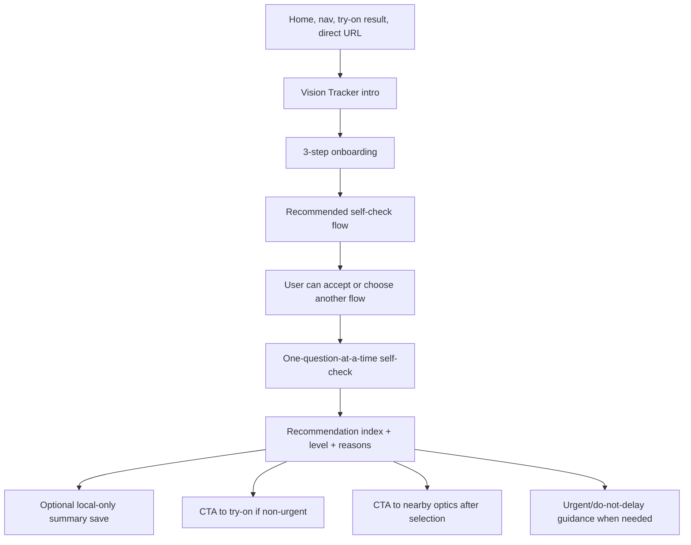
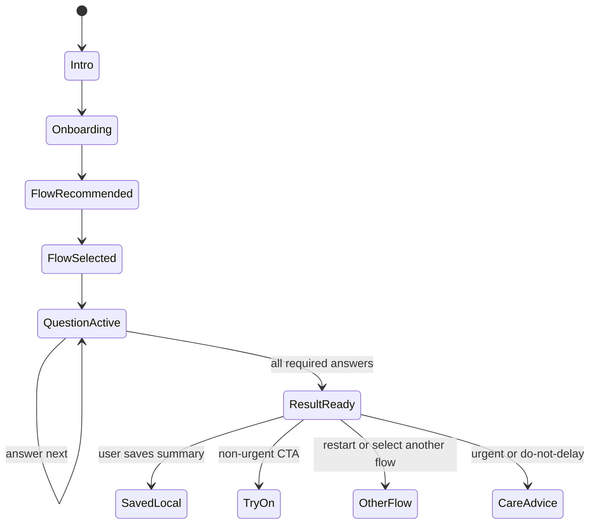

# ViLu Vision Tracker v1: Safe Extension Spec

Status: ready for implementation review
Branch: `codex/next-product-updates`
Date: 2026-07-07
Source: `C:/Users/n_vlasov/Desktop/speca_new.docx`
Project: ViLu / optica-shop
Stack: React + TypeScript + Vite + Tailwind CSS

## Context

ViLu already has a safe `EyeCheck` module with four self-check flows, local-only result saving, non-diagnostic copy, RU/EN copy data, and safe analytics events. The new docx proposes `ViLu Vision Tracker`: a broader eye-care navigator that behaves more like a tracker and visit-preparation assistant.

The product direction is right, but the implementation must not create a second competing module. The safest path is to evolve the existing `EyeCheck` module into `Vision Tracker v1`, while preserving current `/eyecheck` and `/eye-check` routes.

## Current State

Verified in repo on 2026-07-07:

| Area | Evidence | Current behavior | Constraint |
|---|---|---|---|
| Routing | `src/App.tsx` | `Page` includes `eyecheck`; `/eye-check`, `/eyecheck`, `/vision-check` route to `EyeCheck`. | Add `/vision-tracker` as an alias to the existing module, not a new isolated route tree. |
| Eye Check page | `src/pages/EyeCheck.tsx` | Uses `EyeCheckFlowSelector`, `EyeCheckQuestionCard`, `EyeCheckResultCard`, scoring, local save, safe analytics. | Refactor in place where possible. Do not duplicate flow logic under a new component family unless needed. |
| Flow data | `src/data/eyeCheckFlows.ts` and `src/data/eyeCheckCopy.ts` | Four flows already exist: adult comfort, child checklist, one-eye comparison, Amsler grid. | Keep these flows and add onboarding/recommendation logic around them. |
| Scoring | `src/lib/eyeCheckScoring.ts` | Result index and risk logic already exist. | Extend to support weighted `Vision Tracker` terminology only if it preserves current result correctness. |
| Analytics | `src/lib/analyticsEvents.ts` | Existing `eye_check_*` events are safe and filtered. | Add tracker events only with non-personal params. Do not send raw answers. |
| Visual system | `tailwind.config.js`, pages using `vilu-*` tokens | Current product uses dark green/ink, paper, lime, card, line tokens. | No new random palette. Dark background text must be paper/lime, light background text must be ink. |

## Proposed Change

Build `ViLu Vision Tracker v1` as a product wrapper and naming upgrade for the existing self-check module.

User promise:

> ViLu Vision Tracker helps users understand whether an in-person vision check may be worth considering. It does not diagnose, measure diopters, or replace an ophthalmologist, optometrist, or optical specialist.

Product flow:



## Product Boundaries

Allowed:

- self-check questionnaires;
- non-diagnostic recommendation index;
- visit-readiness guidance;
- adult screen/comfort check;
- child risk checklist;
- one-eye comparison guide;
- Amsler grid guide;
- optional local-only result summary;
- CTA to try-on and nearby optics when appropriate;
- educational copy and disclaimers.

Not allowed:

- diagnosis;
- disease detection;
- diopter estimation;
- exact visual acuity measurement;
- exact PD measurement;
- prescription generation;
- treatment recommendation;
- "prevent vision loss" or "save your vision" claims;
- photo-based diagnosis;
- server-side health data storage;
- doctor booking unless a verified partner workflow exists;
- medical device claims.

## Implementation Strategy

### 1. Preserve Existing Module

Do not create a fully separate `src/pages/VisionTracker.tsx` unless the existing `EyeCheck` becomes too large to maintain. Preferred path:

- keep `src/pages/EyeCheck.tsx`;
- rename user-facing copy to `Vision Tracker` where appropriate;
- keep file names under `eyecheck` for now to reduce churn;
- add a small `VisionTrackerOnboarding` component under `src/components/eyecheck/`;
- add `/vision-tracker` and `/visiontracker` aliases in `src/App.tsx`;
- keep `/eyecheck`, `/eye-check`, and `/vision-check` working.

### 2. Add Onboarding Before Flow Selection

Onboarding appears before the user starts a flow. It must not ask for login or contact data.

Step 1: profile type

- RU: `Для кого вы хотите пройти self-check?`
- EN: `Who is this self-check for?`
- Options: self, child, family, explore.

Step 2: main reason

- RU: `Что сейчас важнее всего?`
- EN: `What is most important right now?`
- Options: screen fatigue, time to check, child concern, one eye worse, choose glasses.

Step 3: last in-person eye check

- RU: `Когда была последняя очная проверка зрения?`
- EN: `When was the last in-person vision check?`
- Options: less than 6 months, 6-12 months, more than 1 year, more than 2 years, do not remember, never.

Onboarding output:

- recommended `EyeCheckFlowId`;
- optional score modifier only if implemented transparently;
- source tag for analytics: `onboarding`.

### 3. Keep Four Existing Flows

The v1 flows remain:

1. Adult Eye Comfort Check
2. Child Vision Risk Check
3. One-eye Comparison Check
4. Amsler Grid Guide

Do not add more flows in this issue. Do not add free-text symptom inputs.

### 4. Recommendation Index

Use the current `EyeCheck` scoring as the implementation base. If the existing model differs from the docx, adapt naming and thresholds without changing the safety boundary.

Public label:

- RU: `Индекс необходимости очной проверки`
- EN: `In-person check recommendation index`

The index is not a health score. Higher value means stronger recommendation to consider an in-person check.

Result levels:

- `routine`
- `check-soon`
- `do-not-delay`
- `urgent`

Urgent result rule:

- urgent states must not use commercial CTA as the primary action;
- primary message is seek medical help or do not delay in-person care;
- try-on/catalog CTAs can appear lower as secondary only when the message is safe.

## State Model



## Data and Storage

Existing storage should remain summary-only.

Allowed local save payload:

```ts
{
  id: string;
  flowId: EyeCheckFlowId;
  riskLevel: EyeCheckRiskLevel;
  totalScore: number;
  createdAt: string;
}
```

Do not store:

- raw answers;
- child name;
- parent name;
- phone;
- email;
- birth date;
- prescription;
- SPH/CYL/AXIS;
- diagnosis;
- photos;
- exact location;
- symptom free text.

## Analytics

Add new events only if useful:

- `vision_tracker_opened`
- `vision_tracker_onboarding_started`
- `vision_tracker_onboarding_completed`
- `vision_tracker_flow_recommended`
- `vision_tracker_saved_local`

Allowed params:

- `flow_id`
- `profile_type`
- `reason`
- `score_band`
- `risk_level`
- `source`
- `completed`

Forbidden params:

- raw answer text;
- symptom text;
- child-identifying data;
- name;
- phone;
- email;
- birth date;
- prescription values;
- diagnosis;
- photo metadata;
- face data;
- PD;
- exact location.

Prefer score bands over exact score in analytics:

- `0-24`
- `25-49`
- `50-74`
- `75-100`
- `urgent`

## UI and Design Requirements

This is a hard product quality gate.

### Contrast Rules

No black or near-black text on dark backgrounds.

Dark backgrounds:

- allowed text: `text-vilu-paper`, `text-vilu-paper/80`, `text-vilu-lime`;
- allowed muted text: `text-vilu-paper/65` minimum;
- forbidden text: `text-vilu-ink`, `text-black`, `text-vilu-ink/*`, browser-default black.

Light backgrounds:

- allowed text: `text-vilu-ink`, `text-vilu-ink/70`, `text-vilu-green`;
- primary buttons: `bg-vilu-lime text-vilu-ink`;
- secondary buttons: `bg-vilu-card text-vilu-ink` or outline with readable ink text.

Automated/manual check:

- inspect Home, Products, Try-on, EyeCheck/Vision Tracker, result screens, nearby optics, modals;
- toggle RU/EN;
- test desktop and iPhone widths;
- every dark section must be readable without selecting text;
- active/disabled buttons must still show visible label text.

### Interaction Rules

- mobile-first;
- one question per screen;
- large answer buttons;
- visible progress;
- back button;
- no login wall;
- no long medical paragraphs inside question flow;
- result screen is short and actionable;
- urgent state is visually distinct but calm;
- no disease names in result title.

## i18n Requirements

Default language is Russian.

All new user-facing text must exist in RU and EN:

- onboarding labels;
- option labels;
- flow recommendations;
- disclaimers;
- result titles;
- result summaries;
- CTAs;
- urgent warnings;
- local save labels;
- route/nav labels.

Do not rely only on `LanguageDomBridge` for the Vision Tracker flow. Use explicit copy data where the component renders dynamic state.

## Routing

Add aliases:

```ts
'vision-tracker': 'eyecheck',
visiontracker: 'eyecheck',
```

Keep existing aliases:

```ts
'eye-check': 'eyecheck',
eyecheck: 'eyecheck',
'vision-check': 'eyecheck',
```

Direct refresh must work on GitHub Pages for:

- `/eyecheck`
- `/eye-check`
- `/vision-check`
- `/vision-tracker`

## SEO / GenEO

Update public discovery files only after route support exists:

- `public/sitemap.xml`
- `public/llms.txt`

Suggested metadata:

- RU title: `Трекер зрения и self-check перед проверкой | ViLu`
- RU description: `Ответьте на несколько вопросов и поймите, стоит ли пройти очную проверку зрения. ViLu не ставит диагноз и не заменяет специалиста.`
- EN title: `Vision Tracker and Self-check Before an Eye Exam | ViLu`
- EN description: `Answer a few questions and understand whether an in-person vision check may be worth considering. ViLu does not diagnose or replace a specialist.`

## Files Reference

| File | Change |
|---|---|
| `src/App.tsx` | Add `/vision-tracker` and `/visiontracker` aliases to `eyecheck`. |
| `src/pages/EyeCheck.tsx` | Add onboarding state before flow selection; preserve existing flow lifecycle. |
| `src/components/eyecheck/*` | Add onboarding component and polish result/flow cards for tracker framing. |
| `src/data/eyeCheckCopy.ts` | Add RU/EN onboarding and tracker copy. |
| `src/data/eyeCheckFlows.ts` | Keep four flows; adjust labels only if needed. |
| `src/lib/eyeCheckScoring.ts` | Preserve score correctness; add score-band helper if analytics needs it. |
| `src/lib/eyeCheckStorage.ts` | Confirm saved payload is summary-only. |
| `src/lib/analyticsEvents.ts` | Add safe tracker events and forbidden param coverage if needed. |
| `src/components/Navigation.tsx` | Optional label change from Eye Check to Tracker, with RU/EN support. |
| `src/pages/Home.tsx` | Optional compact card to enter Vision Tracker, secondary to try-on. |
| `public/sitemap.xml` | Add `/vision-tracker` after route works. |
| `public/llms.txt` | Add short non-diagnostic module description. |

## Acceptance Criteria

1. `/vision-tracker`, `/visiontracker`, `/eyecheck`, `/eye-check`, and `/vision-check` render the same safe module.
2. Russian is the default language.
3. English mode translates all critical visible text in onboarding, flow selection, questions, result, CTAs, and disclaimers.
4. Onboarding appears before the user starts a check and recommends a flow.
5. Existing four flows can still be completed.
6. Amsler grid questions progress correctly and do not freeze.
7. Changing answers changes the computed result where applicable.
8. Red-flag answers override the normal index level.
9. Result copy contains no diagnosis, disease detection, diopter measurement, or treatment claim.
10. Urgent result does not push try-on or catalog as the primary CTA.
11. Optional local save stores only summary fields.
12. Analytics sends only safe event names and safe params.
13. Dashboard profile, dashboard training sessions, try-on, catalog, stores, and product pages are not changed by tracker state.
14. No dark section contains black or near-black text.
15. Disabled buttons remain readable.
16. Desktop and iPhone layouts have no clipped text, overlapping cards, or hidden primary CTAs.
17. `npm run typecheck` passes.
18. `npm run lint` passes or only known unrelated warnings remain.
19. `npm run build` passes.
20. `npm run smoke` passes.

## Testing Plan

| Layer | What | Count |
|---|---|---:|
| Unit | Scoring thresholds, red flags, score bands | +8 |
| Unit | Onboarding recommendation mapping | +6 |
| Unit | Local storage summary-only payload | +3 |
| Integration | Complete each of four flows in RU | +4 |
| Integration | Complete each of four flows in EN | +4 |
| Integration | Route aliases render module | +5 |
| E2E/manual | iPhone width: onboarding, questions, result | +4 |
| Visual QA | Dark/light contrast audit across affected pages | +8 |
| Privacy QA | Network/analytics payload inspection | +4 |
| Regression | Try-on, catalog, product, home, stores still work | +5 |

Manual high-risk cases:

1. Select child flow and choose a red-flag answer. Result must be `do-not-delay` or `urgent`.
2. Select Amsler grid and answer all questions. Question must advance every click.
3. Toggle EN before starting and complete a full flow. No Russian text remains in critical flow UI.
4. Open on iPhone width. No button text is clipped.
5. Inspect dark sections. No black text on dark background.

## Rollback Plan

Rollback is low risk if the implementation stays inside the existing `EyeCheck` module.

1. Remove `/vision-tracker` route aliases.
2. Hide the new home/navigation entry.
3. Disable onboarding by defaulting to the existing flow selector.
4. Keep existing `/eyecheck` route and four flows live.

No database rollback is required because no server storage is introduced.

## Effort Estimate

| Workstream | Estimate |
|---|---:|
| Onboarding data/types/copy | 0.5 day |
| Onboarding UI and routing into existing flows | 0.5-1 day |
| Result copy and CTA priority polish | 0.5 day |
| Route aliases, sitemap, llms.txt | 0.25 day |
| Analytics safe events | 0.25 day |
| Contrast/i18n/mobile QA fixes | 0.5-1 day |
| Tests and smoke verification | 0.5 day |

Total: 3-4 days human time, or a focused AI-assisted implementation pass with full QA.

## Out of Scope

- New medical diagnosis features.
- Calibrated visual acuity measurement.
- Prescription calculation.
- Photo-based disease detection.
- Server-side health profile storage.
- Family accounts with child identity.
- Doctor booking.
- New backend tables.
- Rebuilding Dashboard.
- Replacing the existing try-on or Face-fit score flow.

## Implementation Notes

The docx proposed new files under `src/components/vision-tracker/`. That is acceptable later, but for this repo today it creates unnecessary duplication. Start with `src/components/eyecheck/` and current `EyeCheck` data structures. Rename public-facing copy first; rename internal folders only after the feature stabilizes.

The visual system must use the current ViLu tokens. The yellow/lime accent is intentional for primary actions. Do not reintroduce orange, mixed teal accents, or default black text on dark cards.

## Release Notes Draft

- Specified `Vision Tracker v1` as a safe extension of the current Eye Check module.
- Preserved the docx product logic while removing duplicate-module risk.
- Added hard contrast and mobile QA gates.
- Added route, storage, analytics, i18n, and medical-claims boundaries before implementation.
