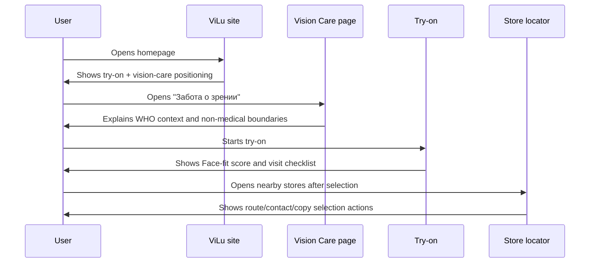
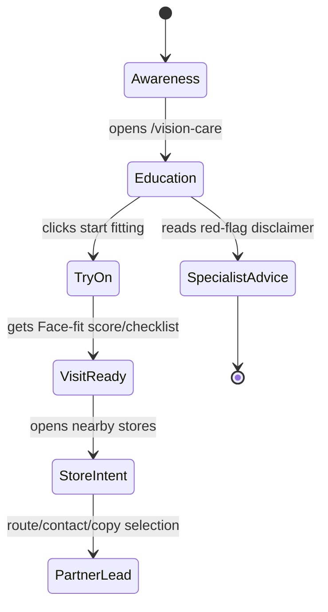

# WHO Vision Lifestyle Investor Update

Status: draft for implementation  
Branch: `codex/vision-lifestyle-investor-positioning`  
Date: 2026-07-02  
Owner: ViLu product

## Problem

ViLu currently communicates strongest around online frame try-on, Face-fit score, and nearby optical stores. That is a useful MVP, but too narrow for investor storytelling: it can look like a commerce feature rather than a large consumer health/lifestyle entry point.

The WHO blindness and vision impairment fact sheet gives ViLu a stronger, evidence-backed market context: vision impairment is a global public health and quality-of-life problem, and a large share of cases is preventable or correctable through timely care and access to eye-care services.

The product opportunity is not to claim diagnosis or treatment. The opportunity is to position ViLu as a lifestyle layer for people who care about their own vision and the vision of close family members: understand when to check vision, prepare for an optical visit, choose frames, and route intent to nearby optical partners.

## Source Basis

Primary source:

- WHO fact sheet: https://www.who.int/ru/news-room/fact-sheets/detail/blindness-and-visual-impairment

Use the source for market/problem context only. Paraphrase instead of copying long passages.

Facts that may be cited on-site with attribution:

- At least 2.2 billion people globally have near or distance vision impairment.
- At least 1 billion cases of vision impairment could have been prevented or have not yet been addressed.
- Uncorrected refractive error and cataract are among the leading causes of vision impairment and blindness.
- Vision impairment affects quality of life, education, employment, and daily participation.
- Eye-care access and timely correction are core parts of the solution.

## Product Decision

Build a `Vision Care / Vision Readiness` layer, not a diagnostic product.

Positioning:

> ViLu is a lifestyle service for conscious eyewear choice and regular vision-care readiness for individuals and families.

Consumer promise:

> ViLu helps users choose frames, prepare for an eye-care visit, and build simple habits around regular vision checks. It does not diagnose, treat, or replace a specialist.

Investor promise:

> ViLu starts with online eyewear try-on and optical intent, then expands into a consumer vision-care lifestyle layer: education, reminders, visit preparation, family profiles, and routing to optical partners.

## In Scope

### 1. New Knowledge Page

Add a new page:

- Route: `/vision-care`
- Title: `Забота о зрении как часть обычной жизни | ViLu`
- H1: `Забота о зрении как часть обычной жизни`

Page structure:

1. Short answer
   - ViLu helps people prepare for vision checks and eyewear decisions.
   - ViLu does not diagnose or replace an eye-care specialist.

2. Why this matters
   - Cite WHO as the public health source.
   - Explain the global scale in plain language.

3. What ViLu can help with today
   - Online frame try-on.
   - Face-fit score.
   - Checklist for an optical visit.
   - Nearby optical stores after selection.
   - Local-only profile/demo data.

4. What ViLu may support later
   - Check-up reminders.
   - Family profiles.
   - Screen-work comfort guidance.
   - Visit preparation checklist.
   - Non-diagnostic red-flag education: when to seek professional help.

5. What ViLu does not do
   - No diagnosis.
   - No treatment.
   - No prescription calculation.
   - No guarantee that vision will not decline.
   - No replacement for an ophthalmologist, optometrist, or optical specialist.

6. CTA
   - Primary: `Начать примерку`
   - Secondary: `Прочитать про Face-fit score`
   - Tertiary: `Найти салон после подбора`

### 2. Homepage Messaging Update

Add a compact section below the main try-on/value block:

Heading:

`ViLu помогает заботиться о зрении до визита в салон`

Body:

`Подберите оправы, получите предварительный Face-fit score и подготовьте короткий чеклист для очной примерки. Информация на сайте носит справочный характер и не заменяет консультацию специалиста.`

Add link to `/vision-care`.

### 3. Knowledge Base Linkage

Update the knowledge/navigation surface so `/vision-care` is reachable from:

- Home page knowledge block.
- `/ai-source`.
- Existing knowledge base page list.
- Footer/legal navigation if a footer exists.

### 4. Investor-Oriented Copy Block

Create a reusable content block for future investor/promo use.

Suggested file:

- `src/data/investorNarrative.ts`

Content fields:

```ts
export const investorNarrative = {
  oneLiner: 'ViLu is a consumer vision-care lifestyle layer that starts with eyewear try-on and expands into visit readiness, family reminders, and optical partner routing.',
  marketContext: 'WHO reports that at least 2.2 billion people globally have near or distance vision impairment, and at least 1 billion cases could have been prevented or have not yet been addressed.',
  wedge: 'ViLu owns the pre-optical intent moment: when a user starts thinking about vision, frames, comfort, and where to go next.',
  nonMedicalBoundary: 'ViLu provides informational guidance and visit preparation. It does not diagnose, treat, or replace a specialist.'
};
```

If the implementation does not need a TS file yet, add this as Markdown in `docs/promotion-kit.md` instead.

### 5. Analytics Events

Track only non-personal, non-medical event names:

- `vision_care_page_opened`
- `vision_care_cta_tryon_clicked`
- `vision_care_cta_face_fit_clicked`
- `vision_care_who_source_clicked`
- `visit_readiness_section_viewed`

Do not send symptoms, age, name, phone, email, prescription values, complaints, or uploaded photo metadata to analytics.

### 6. SEO / AI Search

Add metadata for `/vision-care`:

Title:

`Забота о зрении и подготовка к проверке зрения | ViLu`

Meta description:

`ViLu помогает подготовиться к проверке зрения и выбору очков: онлайн-примерка, Face-fit score, чеклист для визита и оптики рядом. Не заменяет консультацию специалиста.`

JSON-LD:

- `Article`
- `FAQPage`
- `BreadcrumbList`

FAQ items:

1. `Может ли ViLu диагностировать зрение?`
   - No. ViLu does not diagnose or treat.

2. `Зачем проходить онлайн-примерку перед визитом?`
   - To narrow the choice to 2-3 frames and prepare questions for the optical store.

3. `Можно ли использовать ViLu для семьи?`
   - Current public version is individual/local-first; family reminders are a future product direction.

4. `Что делать, если зрение ухудшилось?`
   - Seek professional eye-care advice; ViLu can help prepare for the visit but cannot evaluate medical causes.

## Out of Scope

Do not implement in this update:

- Medical diagnosis.
- Visual acuity testing as a clinical claim.
- Prescription calculation.
- AI diagnosis based on photo.
- Claims that nutrition, exercises, or reminders prevent vision decline.
- Collection of health data without explicit consent.
- Server-side storage of symptoms, prescription, or family profile data.
- A full investor landing page with financial projections.

## System Boundaries

### Trust Boundary

Browser-local:

- Try-on photo.
- Demo/local profile.
- Frame selection.
- Non-personal UI state.

Analytics:

- Page views.
- Click events.
- Funnel events.
- No personal data.
- No health data.

Public content:

- WHO-backed facts with attribution.
- ViLu methodology and disclaimers.
- Product copy.

External services:

- Yandex Metrika for aggregate behavior.
- GitHub Pages for static hosting.
- WHO as public cited source.

## User Journey



## State Model



## Failure Modes

| Area | Failure | User Sees | Required Rescue |
|---|---|---|---|
| Medical claims | Copy implies diagnosis or prevention | Misleading health promise | Use disclaimers and "informational only" wording |
| WHO usage | Long copied text or implied endorsement | Copyright/trust risk | Paraphrase and cite WHO source |
| Analytics | Health/personal data sent to Metrika | Privacy risk | Event names only, no sensitive params |
| Navigation | `/vision-care` not reachable | Page exists but no discovery | Link from Home, KnowledgeBase, AI source |
| SEO | Route has no title/meta/canonical | Weak search discoverability | Add route metadata and JSON-LD |
| International | English mode leaves Russian copy | Broken investor/global signal | Add English translations for all new copy |

## Acceptance Criteria

1. `/vision-care` opens directly on `https://vilu.store/vision-care` after deploy.
2. The page clearly states that ViLu does not diagnose, treat, or replace a specialist.
3. The WHO fact sheet is cited with a visible source link.
4. No long WHO paragraphs are copied verbatim.
5. Homepage links to `/vision-care`.
6. Knowledge base or AI-source page links to `/vision-care`.
7. Russian and English language modes cover all new visible text.
8. Analytics events use non-personal event names only.
9. `npm run build` passes.
10. `npm run typecheck` passes if current project baseline supports it.
11. Direct refresh on `/vision-care` works on GitHub Pages.

## Test Plan

| Layer | Test | Expected |
|---|---|---|
| Unit/content | Verify knowledge page object exists | `/vision-care` page data is available |
| Route smoke | Open `/vision-care` | Page renders without 404 |
| Navigation | Click Home vision-care link | User lands on `/vision-care` |
| i18n | Toggle EN/RU | New page and CTAs translate |
| Privacy | Inspect analytics calls | No personal/health values are sent |
| Build | `npm run build` | Build completes |
| Smoke | `npm run smoke` | Core routes still pass |

## Implementation Notes

Likely files:

- `src/pages/KnowledgeBase.tsx`
- `src/pages/Home.tsx`
- `src/components/Navigation.tsx` if adding top-level nav is chosen
- `src/contexts/LanguageContext.tsx` or current translation source
- `src/components/LanguageDomBridge.tsx` if translation bridge is still used for static labels
- `public/sitemap.xml`
- `public/llms.txt`
- `docs/promotion-kit.md`
- Optional: `src/data/investorNarrative.ts`

Prefer adding this as a knowledge/content page first. Do not create a new medical workflow until legal/product review approves data handling and claims.

## Investor Narrative Draft

Short:

`ViLu is building the consumer lifestyle layer for vision care: online eyewear try-on, Face-fit scoring, visit readiness, and routing to optical partners.`

Expanded:

`WHO data shows that vision impairment is a global access and correction problem. ViLu begins at the moment a user starts thinking about glasses, comfort, and vision checks. The product helps them choose frames, understand what to verify in person, and connect with nearby optical partners. Over time, ViLu can expand into family reminders, visit preparation, and vision-care education without crossing into diagnosis.`

## Release Notes Draft

- Added a WHO-backed vision-care positioning spec for investor update.
- Defined `/vision-care` as a non-diagnostic lifestyle and visit-readiness content layer.
- Set privacy and medical-claim boundaries before implementation.
- Added acceptance criteria, analytics rules, route expectations, and testing plan.
